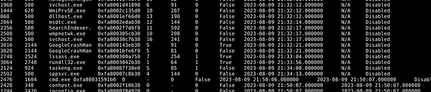
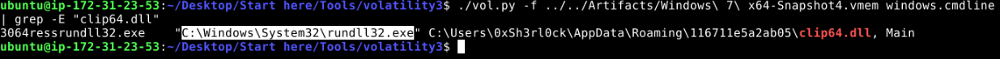

En este laboratorio de **[Cyberdefenders](https://cyberdefenders.org/blueteam-ctf-challenges/amadey/)** asumiremos el rol de un analista de ciberseguridad investigando una alerta del sistema **EDR** que detectó actividad sospechosa en una workstation Windows, señalando la presencia del **troyano Amadey**. Este malware, especializado en **robo de credenciales y persistencia**, opera en memoria, lo que dificulta su detección. En este análisis, usaremos **Volatility3** para examinar el volcado de memoria, identificar procesos maliciosos, rastrear conexiones de red y entender el alcance del ataque.

~~~
Platform: CyberDefenders
Level: Easy
Type: Endpoint Forensics, DFIR
~~~

### Lab Scenario

> Una alerta fuera del horario laboral del sistema de Detección y Respuesta de Endpoints (EDR) señala una actividad sospechosa en una estación de trabajo con Windows. El malware detectado coincide con el troyano Amadey. Tu tarea es analizar el volcado de memoria presentado y crear un informe detallado sobre las acciones realizadas por el malware.

### Key Information

- Un **`Memory Dump (volcado de memoria)`** es una captura del contenido de la memoria RAM de un sistema en un momento específico. Se utiliza para analizar el estado del sistema en caso de fallos, ataques de malware o investigaciones forenses

- **Amadey** es un troyano diseñado para el **robo de información y credenciales**, con capacidades de **persistencia y descarga de payloads adicionales**. Se distribuye principalmente a través de **phishing y exploit kits**, permitiendo a los atacantes recopilar datos del sistema, registrar pulsaciones de teclas y comunicarse con servidores de comando y control (C2). Su capacidad para operar en memoria lo hace difícil de detectar con métodos tradicionales, requiriendo análisis forense avanzado.

### Analysis

Utilizaremos **[Volatitlity](https://github.com/volatilityfoundation/volatility)**, una herramienta de forense avanzada de código abierto que es utilizada para realizar investigaciones detalladas en **volcados de memoria (memory dumps)**. Permite a los analistas extraer y analizar información relevante de la memoria RAM de un sistema comprometido, como procesos en ejecución, conexiones de red, archivos sospechosos, contraseñas almacenadas y rastros de malware.

#### Task #1 

> En el análisis del volcado de memoria, determinar la raíz de la actividad maliciosa es esencial para comprender el alcance de la intrusión. ¿Cuál es el nombre del proceso principal que desencadenó este comportamiento malicioso?

Se utilizó el plugin **pslist** de **Volatility** **`./vol.py -f ../../Artifacts/Windows\ 7\ x64-Snapshot4.vmem windows.pslist.PsList`** con el fin de analizar los procesos del volcado de memoria. Esto permite investigar procesos en ejecución y buscar posibles indicios de actividad sospechosa.

Se observó un posible proceso malicioso denominado **`lssass.exe`** con el **PID 2748**, que parece querer pasar desapercibido suplantando al proceso legítimo **`lsass.exe`** (mostrado en la imagen anterior). El proceso legítimo **`lsass.exe`** **(Local Security Authority Subsystem Service)** es un componente fundamental del sistema operativo **Windows**. Su función principal está relacionada con la **gestión de la seguridad** y **autenticación** de los usuarios en el sistema.

Para analizar la **estructura jerarquica de los procesos**, más específicamente del proceso sospechoso **`lssass.exe`** se utiliza el plugin **pstree** **`./vol.py -f ../../Artifacts/Windows\ 7\ x64-Snapshot4.vmem windows.pstree.PsTree`**

Se observa que el proceso padre **`lssass.exe`** tiene un proceso hijo que se encuentra activo (marcado por el * indica que está activo) llamado **`rundll32.exe`** 

**`rundll32.exe`** es un proceso legítimo de Windows que se utiliza para ejecutar funciones contenidas en bibliotecas DLL. Sin embargo, también puede ser **abuso de este proceso legítimo** por parte de malware para ejecutar código malicioso.

#### Task #2 

> Una vez que se ha identificado el proceso malicioso, su ubicación exacta en el dispositivo puede revelar más detalles sobre su naturaleza y origen. ¿Dónde se encuentra ubicado este proceso en la estación de trabajo?

Para localizar la ubicación del proceso malicioso **`lssass.exe`**, se utilizó el plugin **filescan**, que escanea la memoria en busca de archivos cargados en el sistema. Este plugin permite identificar el archivo ejecutable asociado con el proceso y su ubicación en el sistema de archivos, lo cual es crucial para determinar si proviene de una ubicación legítima o sospechosa, como una carpeta temporal o una ruta no estándar.

El comando **`./vol.py -f ../../Artifacts/Windows\ 7\ x64-Snapshot4.vmem windows.filescan.FileScan | grep -F lssass.exe`** con la utilidad **`grep`**, que permite filtrar la salida para encontrar específicamente el archivo **`lssass.exe`**, lo que ayuda localizar su ubicación en la memoria y analizar su origen y comportamiento en el sistema.

Por lo visto, la ubicación del proceso malicioso es **`C:\Users\0XSH3R-1\AppData\Local\Temp\925e7e99c5\lssass.exe`** y la **dirección de memoria** es **`0x517b290`**

Esta ruta sugiere que el proceso malicioso está ejecutándose desde una **carpeta temporal**, lo cual es común en los **malware** que intentan ocultarse y evadir la detección. Las carpetas de **AppData** y **Temp** son ubicaciones frecuentemente utilizadas por los atacantes para almacenar archivos temporales de ejecución que pueden eliminarse después del reinicio o del cierre de sesión.

Procedemos a **volcar el archivo `lssass.exe` de la memoria** y **obtener su hash** para posteriormente analizarlo con **VirusTotal**. 

En primer lugar se utiliza **Volatility** con el plugin **dumpfiles** el cual nos permite obtener una copia exacta del archivo tal como se encuentra en la memoria RAM del sistema. Con el comando **`./vol.py -f ../../Artifacts/Windows\ 7\ x64-Snapshot4.vmem windows.dumpfiles.DumpFiles --physaddr 0x517b290`** utilizamos **`--physaddr 0x517b290`** para especificar la dirección fisica en la memoria que queremos volcar.

Luego de ejecutar el comando nos devuelve la imagen del archivo **`ImageSectionObject`** la cual procedemos a utilizar con el comando `sha256sum` con el fin de obtener el **hash** 

Con el **hash** resultante procedemos a analizarlo en **[VirusTotal](https://www.virustotal.com/gui/)**. 

Con lo cual podemos concluir que es un malware categorizado como **troyano** de la familia **amadey/jaik**

#### Task #3

> Las comunicaciones externas persistentes sugieren que el malware está intentando contactar con un servidor de Comando y Control (C2C). ¿Puedes identificar la dirección IP del servidor C2C con el que interactúa el proceso?

Para identificar la dirección IP del servidor **C2C** que interactúa con **`lssass.exe`** utilizamos el comando **`./vol.py -f ../../Artifacts/Windows\ 7\ x64-Snapshot4.vmem windows.netscan | grep -F lssass.exe`** Se utiliza el plugin **`netscan`** para detectar las conexiones de red activas. 

La salida muestra que la dirección IP local **`192.168.195.136`** está intentando establecer una conexión con la dirección IP remota **`41.75.84.12`**, que corresponde a un posible **servidor C2C** (Comando y Control) utilizado por el atacante. El proceso **`lssass.exe`** está intentando conectarse al puerto **80**, que es comúnmente usado para tráfico HTTP. Sin embargo, el estado de la conexión es **CLOSED**, lo que indica que la conexión no pudo ser establecida. Esto podría deberse a que el servidor remoto no está respondiendo o a que un firewall está bloqueando la conexión.

#### Task #4 

> Siguiendo el vínculo del malware con el servidor C2C, es probable que el malware esté descargando herramientas o módulos adicionales. ¿Cuántos archivos distintos está intentando traer al equipo comprometido?

Para identificar los archivos que el malware está tratando de traer al equipo comprometido, utilizamos el comando **`strings ../../Artifacts/Windows\ 7\ x64-Snapshot4.vmem | grep -F "41.75.84.12"`**. El comando **`strings`** extrae las cadenas de texto legibles (strings) presentes en el volcado de memoria, mientras que **`grep -F`** se utiliza para buscar la cadena exacta **`41.75.84.12`** sin interpretar patrones regulares.

Específicamente, buscamos conexiones **HTTP**, ya que previamente se intentaron establecer conexiones a través del puerto 80.

Podemos observar dos conexiones HTTP al **servidor C2C**:

1. **`http://41.75.84.12/rock/index.php`**
2. **`http://41.75.84.12/rock/Plugins/clip64.dll`**

Esto sugiere que el malware está intentando descargar **2 archivos** adicionales desde el servidor remoto. El primero parece ser un archivo PHP, posiblemente utilizado para continuar la explotación, mientras que el segundo es un archivo DLL con el nombre **`clip64.dll`**, probablemente una carga útil adicional que el malware intenta ejecutar en el equipo comprometido.

#### Task #5 

> Identificar los puntos de almacenamiento de estos componentes adicionales es crucial para el control y la limpieza. ¿Cuál es la ruta completa del archivo descargado y utilizado por el malware en su actividad maliciosa?

Para encontrar la ubicación del archivo descargado y utilizado por el malware en su actividad maliciosa utilizamos nuevamente el plugin **filescan** de **Volatility** con el fin de escanear la memoria en busca de archivos cargados en el sistema, más específicamente el archivo **`clip64.dll`**

La salida indica que la ubicación del archivo descargado es **`C:\Users\0xSh3rl0ck\AppData\Roaming\116711e5a2ab05\clip64.dll`**

#### Task #6

> Una vez recuperados, el malware tiene como objetivo activar sus componentes adicionales. ¿Qué proceso hijo es iniciado por el malware para ejecutar estos archivos?

Utilizamos el plugin **`cmdline`** de **Volatility**. Este plugin permite ver los comandos de línea utilizados por los procesos, lo que ayuda a identificar si el malware está ejecutando un archivo específico.

Previamente, al usar el plugin **`pstree`** de **Volatility**, observamos que el proceso **`lssass.exe`** tiene como proceso hijo a **`rundll32.exe`**.

La salida muestra que **`rundll32.exe`** está ejecutando el archivo **`clip64.dll`**. Esto indica que **`rundll32.exe`** es el proceso hijo que el malware utiliza para ejecutar **`clip64.dll`**.

#### Task #7

> Comprender toda la gama de mecanismos de persistencia del malware Amadey puede ayudar a una mitigación efectiva. Aparte de las ubicaciones ya mencionadas, ¿dónde más podría el malware estar asegurando su presencia persistente?

Para encontrar la ubicación donde el malware podría estar asegurando su presencia constante utilizo nuevamente el plugin de **Volatility** llamado **filescan** que permite identificar el archivo ejecutable asociado con el proceso y su ubicación en el sistema de archivos.

Por lo visto, se ademas de la ubicación anteriormente mencionada se encuentra también en **`C:\Windows\System32\Tasks\lssass.exe`** lo que indica que el malware podría estar intentando asegurar su persistencia mediante una tarea programada en el sistema.

**[Verify Achievement](https://cyberdefenders.org/blueteam-ctf-challenges/progress/Yw4rf/130/)**

