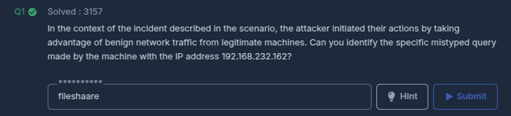

En este laboratorio de **[CyberDefenders](https://cyberdefenders.org/blueteam-ctf-challenges/poisonedcredentials/)**, se simuló un incidente de seguridad de red relacionado con credenciales envenenadas, donde los atacantes explotaron vulnerabilidades en los protocolos Link-Local Multicast Name Resolution (LLMNR) y NetBIOS Name Service (NBT-NS). Estos protocolos, diseñados para la resolución de nombres en redes locales, son vulnerables por su dependencia de consultas de difusión y la falta de autenticación robusta, lo que permite a los ciberdelincuentes realizar ataques man-in-the-middle, redirigir el tráfico y robar credenciales.

El escenario comenzó con una actividad sospechosa detectada por el equipo de seguridad, lo que llevó a un análisis con Wireshark para identificar el ataque. A lo largo del laboratorio, se investigaron aspectos clave del ataque, como la identificación de consultas envenenadas, el seguimiento de la IP del atacante y el análisis de intentos de autenticación SMB.

~~~
Platform: CyberDefenders
Level: Easy
Type: SOC, Network Forensics
~~~

### Lab Scenario

> El equipo de seguridad de su organización ha detectado un aumento en la actividad sospechosa de la red. Existen preocupaciones de que puedan estar ocurriendo ataques de envenenamiento LLMNR (Link-Local Multicast Name Resolution) y NBT-NS (NetBIOS Name Service) dentro de su red. Se sabe que estos ataques explotan dichos protocolos para interceptar el tráfico de la red y potencialmente comprometer las credenciales de usuario. Su tarea es investigar los registros de la red y examinar el tráfico capturado.

### Key Information

**`LLMNR (Link-Local Multicast Name Resolution)`** es un protocolo de resolución de nombres en redes locales que permite la resolución de nombres sin depender de un servidor DNS centralizado. Sin embargo, debido a su falta de mecanismos de autenticación robustos, **LLMNR** es susceptible a ataques de **envenenamiento de LLMNR**, donde un atacante puede interceptar las solicitudes de resolución de nombres y responder con información falsa. Este tipo de ataque suele realizarse utilizando herramientas como **Responder**, que engañan a los dispositivos de la red para que envíen credenciales (como hashes NTLMv2 o NTLMv1) al atacante en lugar de al servidor legítimo. Al robar estas credenciales, el atacante puede obtener acceso no autorizado a la red.

De manera similar, **`NBNS (NetBIOS Name Service)`** es un protocolo utilizado en redes locales para la resolución de nombres NetBIOS, permitiendo que los dispositivos se identifiquen y se comuniquen utilizando nombres legibles en lugar de direcciones IP. Al igual que **LLMNR**, **NBNS** carece de autenticación adecuada, lo que lo convierte en un objetivo fácil para ataques de **envenenamiento de NBNS**. En este tipo de ataque, el atacante responde a las solicitudes de resolución de nombres con información falsa, suplantando al servidor legítimo y redirigiendo el tráfico hacia su propio dispositivo. Esto permite que el atacante capture credenciales de usuario o realice ataques de **man-in-the-middle** para interceptar comunicaciones y robar datos sensibles.

Ambos protocolos, al no contar con mecanismos de autenticación robustos, son vulnerables a estos ataques de envenenamiento, en los que los atacantes pueden capturar o manipular credenciales y obtener acceso a recursos sensibles dentro de la red local.

### Analysis

Utilizando la herramienta **Wireshark** analizamos el tráfico de red capturado en el archivo **`PCAP`**

#### Task #1

> In the context of the incident described in the scenario, the attacker initiated their actions by taking advantage of benign network traffic from legitimate machines. Can you identify the specific mistyped query made by the machine with the IP address 192.168.232.162?

Para identificar la máquina del atacante necesitamos analizar la consulta mal escrita que fue transmitida por la máquina victima con la dirección IP **`192.168.232.162`**. Para esto, se utiliza el filtro de **Wireshark** **`ip.src == 192.168.232.162`** con el fin de analizar únicamente los paquetes de red enviados por tal dirección IP.

La consulta realizada por la máquina con la dirección IP **`192.168.232.162`** involucró el nombre mal escrito **`FILESHAARE<20>`**. Esta misma se observa en la solicitud **`NetBIOS Name Service (NBNS)`**. La solicitud es una transmisión, indicada por la dirección IP de destino **`192.168.235.255`**, que muestra la máquina que intenta resolver el nombre para **`FILESHAARE`** en la red. La consulta mal escrita probablemente activó la secuencia de eventos que permiten al atacante responder maliciosamente.

#### Task #2

> We are investigating a network security incident. To conduct a thorough investigation, We need to determine the IP address of the rogue machine. What is the IP address of the machine acting as the rogue entity?

Para identificar la dirección IP de la máquina atacante es necesario analizar la respuesta a la consulta mal escrita que fue transmitida por la máquina víctima con la dirección IP **`192.168.232.162`**. Se aplica el filtro de **Wireshark** **`ip.dst == 192.168.232.162`** con el fin de observar únicamente los paquetes recibidos por tal dirección IP.

Esta respuesta pretende resolver la consulta mal escrita **`FILESHAARE<20>`**, lo que indica que la máquina con la dirección IP **`192.168.232.215`** está tratando de hacerse pasar por el host legítimo falsificando su identidad y respondiendo a la consulta de transmisión. 

Esta misma sugiere que la máquina atacante explota la falta de autenticación en el protocolo **`NBNS`**, al responder a la consulta de transmisión de la víctima con una respuesta manipulada, la máquina del atacante intenta redirigir el tráfico o obtener credenciales. Este comportamiento es caracteristico de un atacante que conduce un **`Poisoning Attack LLMNR o NBT-NS`**

#### Task #3 

> As part of our investigation, identifying all affected machines is essential. What is the IP address of the second machine that received poisoned responses from the rogue machine?

Para identificar la dirección IP de segunda máquina que fue envenenada es necesario aplicar el filtro **`nbns.addr == 192.168.232.215`** el cual aplicado en Wireshark aísla todo el tráfico **`NetBIOS Name Service (NBNS)`** que involucra a la máquina atacante

Por lo visto, la segunda máquina que recibió una respuesta envenenada de la máquina atacante tiene la dirección IP de destino **`192.168.232.176`**. 

#### Task #4 

> We suspect that user accounts may have been compromised. To assess this, we must determine the username associated with the compromised account. What is the username of the account that the attacker compromised?

Para determinar el nombre del usuario comprometido se utilizó el filtro de **Wireshark** **`ip.dst == 192.168.232.215`** con el objetivo de analizar todo el tráfico de red dirigido a la dirección IP de la máquina atacante. Esto permite enfocarse específicamente en las interacciones entre la máquina atacante y otros sistemas en la red, lo que ayuda a rastrear cualquier actividad maliciosa que implique la intercepción de credenciales.

El **`Server Message Block (SMB)`** el protocolo es fundamental en este análisis. `SMB` facilita el intercambio de archivos, el acceso a recursos de red y la autenticación en entornos de Windows. Es ampliamente utilizado, pero también explotado con frecuencia por los atacantes debido a su integración con **`NTLM (NT LAN Manager)`**. En este caso, la máquina atacante aprovecha el **poisoning attack** para manipular las comunicaciones **SMB**, interceptando datos confidenciales como nombres de usuario e intentos de autenticación.

 Es posible observar un **`SMB2 Session Setup Response`** de la máquina atacante. El código de estado **`STATUS_MORE_PROCESSING_REQUIRED`** indica que el proceso de autenticación **NTLM** está en progreso. Dentro de la carga útil de este paquete, el **`NTLMSSP (NT LAN Manager Security Support Provider)`** el protocolo proporciona detalles sobre la sesión. Específicamente, la respuesta de configuración de sesión contiene el nombre de usuario **`janesmith`**, que es visible en la información decodificada del paquete. Este nombre de usuario está asociado con la cuenta que el atacante ha comprometido, ya que fue interceptado por la máquina atacante. El dominio **`cybercactus.local`** y el anfitrión **`WORKSTATION`** confirman aún más el origen de las credenciales, completando la evidencia de la máquina comprometida.

#### Task #5 

> **As part of our investigation, we aim to understand the extent of the attacker's activities. What is the hostname of the machine that the attacker accessed via SMB?**

Para determinar el hostname de la máquina que el atacante accedió via **SMB** se analizó el tráfico de destino a la dirección IP del atacante filtrando por el protocolo **SMB2** en **Wireshark** **`ip.dst == 192.168.232.215 && smb2`**

Es posible observar un paquete **Session Setup Response** (respuesta de configuración de sesión) que incluye un **NTLMSSP (NT LAN Manager Security Support Provider)** **Challenge** el cual es parte del proceso de autenticación de **NTLM**. Este paquete proporciona información crítica sobre el sistema de destino involucrado en la comunicación. Dentro de los detalles del paquete, el campo **`Target Info`** revela los atributos del sistema. Específicamente, el **`DNS computer name`** aparece como **`AccountingPC.cybercactus.local`**. Esto indica que el nombre de host de la máquina a la que se accede a través de SMB es `AccountingPC` dentro del dominio **`cybercactus.local`**.

Esta información confirma que el atacante accedió a la máquina nombrada **`AccountingPC`** usando el protocolo **`SMB`**. El **`NTLMSSP Challenge`** destaca que se intentó la autenticación, probablemente como parte de los esfuerzos de la máquina atacante para establecer el acceso no autorizado.

**[Verify Achievment]()**

