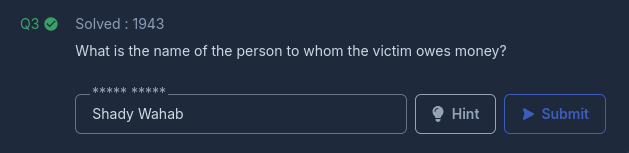

---
title: TheCrime - CyberDefenders
published: 2025-02-28
description: 'Nos enfrentamos a la investigación de un asesinato donde el teléfono de la víctima es una pieza clave de evidencia. Con la ayuda de ALEAPP (Android Logs Events and Protobuf Parser), analizaremos registros de actividad, historial de ubicaciones y otros artefactos digitales extraídos del dispositivo. Nuestro objetivo es reconstruir la secuencia de eventos previos al crimen, identificando pistas que nos permitan esclarecer los hechos y descubrir la verdad detrás del caso.'
image: '../../../assets/CyberDefenders/TheCrime/thecrime-banner-lab.png'
tags: [CyberDefenders, BlueTeam, Endpoint Forensics, DFIR, ALEAPP, Android]
category: 'WriteUp'
draft: false 
---  

En este **[Laboratorio de CyberDefenders](https://cyberdefenders.org/blueteam-ctf-challenges/the-crime/)** enfocado en investigación forense, nos enfrentamos al desafío de resolver un caso de asesinato donde el teléfono de la víctima es la pieza clave de evidencia. Tras entrevistar a testigos y personas cercanas, nuestro objetivo es analizar meticulosamente los datos extraídos del dispositivo para reconstruir la secuencia de eventos previos al crimen.

Para ello, utilizaremos **ALEAPP (Android Logs Events and Protobuf Parser)**, una herramienta forense que nos permitirá clasificar y examinar registros de actividad, historial de ubicaciones y otros artefactos digitales que podrían revelar información crucial. A través de este análisis, seguiremos el rastro de la evidencia digital para esclarecer los hechos y descubrir la verdad detrás del caso. 

~~~
Platform: CyberDefenders
Level: Easy
Type: Endpoint Forensics, DFIR
~~~

### Lab Scenario

> Estamos actualmente en medio de una investigación de asesinato, y hemos obtenido el teléfono de la víctima como pieza clave de evidencia. Después de realizar entrevistas con testigos y personas del círculo íntimo de la víctima, su objetivo es analizar meticulosamente la información que hemos recopilado y rastrear diligentemente la evidencia para reconstruir la secuencia de eventos que condujeron al incidente.

### Analysis

Utilizaremos **[ALEAPP (Android Logs Events and Protobuf Parser)](https://github.com/abrignoni/ALEAPP)**, una herramienta forense que nos permitirá clasificar y examinar registros de actividad, historial de ubicaciones y otros artefactos digitales que podrían revelar información crucial.

Comenzamos especificando la ubicación de la carpeta de origen que deseamos analizar. En este caso, la carpeta es **`data/`**. A continuación, definimos la carpeta de destino donde se generarán los resultados del análisis.

Una vez configuradas las rutas, hacemos clic en el botón **`Process`** para iniciar el análisis.

Al finalizar el proceso, confirmamos con el botón **`OK`**. Esto nos dirigirá al resumen del informe, donde podremos examinar los hallazgos obtenidos.

#### Task #1 

> Según los relatos de los testigos y personas cercanas a la víctima, ha quedado claro que la víctima estaba interesada en el trading. Esto lo llevó a invertir todo su dinero y contraer deudas. ¿Puedes identificar el SHA256 de la aplicación de trading que la víctima utilizaba principalmente en su teléfono?

Para identificar el **SHA-256** de la aplicación de trading que la victima utilizaba nos dirigimos a la sección **`Installed Apps (GMS) for user 0`** notamos que la app es **`Olymptrade`** y es posible observar su **SHA-256 Hash**

#### Task #2 

> Según el testimonio del mejor amigo de la víctima, dijo: "Mientras estábamos juntos, mi amigo recibió varias llamadas que evitó. Dijo que le debía mucho dinero a la persona que llamaba, pero que no podía pagar ahora". ¿Cuánto le debe la víctima a esta persona?

En la sección **`SMS Messages Report`** es posible extraer información sobre los mensajes de texto (SMS) almacenados en el dispositivo. Notamos un mensaje algo amenazante del número **`+201172137250`** 

Parece ser que la victima debia **`250000`** **EGP** 

#### Task #3 

> ¿Cuál es el nombre de la persona a quien la víctima le debe dinero?

En la sección **`Contacts`** es posible extraer información detallada de los contactos almacenados en el dispositivo de la victima. En particular, se observa el nombre del contacto perteneciente al número de télefono anteriormente mencionado.

El nombre del contacto al que la victima debia mucho dinero es **`Shady Wahab`**

#### Task #4 

> Según la declaración de la familia de la víctima, dijeron que el 20 de septiembre de 2023, salió de su residencia sin informar a nadie de su destino. ¿Dónde se encontraba la víctima en ese momento?

En la sección de **`Recent Activity_0`** es posible ver la ubicación de la victima. Eso debido a que cuando un usuario busca una ubicación en Google Maps o recibe una sugerencia de ubicación, la app puede generar un _snapshot_ o una miniatura de la vista del mapa.

La victima se encontraba en **`The Nile Ritz-Carlton`** el 23 de septiembre de 2023.

#### Task #5 

> El detective continuó su investigación interrogando a la recepcionista del hotel. Ella le informó que la víctima había reservado la habitación por 10 días y tenía un vuelo programado después. El investigador cree que la víctima pudo haber guardado la información de su boleto en su teléfono. Busca a dónde tenía la intención de viajar la víctima.

Para encontrar el boleto de la victima investigamos la carpeta **`data/media/0/`**. Esta ubicación es básicamente el almacenamiento interno accesible al usuario. Aquí se encuentran archivos como imágenes, documentos, descargas y datos de aplicaciones.

El boleto de la victima se encuentra en **`data/media/0/Download/`**   

La victima tenía como objetivo tomar un vuelo del **Cairo** con destino hacia **`Las Vegas`**

#### Task #6 

> Después de examinar las conversaciones de Discord de la víctima, descubrimos que había acordado reunirse con un amigo en un lugar específico. ¿Puedes determinar dónde se suponía que tendría lugar esta reunión?

En la sección **`Discord Chats`**, se observa que la víctima mantuvo conversaciones con un usuario identificado como **rob1ns0n**.

Según los mensajes, parece que ambos planeaban encontrarse en **`The Mob Museum`** tras la llegada de su vuelo.

**[Verify Achievment](https://cyberdefenders.org/blueteam-ctf-challenges/progress/Yw4rf/138/)** 

