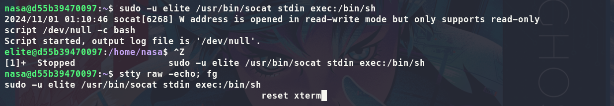

## Introduction

**[DockerLabs](https://dockerlabs.es/)** es una plataforma dedicada a la práctica del hacking ético. En esta ocasión nos encontramos ante una máquina vulnerable con los puertos 80/HTTP y 22/SSH abiertos. Realizaremos un ataque de fuerza bruta al SSH con un diccionario personalizado utilizando las pistas dadas por la página y un JWT (JSON Web Token). Escalaremos privilegios inicialmente de manera horizontal y finalmente de manera vertical aprovechando los binarios sin contraseña: /usr/bin/socat y /usr/bin/chown.

~~~
Platform: DockerLabs
Level: Easy
OS: Linux
~~~

## Reconnaissance

~~~
Target IP: 172.17.0.2
~~~

Inicialmente, usamos el comando **Ping**. Este utiliza el **ICMP (Protocolo de Control de Mensajes de Internet)**. **Ping** envía un mensaje de “echo request” a una **dirección IP** y espera recibir un mensaje de “echo response” en respuesta. Este proceso nos permite verificar si una máquina en la red es accesible y medir la latencia. Podemos inferir que es una máquina **Linux** debido a que el **ttl = 64**

## Scanning

Como vemos, el paquete fue recibido por la máquina victima. Una vez verificada la conexión, empezamos a realizar un escaneo de multiples etapas con la herramienta **Nmap**. Primero, haremos un escaneo de puertos abiertos.

Vemos que tenemos los puertos **22/SSH** y **80/HTTP** Procedemos a hacer un escaneo más detallado de los mismos con el fin de obtener más información. Esto lo haremos con la flag `-sCV`

## Enumeration

**22/SSH** El puerto 22 ejecuta el servicio SSH versión **OpenSSH 9.6p1**. De momento no tenemos ninguna vulnerabilidad que aprovechar para esta versión.

**80/HTTP** El puerto 80 ejecuta un servidor web **Apache/2.4.58**. El título de la web es "**NASA Hackeada**" y por lo visto, es accesible. Haremos uso de **whatweb** para obtener más información acerca del sitio web.

No obtenemos más información de la que ya sabíamos anteriormente. El **200 OK** nos indica que la web es accesible asi que procedemos a ingresar:

El sitio web parece tener que ver con Astronomía, más específicamente acerca de la **Nasa**. Notamos que en el centro de la página se nos pregunta: **¿Qué astrónomo alemán descubrió Neptuno?** Al buscarlo:

Tal parece: **Johann Gottfried Galle** descubrió **Neptuno**

Las secciones no llevan a ningún lado. Al indagar dentro del código fuente de la página tampoco encontramos mucho:

Procedemos a hacer **Fuzzing web** con **Gobuster**, esto consiste en realizar un escaneo a través de diferentes rutas o directorios aleatorios a una apliación web con el objetivo de encontrar archivos o directorios ocultos. 

Encontramos el subdirectorio **/universe**, al ingresar notamos que es una imagen de un universo. 

Al inspeccionar dentro del código fuente notamos al final del mismo un **JWT (JSON Web Token)** "un estándar abierto (RFC7519) que define un modo ​compacto y ​autocontenido ​para transmitir información segura entre distintas partes utilizando objetos JSON" [Fuente](https://auth0.com/es/learn/json-web-tokens)

## Exploitation

Al usar **[CyberChef](https://gchq.github.io/CyberChef/)** para decodificar el **JWT (JSON Web Token) ** nos devuelvo los objetos JSON:

~~~JSON
{
"sub": "1234567890",
"user": "neptuno",
"iat": "1516239022" 
}
~~~

El que más nos llama la atención es el objeto JSON que indica el usuario: **neptuno** 

Ahora que tenemos un posible usuario: **neptuno** antes de intentar un ataque con un diccionario ya establecido podriamos usar los nombres y el apellido de la persona que descrubrió Neptuno: **Johann Gottfried Galle** como posibles contraseñas (Ya que por alguna razón nos lo habrán preguntado al inicio). 

Crearemos un archivo **possiblePasswords.txt** con el siguiente contenido: 

A la hora de realizar el **ataque de fuerza bruta** con **Hydra** nos informa el ataque fue efectivo y que el usuario: **neptuno** tiene la contraseña: **Gottfried**

 Ingresamos al servicio **SSH** del usuario **neptuno** correctamente

## Privilege Escalation

En el directorio actual observamos un archivo oculto llamado **.carta_a_la_NASA** al abrir el archivo notamos cosas interesantes: El tema central del texto es la **NASA** y tenemos un nombre **Eisenhower**

De momento, intentamos escalar privilegios pero no tenemos exito: 

Vuelvo pasos atras y tomo los datos **NASA** y **Eisenhower** como usuario y contraseña para intentar acceder por **SSH**

Ingresamos con exito con el usuario: **nasa** y la contraseña: **Eisenhower** por **SSH**

Al intentar escalar privilegios procedo a ejecutar `sudo -l` para listar los permisos **sudo** del usuario actual y como vemos nos indica que el usuario **elite** puede ejecutar el siguiente comando como super usuario sin la necesidad de contraseña: `(elite) NOPASSWD: /usr/bin/socat`

En **[GTFObins](https://gtfobins.github.io/)** nos indica que podemos utilizar el comando `sudo socat stdin exec:/bin/bash`

Para ejecutarlo como el usuario **elite** hay que modificarlo un poco: `sudo -u elite /usr/bin/socat stdin exec:/bin/bash`

Antes que nada procedo a realizar el **tratamiento de la tty** con el objetivo de evitar problemas innecesarios a la hora de ejecutar comandos:

Como ahora somos el usuario **elite** procedemos nuevamente a listar los permisos **sudo** del usuario actual con `sudo -l` y como vemos nos indica que el usuario **root** puede ejecutar el siguiente comando como super usuario sin la necesidad de contraseña: `(root) NOPASSWD: /usr/bin/chown ` este es un binario que cambia el propietario y el grupo propietario de un archivo o directorio en específico.

Procedemos a realizar un bypass de contraseña explotando el binario `chown` con el objetivo de modificar el archivo `etc/passwd` y eliminar la `x`, la misma es una indicación de que la contraseña de `root` está almacenada en el archivo `/etc/shadow`. Al eliminar la `x` en la entrada de `root` en `/etc/passwd`, se está indicando que la contraseña del usuario `root` no está en `/etc/shadow` lo que nos permite escalar privilegios sin necesidad de una contraseña para acceder a `root` 

Como no tenemos un editor de texto en la máquina victima, desde la máquina atacante creo un archivo y pego el `etc/passwd` de la victima y elimino la `x`
 

Con `sudo chown elite:elite /etc/passwd` cambio los permisos de propiedad del archivo `/etc/passwd` al usuario **elite** lo que nos permite realizar cambios en el `/etc/passwd`. Procedemos con `echo '{el contenido /etc/passwd modificado sin la x}' > /etc/passwd` a sobreescribir el contenido archivo con el `/etc/passwd` sin la `x` en una cadena de texto literal

Al ejecutar ahora `su root` deberiamos poder ingresar sin la necesidad de una contraseña como usuario **root**

Al tener privilegios maximos hemos finalizado la máquina y por ende el reto.

---

Aún asi el creador nos dejó en el directorio raíz un archivo ejecutable `PRUEBA_DE_ACCESO_A_NASA.sh` al parecer es un cuestionario sobre la máquina ya finalizada.

¿Pudiste entrar a la NASA? Gracias también Mario por la plataforma <3

 