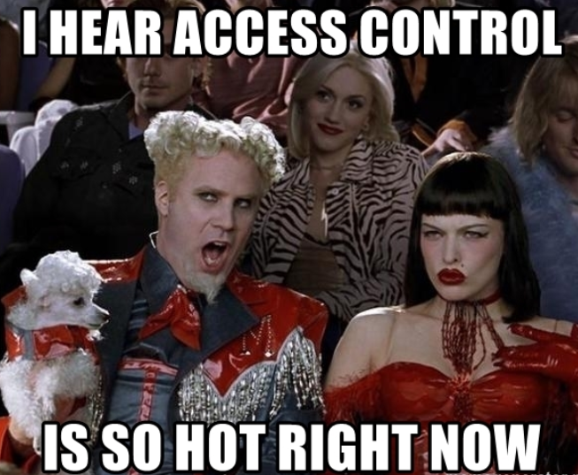
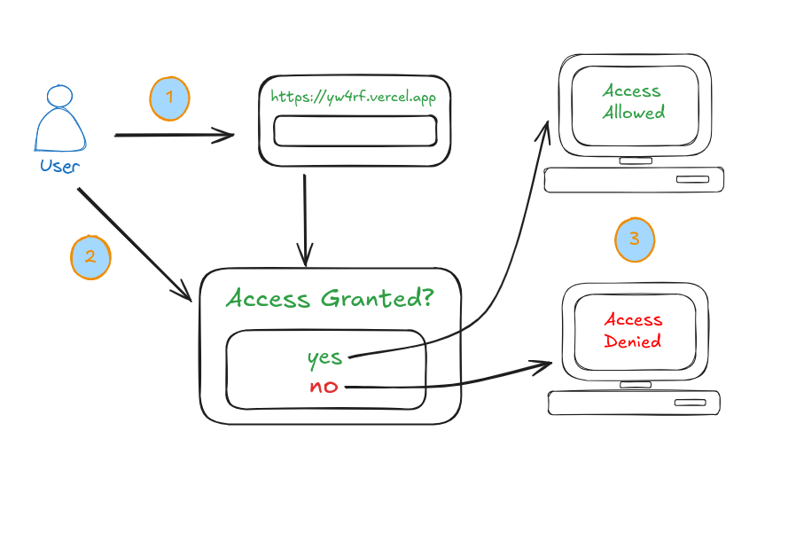
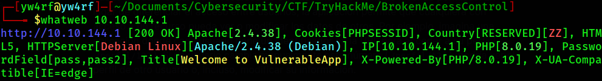
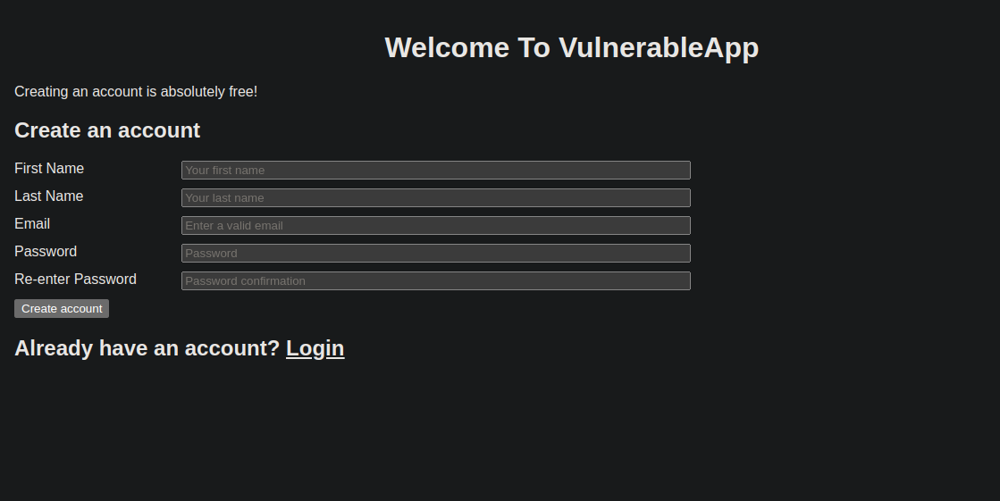
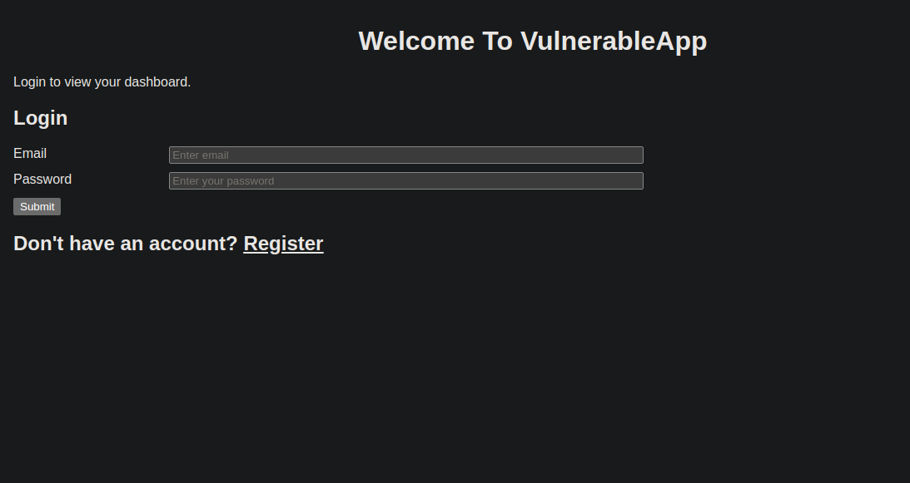
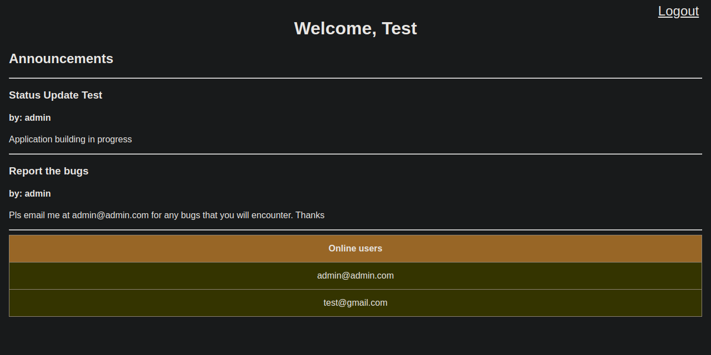
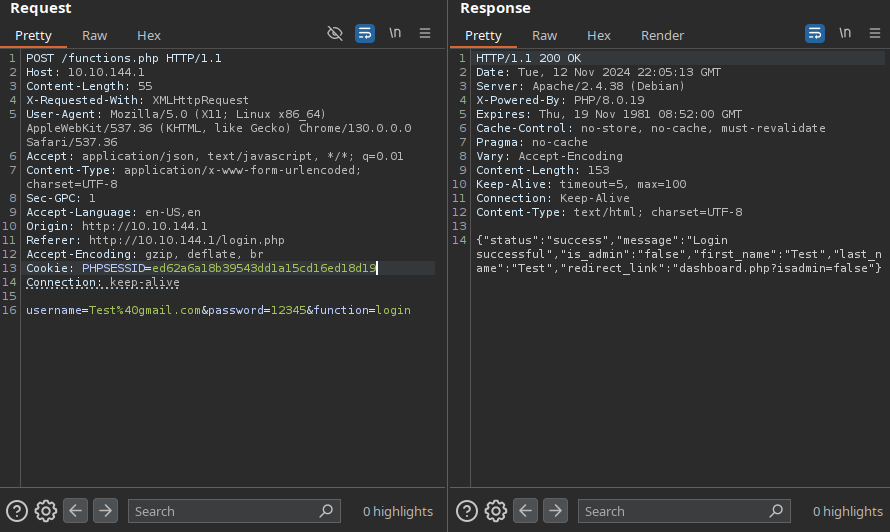
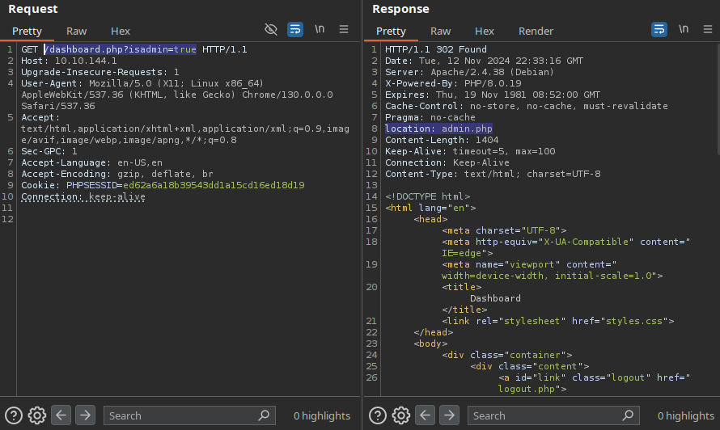
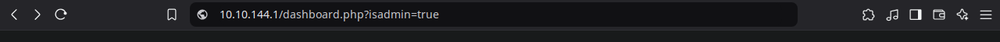
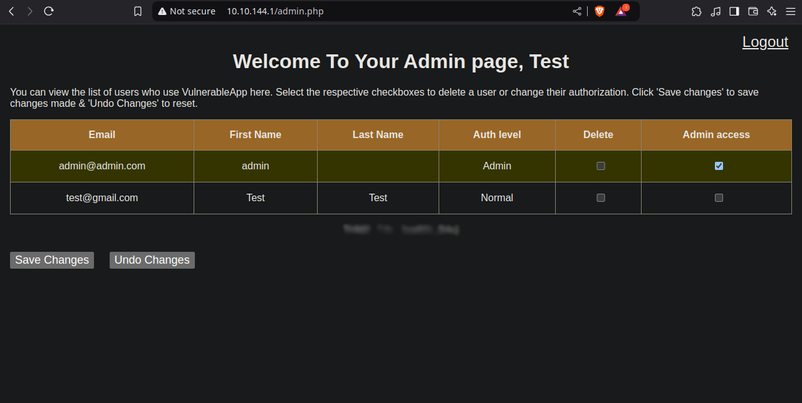

## ¿Qué es Access Control?

El control de acceso es un conjunto de políticas y configuraciones que aseguran que cada usuario pueda acceder solo a los recursos y funcionalidades que tiene autorizados. Por ejemplo, un usuario registrado en una aplicación de redes sociales puede ver su propio perfil, pero no el perfil privado de otro usuario sin permiso. Cuando este control de acceso falla se le conoce como **Broken Access Control**.

## Broken Access Control

**Broken Access Control** es una falla de seguridad que permite a usuarios realizar acciones o acceder a datos que deberían estar restringidos. Las fallas generalmente conducen a la divulgación de información no autorizada, la modificación o la destrucción de todos los datos o la ejecución de una función de negocio fuera de los límites del usuario.

## ¿Qué se necesita para que suceda Broken Access Control?

Para que exista un control de acceso en una aplicación, suelen utilizarse varios elementos que determinan la identidad y permisos de un usuario:

**Autenticación**: Es el proceso mediante el cual un usuario demuestra su identidad, generalmente a través de un nombre de usuario y una contraseña. La autenticación es la base para establecer quién es el usuario y qué permisos debería tener.
    
**Sesiones y Cookies**: Después de autenticarse, una aplicación crea una sesión para el usuario, que guarda información temporal (como un identificador de sesión) para recordar quién es durante su interacción con la aplicación. Las cookies en el navegador guardan esta información y se envían automáticamente con cada solicitud.
    
**Tokens de Acceso**: En sistemas más avanzados, como las APIs, se utilizan tokens de acceso (por ejemplo, JWTs o JSON Web Tokens) que representan la identidad del usuario y contienen sus permisos. Estos tokens deben ser verificados en cada solicitud.

Para que ocurra un fallo de Broken Access Control, la aplicación debe fallar en alguna de las siguientes áreas:

- No verificar adecuadamente la autenticación.
- No comprobar o malinterpretar los permisos (es decir, confundir roles o ignorar los permisos asignados).
- Exponer directamente recursos que no deberían ser accesibles para ciertos usuarios.

## ¿Por qué sucede Broken Access Control?

La vulnerabilidad puede ser causada por errores como:

**Falta de Verificación de Permisos**: La aplicación no revisa adecuadamente si un usuario tiene acceso a cierto recurso o acción.

**Errores de Configuración de Seguridad**: Los desarrolladores pueden dejar permisos predeterminados en sus configuraciones, lo cual permite el acceso a todos los usuarios.

**Confiar Solo en el Lado del Cliente**: A veces, se confía en el control de acceso del lado del cliente, permitiendo que los usuarios maliciosos manipulen la aplicación en el navegador para acceder a recursos restringidos.

## Vulnerabilidades de Broken Access Control

**[Insecure Direct Object Reference (IDOR)](https://yw4rf.vercel.app/posts/ethical-hacking/IDOR)**: es una vulnerabilidad donde el atacante cambia identificadores en los parámetros (por ejemplo, IDs en URLs o formularios) para acceder a recursos de otros usuarios. Sin una validación adecuada, esto puede exponer información privada o permitir modificaciones no autorizadas. Por ejemplo, si la URL `/order/1024` muestra los detalles de un pedido y no se verifica que el usuario es dueño de ese pedido, un atacante podría manipular el ID para ver otros pedidos, como `/order/1025`.

**Autenticación Bypass**: El Bypass de Autenticación ocurre cuando un usuario no autenticado logra eludir el proceso de autenticación para acceder a recursos protegidos o realizar acciones restringidas. Por ejemplo, si una aplicación solo verifica el token de sesión en algunas rutas y no en todas las que deberían estar protegidas, un atacante podría acceder directamente a estas rutas sin autenticarse. Esto es común en aplicaciones mal configuradas donde las rutas sensibles no están protegidas adecuadamente.

**Vertical Broken Access Control**: Este tipo vulnerabilidad permite que un usuario con un nivel de privilegio bajo (como un usuario estándar) ejecute acciones o acceda a recursos que deberían estar restringidos a roles más privilegiados (como un administrador). Por ejemplo, en un sistema de administración, si un usuario normal puede acceder a funciones administrativas cambiando la URL o enviando una solicitud específica, podría realizar acciones como eliminar usuarios, ver información confidencial o modificar configuraciones de la aplicación.

**Horizontal Broken Access Control**: Este tipo de vulnerabilidad ocurre cuando un usuario puede acceder o manipular recursos de otro usuario con el mismo nivel de permisos. En lugar de diferenciar el acceso entre usuarios, la aplicación permite que cualquiera con acceso a un recurso pueda ver o modificar los datos de otros. Por ejemplo, imagina una aplicación donde cada usuario tiene un identificador en la URL para acceder a su perfil (`/perfil/123`). Si un usuario cambia manualmente este número (`/perfil/124`), podría ver el perfil de otro usuario o, incluso, modificar su información.

## POC (Proof Of Concept)

La aplicación web vulnerable que realizaremos pertenece a la plataforma de [TryHackMe](https://tryhackme.com/r/room/owaspbrokenaccesscontrol) cuenta con un Panel de control, Inicio de sesión y Formulario de registro que permite a los usuarios acceder al panel de control del sitio web. 

`Target IP: 10.10.144.1`

Al realizar **whatweb** notamos que el sistema operativo que ejecuta es **Debian Linux**, que utiliza **PHP/8.0.19** y el servidor web es **Apache/2.4.38** al ingresar al sitio web nos encontramos con:

Panel de Registro: Se encuentra en `/index.php` procedo a registrarme utilizando un correo inexistente

Panel de Login: Procedo a ingresar a `/login.php` con las credenciales de prueba registradas anteriormente 

Panel de Control: Notamos que al ingresar nos redirige a `/dashboard.php` como el usuario registrado y nos encontramos con que hay un usuario **administrador** con el correo `admin@admin.com` online

Procedemos a capturar el trafico HTTP con la herramienta **Burpsuite**: Al mandar la petición notamos que ejecuta el [[método POST]] a `/functions.php` y por otro lado la respuesta nos devuelve atributos **JSON** que contienen status, message, first_name, last_name, is_admin, y redirect_link que es el que más nos llama la atención `redirect_link:"dashboard.php?isadmin=false` el servidor lo utiliza para redirigir al usuario a `dashboard.php` con el parametro isadmin=false en la URL

Al modificar la petición a `POST /dashboard.php?isadmin=true HTTP/1.1` nos redirige a `/admin.php` por lo que es posible ingresar

Intentamos ingresar con `/dashboard.php?isadmin=true`

Luego de ingresar notamos que efectivamente nos redirige a `admin.php`

Una vez hecho esto tendriamos acceso al panel de administración y permisos suficientes para dar permisos elevados a otros usuarios. 

## ¿Como prevenir Broken Access Control?

**Implementa Role-Based Access Control (RBAC)**: El Control de Acceso Basado en Roles (RBAC) es un método para regular el acceso a recursos informáticos o de red en función de los roles de los usuarios dentro de una organización. Al definir roles en una organización y asignar derechos de acceso a estos roles, puedes controlar qué acciones puede realizar un usuario en un sistema. El fragmento de código proporcionado muestra cómo definir roles (como ‘admin’, ‘editor’ o ‘usuario’) y los permisos asociados a cada uno.

**Usa Parameterized Queries**: Las consultas parametrizadas son una forma de proteger aplicaciones PHP contra ataques de inyección SQL, en los cuales usuarios malintencionados podrían obtener acceso no autorizado a tu base de datos. Al usar marcadores de posición en lugar de incluir directamente la entrada del usuario en la consulta SQL, puedes reducir significativamente el riesgo de ataques de inyección SQL.

**Proper Session Management**: Una gestión adecuada de sesiones garantiza que los usuarios autenticados tengan acceso oportuno y apropiado a los recursos, reduciendo así el riesgo de acceso no autorizado a información sensible. La gestión de sesiones incluye el uso de cookies seguras, la configuración de tiempos de expiración de sesión y la limitación del número de sesiones activas que un usuario puede tener.

**Use Secure Coding Practices**: Las prácticas de codificación segura incluyen métodos para prevenir la introducción de vulnerabilidades de seguridad. Los desarrolladores deben sanitizar y validar la entrada del usuario para evitar que datos maliciosos causen daños, y deben evitar el uso de funciones o bibliotecas inseguras. 

 

>**References:**
>- [A01:2021 Broken Access Control](https://owasp.org/Top10/A01_2021-Broken_Access_Control/)
>- [OWASPtop10 2021](https://owasp.org/Top10/es/)
>- [TryHackMe Owasp Broken Access Control](https://tryhackme.com/r/room/owaspbrokenaccesscontrol)

 