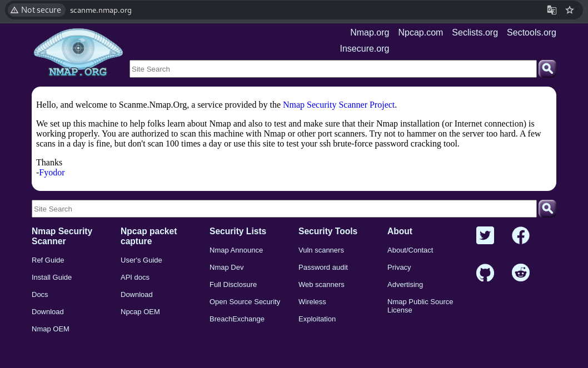
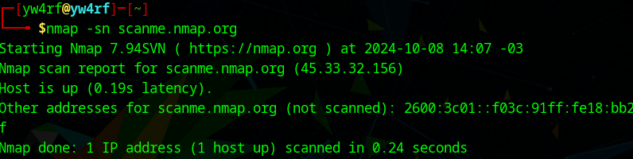
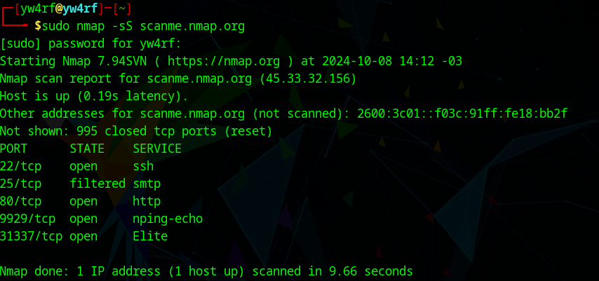
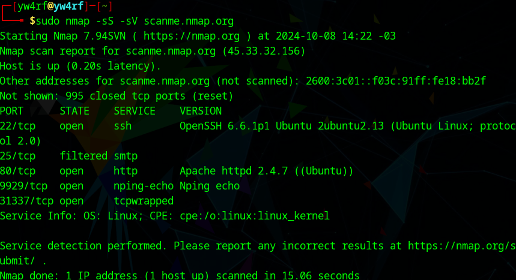
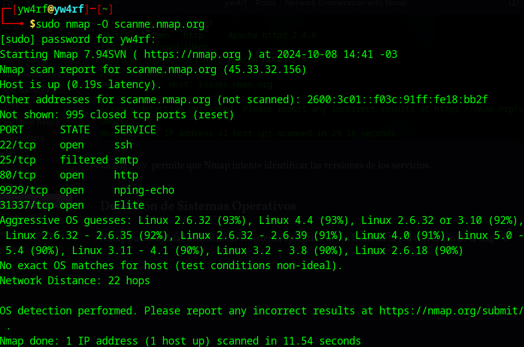
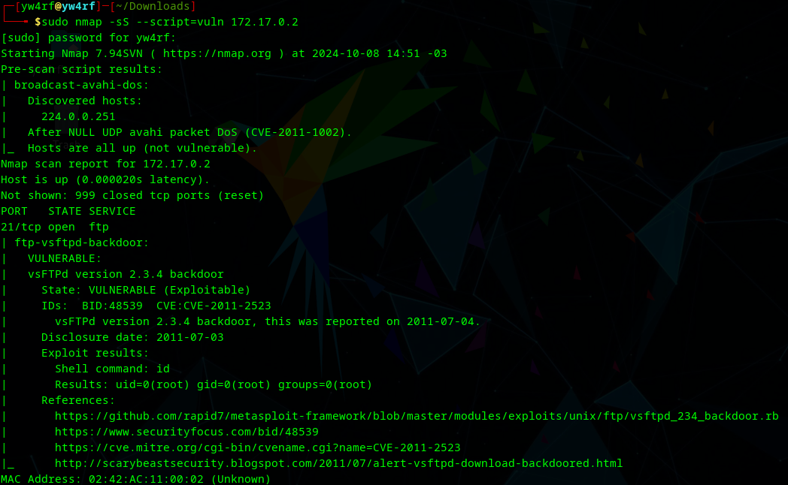

> **Disclaimer:** Este artículo está destinado exclusivamente a fines educativos. Escanear redes sin autorización es ilegal y puede tener consecuencias graves. Asegúrate de obtener el permiso adecuado antes de realizar cualquier tipo de escaneo en una red que no te pertenece. No me hago responsable por el uso indebido del mismo.

## Introducción

La enumeración de redes es un paso crítico en las pruebas de penetración y la seguridad de la red. Una de las herramientas más potentes y versátiles para esta tarea es Nmap (Network Mapper). En este artículo, exploraremos cómo usar Nmap para realizar una enumeración efectiva de redes, descubriendo hosts, servicios y vulnerabilidades.


## ¿Qué es Nmap?


Nmap es una herramienta de código abierto utilizada para explorar redes y realizar auditorías de seguridad. Su capacidad para detectar dispositivos conectados, identificar puertos abiertos y determinar servicios en ejecución la convierte en una herramienta esencial para profesionales de la ciberseguridad.

## Comenzando con Nmap

### Instalación

Nmap está disponible en múltiples plataformas. Puedes instalarlo en sistemas basados en Linux, Windows y macOS. Para instalar en un sistema basado en Debian, usa:

```bash
sudo apt install nmap
```

Haremos uso de **ScanMe Nmap** un sitio web creado y mantenido por el creador de Nmap con el objetivo de escaneos tal como su nombre lo indica. Tenemos la autorización de realizar escaneos y pruebas en la página.



### Descubriendo Hosts

El primer paso en la enumeración de redes es identificar qué hosts están activos. Para ello, usaremos el siguiente comando `nmap -sn scanme.nmap.org` 



Este comando envía paquetes ICMP (ping) y otras solicitudes para determinar si el host responde. Si el host está activo, Nmap mostrará información básica como su dirección IP y, a veces, el nombre del host.

### Escaneo de Puertos

Una vez identificados los hosts activos, el siguiente paso es escanear los puertos abiertos. Se realiza con el siguiente comando `sudo nmap -sS scanme.nmap.org` se utiliza "sudo" ya que requiere privilegios elevados para enviar paquetes RAW.



la flag `-sS` realiza un escaneo SYN, que es menos detectable y más rápido que un escaneo TCP completo. Como vemos, nos indica los **puertos** abiertos, el **estado** de los mismos y que **servicios** ejecutan.

Si en su lugar queremos un escaneo agresivo que de mucha más información es posible usar `-A` Este tipo de escaneo puede ser más lento que un escaneo estándar debido a la cantidad de información que intenta recopilar, adémas que es mucho más fácil de detectar ya que genera más tráfico.

También es posible usar la flag `-p-` que le indica a Nmap que escanee todos los puertos (**1-65535**) Es un escaneo exhaustivo de puertos.  Si en su lugar, quieres escanear unos puertos en específico como por ejémplo los puertos **80/http** y **443/https** se haria esto en su lugar: `-p80,443`

Podriamos acompañarlo de `--open` que le indica que solo muestre los que están abiertos. Es útil para filtrar y solo enfocarse en los servicios que están activos.

### Identificación de Servicios

Para obtener más información sobre los servicios que se están ejecutando en los puertos abiertos, podemos usar  `nmap -sV 192.168.1.10`



La flag `-sV` permite que Nmap intente identificar las versiones de los servicios.

### Detección de Sistemas Operativos

Nmap puede ayudar a identificar el sistema operativo de los hosts en la red con el uso de la flag `-O` 



### Detección de Vulnerabilidades

En este caso, usare una máquina CTF llamada **[FirstHacking](https://yw4rf.vercel.app/posts/dockerlabs/machine-firsthacking/)** de la plataforma **[DockerLabs](https://dockerlabs.es)** la cual está hecha para ser vulnerable.

Usaremos `--script=vuln` para usar el script de detección de vulnerabilidades



Como vemos, detecto que la máquina es vulnerable **vsFTPd version 2.3.4 backdoor** y nos indica el **CVE: CVE-2011-2523**

### Optimización del Escaneo

**Ajustar la Velocidad del Escaneo**: Nmap permite ajustar la velocidad del escaneo usando la flag `-T`, que va de los valores del 0 al 5

- **-T0**: Paranoico (muy lento y sigiloso)
- **-T1**: Muy lento
- **-T2**: Lento (predeterminado)
- **-T3**: Normal
- **-T4**: Rápido
- **-T5**: Insano (muy rápido, alto riesgo de detección)

~~~bash
nmap -T1 -sS <IP>
~~~


**Controlar la Tasa de Paquetes**: Se puede usar la flag `--min-rate` y `--max-rate` para controlar la cantidad de paquetes enviados por segundo. Esto llega a ser útil cuando uno quiere evitar saturar la red o levantar alertas en sistemas IDS.

~~~bash
nmap --min-rate=100 <IP>
~~~


**Hacer Escaneo en Multiples Etapas**:

Se puede realizar un escaneo rapido de puertos para solamente identificar los puertos abiertos y luego hacer un escaneo mas detallado de esos puertos abiertos.

~~~bash
sudo nmap -p- --open -sS <IP>
~~~

Digamos que encontró el puerto 80 y el 443 abiertos.

~~~bash
sudo nmap -p80,443 -sV -sS <IP>
~~~


**Evitar la Resolución DNS y el Descubrimiento de Hosts**:

La flag `-n` le indica a Nmap que no aplique la **Resolucion DNS**, en otras palabras, le dice qué no convierta las direcciones IP en nombres de hosts durante el escaneo.

La flag `-Pn` le indica a Nmap que no realice el **Descubrimiento de Hosts**, asumirá que todos los hosts especificados están activos y procederá a escanear los puertos directamente.

~~~bash
nmap -n -Pn <IP>
~~~


**Verbosidad de salida**: 

La flag `-vvv` le indica a Nmap que nos proporcione la mayor cantidad de información posible a medida que la encuentre durante el escaneo sin tener la necesidad de esperar a que este termine.

~~~bash
nmap -sS -vvv <IP>
~~~


### Evasión de Firewalls y IDS/IPS

**Fragmentación de Paquetes**: Esta técnica implica dividir un escaneo en múltiples fragmentos de paquetes más pequeños. Esto puede dificultar la tarea de los sistemas de detección al no permitirles analizar el tráfico completo de una sola vez.

~~~bash
nmap -f <IP>
~~~

**Uso de Decoys**: La técnica de decoy implica enviar paquetes desde direcciones IP adicionales (falsas) junto con la dirección IP real. Esto confunde al sistema de detección, que puede no estar seguro de cuál IP es la que realmente está realizando el escaneo. `RND:10` generará 10 direcciones IP aleatorias para suplantar la real.

~~~bash
nmap -D RND:10 <IP>
~~~

### Análisis de Resultados y Reportes

Nmap permite exportar los resultados de los escaneos en varios formatos para su posterior analisis

**Formato normal**: Ideal para visualización rápida.

~~~bash
nmap -sn <IP> > resultados.txt
~~~

**Formato XML**: Útil para análisis automatizado y procesamiento por otras herramientas.    

~~~bash
nmap -oX resultados.xml -sn <IP>
~~~
 
 **Formato grepable**: Para análisis más flexible en CLI.    

 ~~~bash
 nmap -oG resultados.gnmap -sn <IP>    
 ~~~
 
 **Formato JSON**: Para integración con otras aplicaciones o análisis en plataformas que admiten JSON. 

~~~bash
nmap -oJ resultados.json -sn <IP>
~~~


## Cheatsheet Nmap

| Comando           | Descripción                      |
| ----------------- | -------------------------------- |
| `nmap -sV <host>` | Escaneo de servicios y versiones |
| `nmap -sS <host>` | Escaneo SYN (stealth)            |
| `nmap -sT <host>` | Escaneo TCP Connect              |
| `nmap -sU <host>` | Escaneo UDP                      |
| `nmap -O <host>`  | Detección del sistema operativo  |

| Comando                                        | Descripción                                             |
| ---------------------------------------------- | ------------------------------------------------------- |
| `nmap -A <host>`                               | Escaneo completo (detección de OS, servicios y scripts) |
| `nmap --script <script_name> <host>`           | Escaneo de scripts específicos                          |
| `nmap --script vuln <host>`                    | Escaneo de scripts de vulnerabilidades                  |
| `nmap -p <port> --script <script_name> <host>` | Escaneo de un puerto específico con script              |

| Comando                       | Descripción                         |
| ----------------------------- | ----------------------------------- |
| `nmap -f <host>`              | Fragmentación de paquetes           |
| `nmap -D RND:10 <host>`       | Uso de decoys (IP suplantadas)      |
| `nmap --scan-delay 1s <host>` | Manipulación del tiempo de escaneo  |
| `nmap -T0 <host>`             | Escaneo más lento (menos detección) |
| `nmap -T5 <host>`             | Escaneo rápido (más detección)      |

| Comando              | Descripción                                   |
| -------------------- | --------------------------------------------- |
| `nmap -sn <network>` | Escaneo de hosts vivos en una red             |
| `nmap -Pn <host>`    | Omite el ping (asume que el host está activo) |
| `nmap -sP <network>` | Escaneo de red para descubrir hosts           |

| Comando                               | Descripción                                     |
|---------------------------------------|-------------------------------------------------|
| `nmap -oN output.txt <host>`         | Guardar resultados en formato texto             |
| `nmap -oX output.xml <host>`         | Guardar resultados en formato XML               |
| `nmap -oG output.gnmap <host>`      | Guardar resultados en formato grepable          |

<br>

> Referencias: [Nmap Official Documentation](https://nmap.org/docs.html)


## Conclusión

Nmap es una herramienta fundamental en la enumeración de redes y auditorías de seguridad, permitiendo identificar hosts, puertos, servicios y vulnerabilidades de manera eficiente. A través de sus diversas opciones y flags, los usuarios pueden personalizar sus escaneos para obtener la información más relevante mientras minimizan el riesgo de detección. El dominar Nmap, te especial permite fortalecer la seguridad de las redes y contribuir a un entorno digital más seguro.


<br>