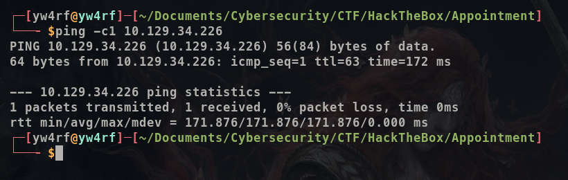
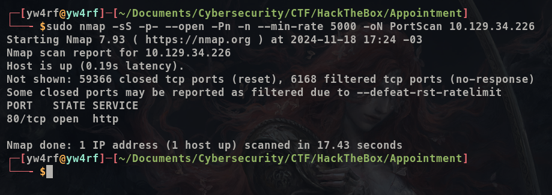
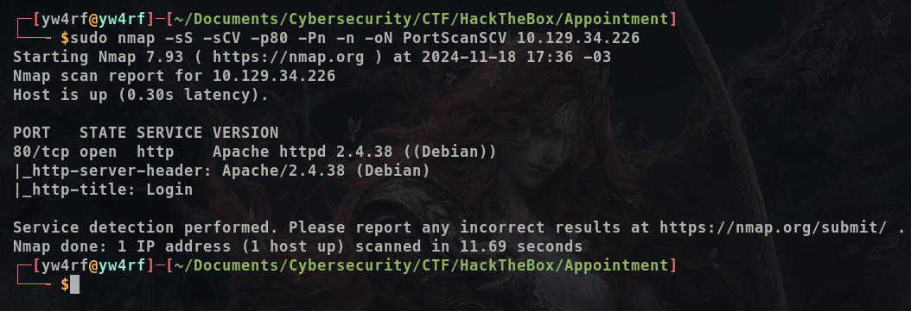
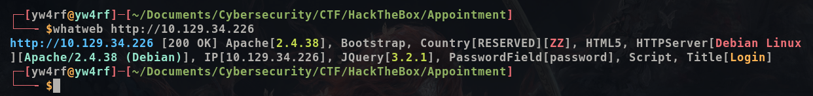
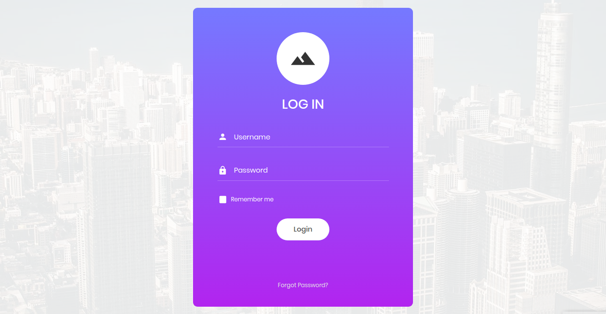
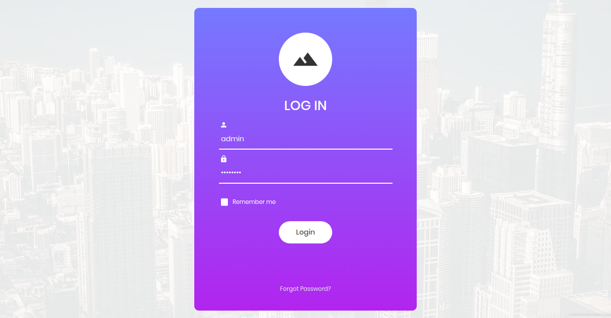
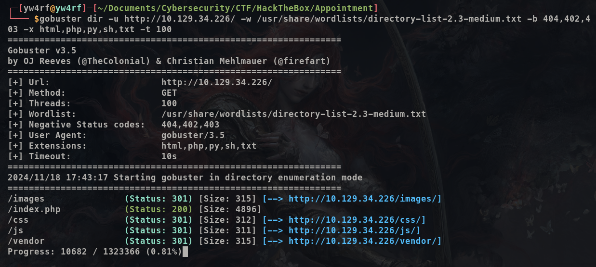
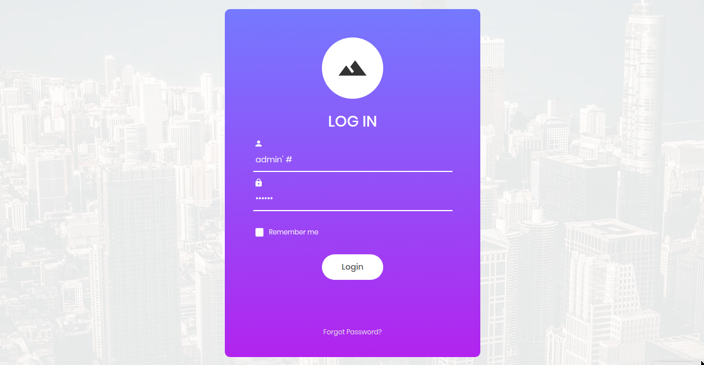
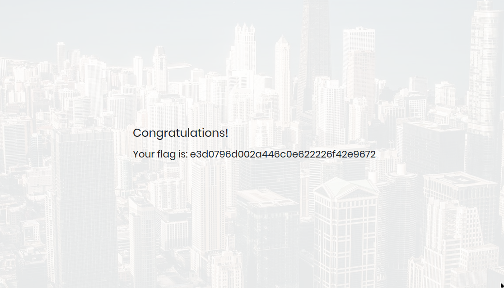

## Introduction

**[HackTheBox](https://app.hackthebox.com/profile/2035837)** es una plataforma diseñada para la práctica de hacking ético. En esta ocasión, abordaremos la máquina Appointment. Nos encontraremos con el 80/HTTP y realizaremos Auth Bypass mediante SQLi (SQL Injection) lo que nos permitirá ingresar como admin sin contraseña y encontrar la flag.

~~~
Platform: HackTheBox
Level: Very Easy
OS: Linux
~~~

## Reconnaissance

~~~
Target: 10.129.34.226
~~~

Comenzamos con el comando **ping**, que utiliza el **ICMP (Protocolo de Control de Mensajes de Internet)**. Este comando envía un mensaje de "echo request" a una dirección IP y espera recibir un mensaje de "echo response". Este proceso permite verificar si una máquina en la red es accesible y medir la latencia. Además, se puede inferir que es una máquina **Linux** debido al **TTL = 63**.

## Scanning 

Como vemos, el paquete fue recibido por la máquina víctima. Una vez verificada la conexión, empezamos a realizar un escaneo de múltiples etapas con la herramienta **Nmap**. Primero, haremos un escaneo de puertos abiertos.

Vemos que tenemos el puerto **80/HTTP** Procedemos a hacer un escaneo más detallado de los mismos con el fin de obtener más información. Esto lo haremos con la flag `-sCV`

## Enumeration

**80/HTTP** El puerto 80 ejecuta un servidor web **Apache httpd 2.4.38 (Debian)**. Haremos uso de **whatweb** para obtener más información acerca del sitio web.

Observamos que el sitio web es accesible, vemos que utiliza **Bootstrap** y **JQuery 3.2.1**. No obtenemos mucha informacion relevante, el sitio parece ser un **panel de autenticación**. Al ingresar notamos que no hay mucho que ver más que eso.

 Procedemos a probar suerte e intentamos ingresar con **credenciales debiles**: 

~~~~
admin:admin
guest:guest
user:user
root:root
administrator:administrator
~~~~

Al no tener los resultados esperados procedemos a realizar **enumeración de directorios** con **Gobuster**

Notamos que el sitio se ejecuta en **PHP** y no mucho más que eso asi que volvemos nuevamente al **panel de autenticación**. 

## Exploitation

El siguiente paso seria intentar realizar un **ataque de fuerza bruta** con una herramienta como **Hydra** pero sin credenciales nos llevaria demasiado tiempo y no seria muy eficiente por lo que procedemos a intentar explotar **SQL Injection** utilizando como usuario credenciales debiles.

> **SQL Injection**: Una inyección de SQL, a veces abreviada como SQLi, es un tipo de vulnerabilidad en la que un atacante usa un trozo de código SQL (lenguaje de consulta estructurado) para manipular una base de datos y acceder a información potencialmente valiosa. Es uno de los tipos de ataques más frecuentes y amenazadores, ya que puede atacar prácticamente cualquier sitio o aplicación web que use una base de datos basada en SQL (la mayoría). **[Fuente](https://latam.kaspersky.com/resource-center/definitions/sql-injection)**

Podriamos intentar realizar un **Bypass de Autenticación**. Tenemos conocimiento de que el sitio web ejecuta **PHP**. Este lenguaje ha sido históricamente vulnerable a inyecciones SQL debido a cómo se manejaban las consultas SQL en versiones antiguas, especialmente con la extensión `mysql_*`, que permitía construir y ejecutar consultas SQL concatenando directamente las entradas del usuario sin ningún tipo de protección. 

Los comentarios en **PHP** se realizan de dos maneras: con las **//** para ignorar todo el texto seguido de las barras diagonales o **#** para ignorar toda la linea del texto seguido de la almohadilla

 Hipoteticamente al ingresar `admin'#` la consulta SQL se veria algo asi:

~~~SQL
SELECT * FROM users WHERE username='admin'#' AND password='cualquiercosa'
~~~

SQL intenta seleccionar todos los registros de la tabla **users** donde el username es `admin` y la contraseña `cualquiercosa`. Lo que sucede al añadir la **#** es que al tratarse de un comentario todo lo que le sigue es ignorado y por lo tanto `AND password='123'` se ignora por completo por lo que la consulta que realmente se ejecuta es: 

~~~SQL
SELECT * FROM users WHERE username='admin';
~~~

Por lo que es posible hacer un Bypass de Autenticación.

Luego de ingresar el **Payload** notamos que ingresamos correctamente por lo que si era vulnerable a **SQLi**

Una vez con la flag hemos finalizado la máquina y por ende hemos terminado.