## Introduction

**[HackTheBox](https://app.hackthebox.com)** es una plataforma para practicar hacking ético. En este writeup resolveremos la máquina Crocodile, explorando vulnerabilidades como **Anonymous FTP login allowed** en el servicio FTP y un sitio web HTTP con directorios ocultos. Usaremos herramientas clave como **Nmap** y **Gobuster**, aplicando técnicas básicas de pentesting en sistemas Linux.

~~~
Platform: HackTheBox
Level: VeryEasy
OS: Linux
~~~

## Reconnaissance

~~~
Target IP: 10.129.169.55
~~~

Comenzamos con el comando **ping**, que utiliza el **ICMP (Protocolo de Control de Mensajes de Internet)**. Este comando envía un mensaje de "echo request" a una dirección IP y espera recibir un mensaje de "echo response". Este proceso permite verificar si una máquina en la red es accesible y medir la latencia. Además, se puede inferir que es una máquina **Linux** debido al **TTL = 63**.

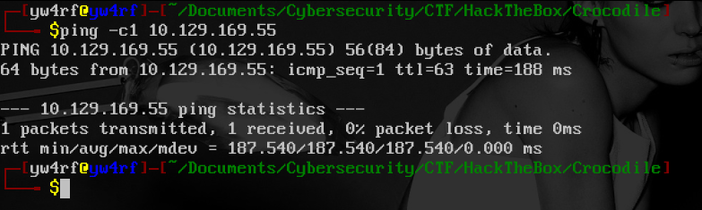

## Scanning 

El paquete fue recibido correctamente por la máquina objetivo. Verificada la conexión, realizamos un escaneo de múltiples etapas con la herramienta **Nmap**. Primero, identificamos los puertos abiertos:

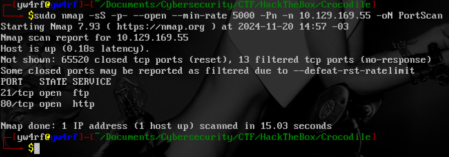

Los puertos abiertos son **21/tcp** y **80/tcp**. A continuación, realizamos un escaneo más detallado utilizando la bandera `-sCV` para obtener más información:

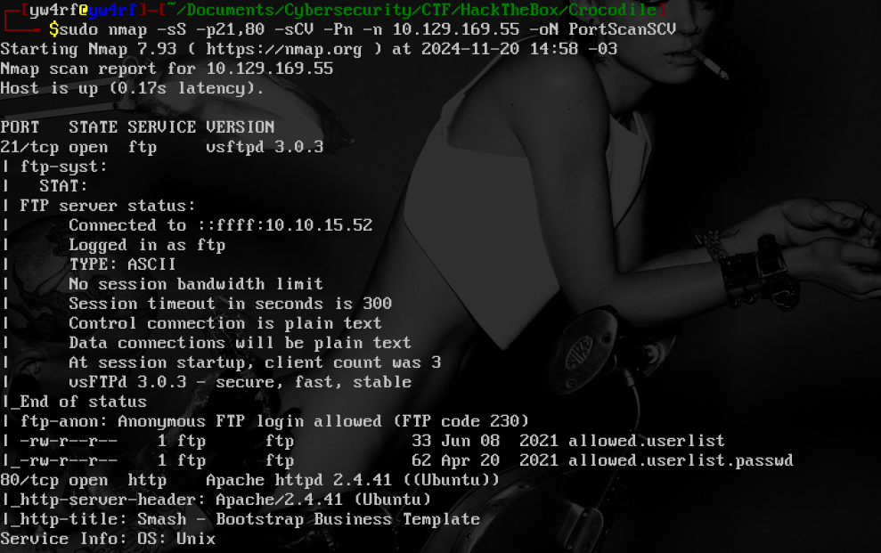

## Enumeration

### 21/tcp

El puerto 21 ejecuta `FTP vsFTPd 3.0.3`. Además, observamos que tiene `Anonymous FTP login allowed`, lo que permite acceder sin autenticación. El servidor contiene dos archivos: `allowed.userlist` y `allowed.userlist.passwd`.

### 80/tcp 

El puerto 80 ejecuta un servidor web `Apache httpd 2.4.41 ((Ubuntu))`. Usamos la herramienta **whatweb** para obtener información adicional y encontramos que se ejecutan `jQuery/1.12.4` y `Modernizr/3.7.1`. También se revelan dos correos electrónicos: `hello@ayroui.com` y `support@euideck.com` 

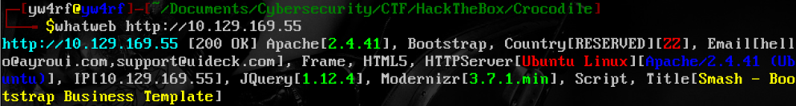

Accedemos al sitio web en `http://10.129.169.55/` 

No encontré nada interesante por lo que ingrese directamente al FTP de la máquina objetivo con el comando `ftp 10.129.169.55` aprovechando la vulnerabilidad `FTP Anonymous login allowed`

## Exploitation

> **FTP Anonymous login**: Es una vulnerabilidad que permite ingresar a un servidor FTP sin necesidad de autenticarse con una cuenta y contraseña. Los usuarios se conectan al servidor utilizando el nombre de usuario "anonymous" (o "ftp" en algunos casos) y cualquier contraseña.

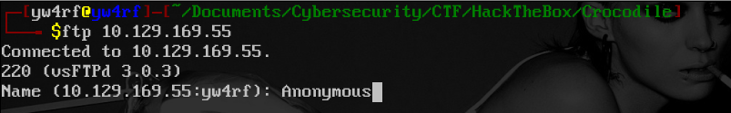

Una vez conectados exitosamente lo primero que hago es listar el directorio actual con el comando `ls` y efectivamente encontramos los archivos `allowed.userlist` y `allowed.userlist.passwd` tal como lo habia reportado el escaneo de Nmap

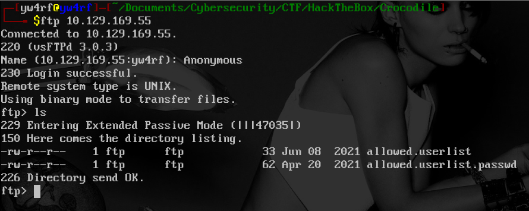

Descargamos los archivos con el comando `get [file_name]`:

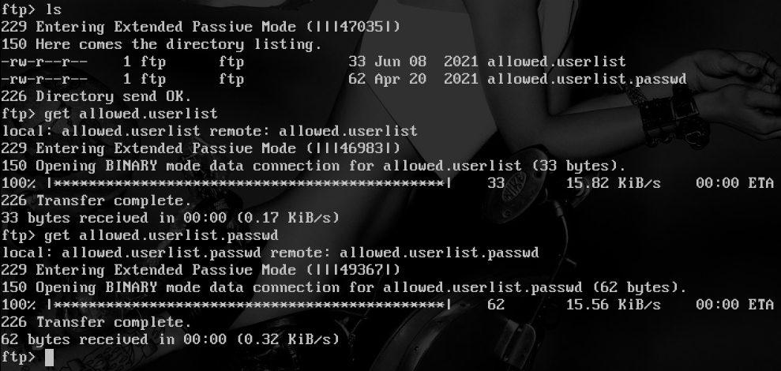

Al inspeccionar los archivos descargados con `cat [file_name]`, encontramos listas de **usuarios** y sus respectivas **contraseñas**:

~~~
aron:root
pwnmeow:Supersecretpassword1
egotistcalsw:@BaASD&9032123sADS
admin:rKXM59ESxesUFHAd
~~~

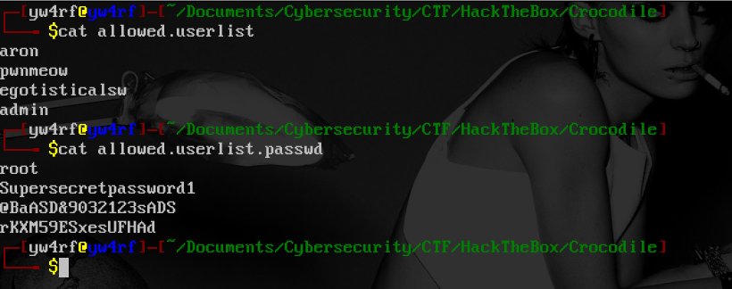

En la página `http://10.129.169.55/` no habia ningun panel de autenticación, pero aún no he enumerado los directorios ocultos del sitio por lo que procedo a usar **Gobuster** para realizarlo:

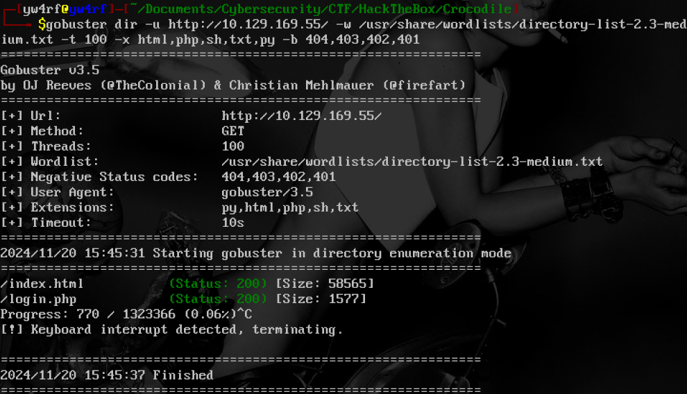

**Gobuster** identifica el directorio `/login.php`. Nos dirigimos a esta página e ingresamos las credenciales `admin:rKXM59ESxesUFHAd`

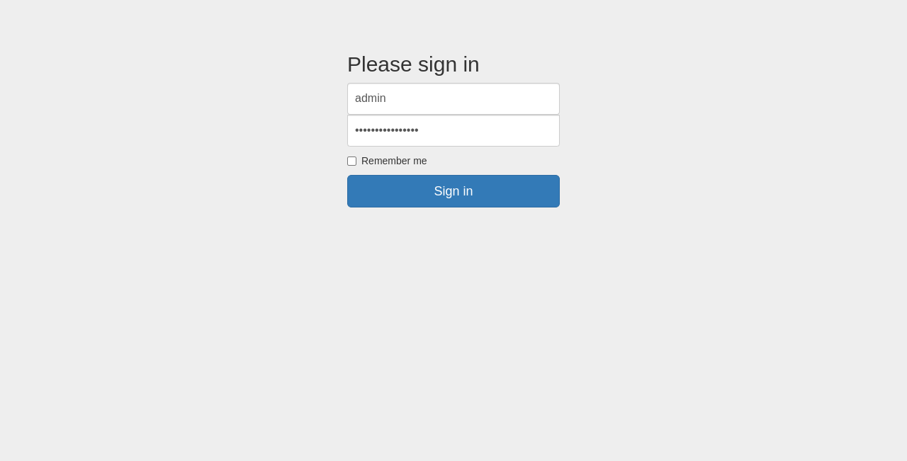

Una vez autenticados, accedemos al "server manager" como usuario **admin**. Desde allí, obtenemos la flag, completando así la máquina:

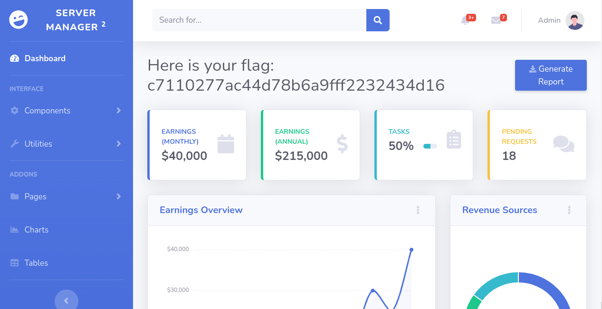

Una vez encontrada la flag hemos finalizado la máquina Crocodile.