En este desafío de Sherlock, Se analizó el tráfico de red utilizando la herramienta Wireshark, identificando una técnica de robo de credenciales mediante el abuso del protocolo LLMNR en Windows. Se observó cómo la víctima cometió un error tipográfico al intentar acceder a un recurso compartido en la red, lo que permitió que el atacante, utilizando la herramienta Responder, interceptara hashes y se hiciera pasar por un dispositivo legítimo dentro de la red interna. Finalmente, se empleó Hashcat para descifrar un hash NTLMv2, aprovechando la información recopilada del tráfico SMB.

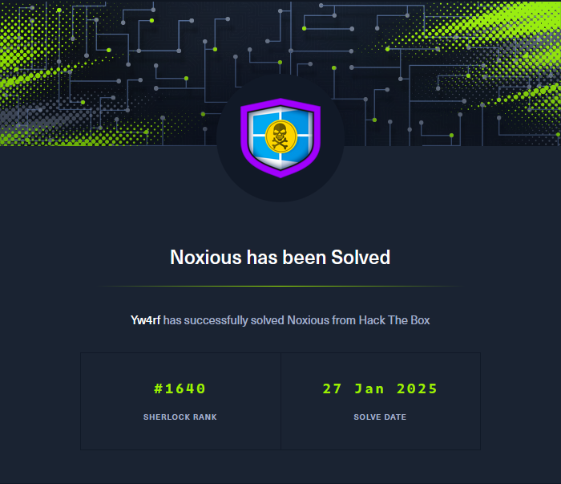

~~~
Platform: HackTheBox
Level: Very Easy
OS: Windows
~~~

### Sherlock Scenario

> El dispositivo IDS nos alertó sobre la posible presencia de un dispositivo no autorizado en la red interna de Active Directory. El Sistema de Detección de Intrusos también indicó señales de tráfico LLMNR, lo cual es inusual. Se sospecha que ocurrió un ataque de envenenamiento de LLMNR. El tráfico LLMNR estaba dirigido hacia Forela-WKstn002, que tiene la dirección IP 172.17.79.136. Se te proporciona una captura de paquetes limitada correspondiente al momento del incidente, como nuestro experto en Forensia de Redes. Dado que esto ocurrió en la VLAN de Active Directory, se sugiere realizar Threat Hunting en la red teniendo en cuenta el vector de ataque de Active Directory, enfocándose específicamente en el envenenamiento de LLMNR.

### Key Information

- ``LLMNR`` (Link-Local Multicast Name Resolution) es un protocolo de resolución de nombres en redes locales. Su tráfico puede ser utilizado por atacantes para realizar un ataque de **envenenamiento de LLMNR** y capturar credenciales. Este ataque suele implicar el uso de herramientas como _Responder_ para engañar a los hosts en la red y capturar hashes NTLMv2 o NTLMv1.

- El tráfico estaba dirigido hacia un host específico: `Forela-WKstn002`, con la dirección IP `172.17.79.136`.

Utilizamos la herramienta **Wireshark*** para inspeccionar la captura de paquetes:

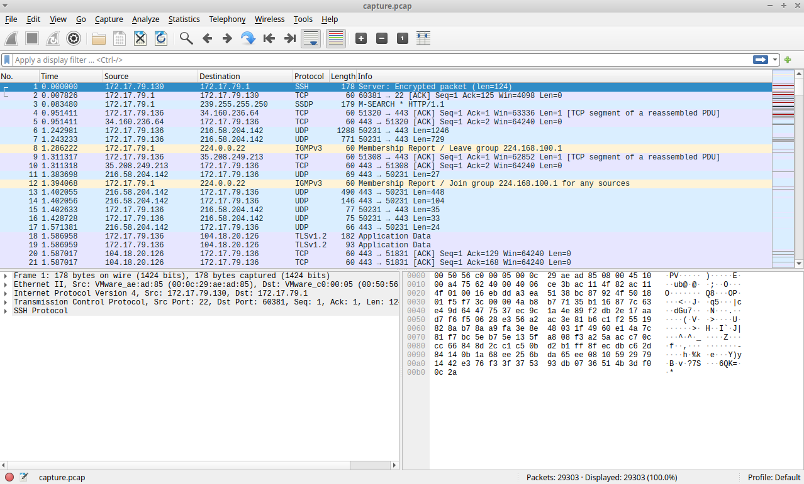

``LLMNR, o Link-Local Multicast Name Resolution``, es un protocolo diseñado para resolver nombres en redes locales sin la necesidad de un servidor DNS centralizado. Es un estándar definido en la RFC 4795 y opera utilizando mensajes multicast sobre el puerto **UDP 5355**. Su principal función es permitir que los dispositivos dentro de una misma red se comuniquen entre sí y resuelvan nombres de host cuando no tienen acceso a un servidor DNS.

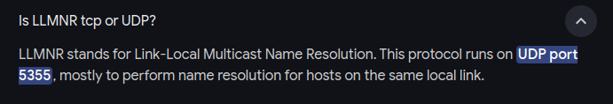

### Traffic Analysis

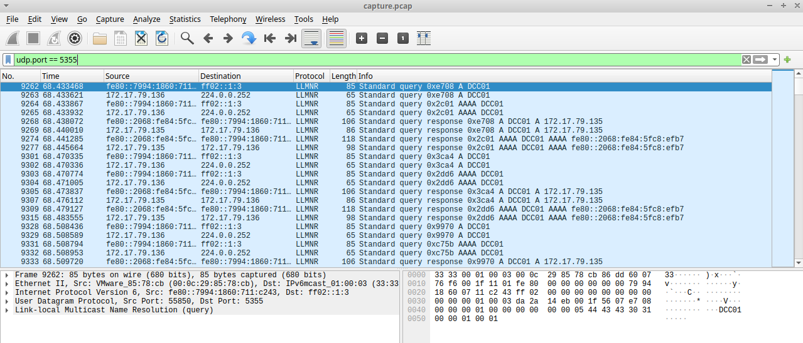

#### Task #1 

> Its suspected by the security team that there was a rogue device in Forela's internal network running responder tool to perform an LLMNR Poisoning attack. Please find the malicious IP Address of the machine.

El protocolo LLMNR opera en el puerto UDP 5355 por defecto, lo que facilita la resolución de nombres en redes locales. Al filtrar el tráfico en Wireshark con el filtro `udp.port==5355`, se identificaron solicitudes iniciadas desde la IP `172.17.79.136` hacia un recurso denominado "DCC01". Este nombre parece ser un error tipográfico, ya que probablemente debería haber sido "DC01", que corresponde al controlador de dominio legítimo.

Después de la consulta inicial realizada por `172.17.79.136`, la IP `172.17.79.135` respondió con datos. Este comportamiento es consistente con un ataque de envenenamiento de LLMNR, donde el atacante (`172.17.79.135`) intercepta y responde a consultas de resolución de nombres, simulando ser el recurso legítimo.

El análisis del tráfico sugiere que el atacante (`172.17.79.135`) utilizó LLMNR para engañar al dispositivo de la víctima (`172.17.79.136`), probablemente redirigiendo tráfico o capturando credenciales sensibles como hashes NTLMv2. Esto ocurre porque LLMNR no tiene autenticación robusta y permite respuestas a cualquier dispositivo en la red local.

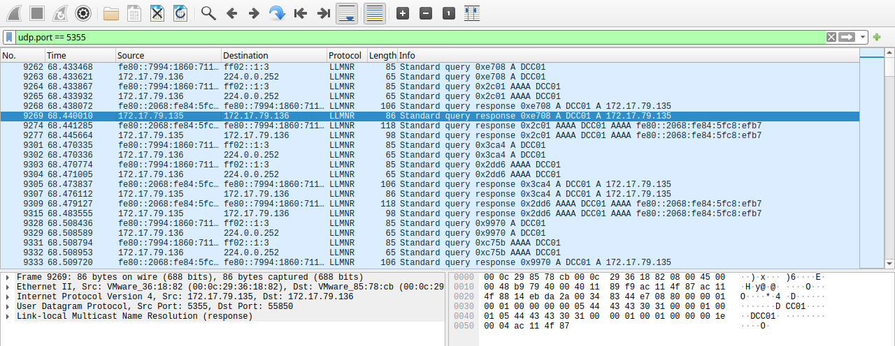

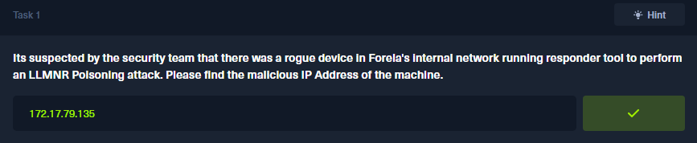

#### Task #2

> What is the hostname of the rogue machine? 

Es posible identificar el hostname del dispositivo atacante filtrando el tráfico de la dirección IP y DHCP en Wireshark utilizando el filtro `ip.addr==172.17.79.135 && dhcp`

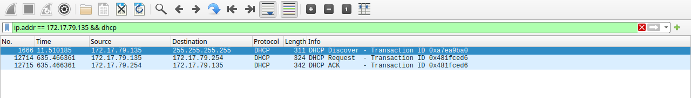

Una vez aplicado el filtro, se analizan los paquetes DHCP, especialmente los mensajes **DHCP Discover**, **Request** o **ACK**. En estos paquetes, existe un campo llamado **Hostname** (opción 12), que generalmente contiene el nombre del dispositivo proporcionado por el cliente durante el intercambio DHCP.

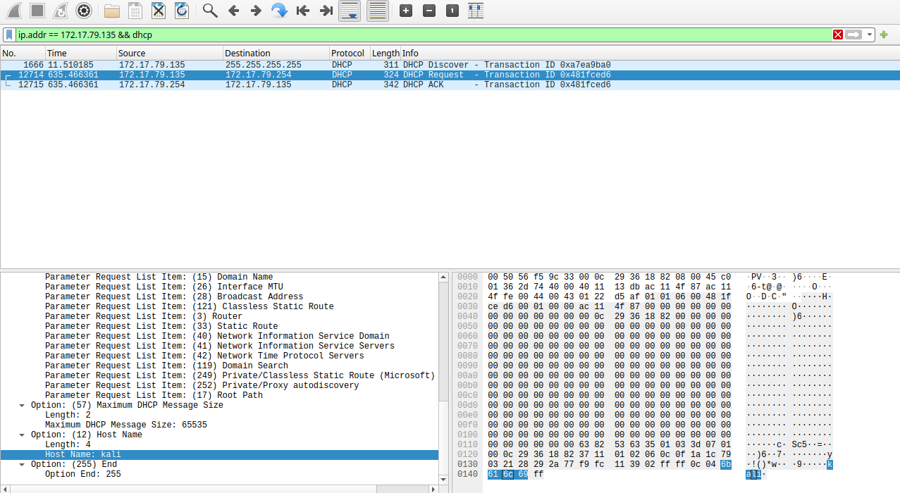

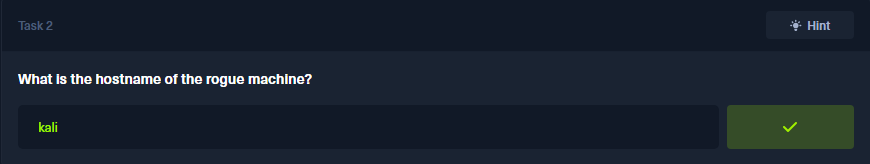

#### Task #3

> Now we need to confirm whether the attacker captured the user's hash and it is crackable!! What is the username whose hash was captured?

NTLMSSP (**NT LAN Manager Security Support Provider**) es un componente del protocolo NTLM utilizado para autenticar usuarios en redes Windows. Específicamente, NTLMSSP es el mecanismo que maneja el intercambio de mensajes durante la **autenticación basada en el challenge-response** de NTLM. Este proceso es utilizado principalmente en protocolos como SMB (Server Message Block) y es común verlo en escenarios de ataques como el **envenenamiento LLMNR**.

Entre los paquetes filtrados, identificamos una **Session Setup Request** para el protocolo SMB2. Este es el momento en el que la víctima intenta autenticarse con el servidor SMB malicioso del atacante. 

- **Username:** `john.deacon`
- **Domain name:** `FORELA`

La fase **NTLMSSP_AUTH** indica que el hash de la contraseña del usuario ha sido enviado y, si es interceptado, puede ser capturado.

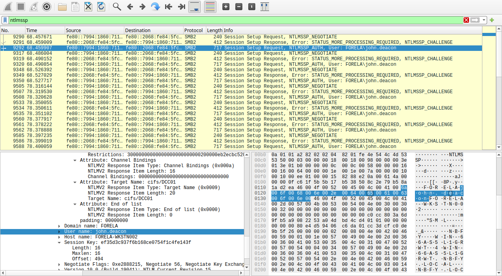

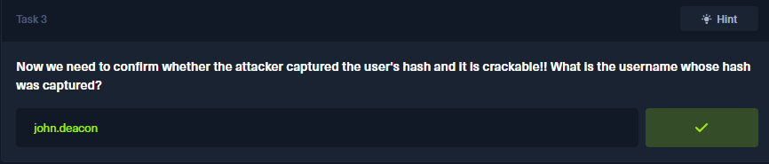

#### Task #4

> In NTLM traffic we can see that the victim credentials were relayed multiple times to the attacker's machine. When were the hashes captured the First time?

Para identificar el tiempo exacto en el que los hashes fueron capturados por primera vez debemos configurar las opciones de **Wireshark** para ello: **View > Time Display Format > UTC Date and Time of Day (1970-01-01 01:02:03.123456)** 

Una vez que hecha la configuración, con el filtro `ntlmssp` de **Wireshark** es posible buscar en los paquetes la **primera solicitud al protocolo SMB2** con el mensaje **NTLMSSP AUTH**, que es donde se envía el hash de la contraseña. Al localizar este paquete en el análisis de tráfico de Wireshark, se observa la **fecha y hora exacta** en la que se realizó esta solicitud. Esto marca el momento en el que los hashes fueron capturados por primera vez.

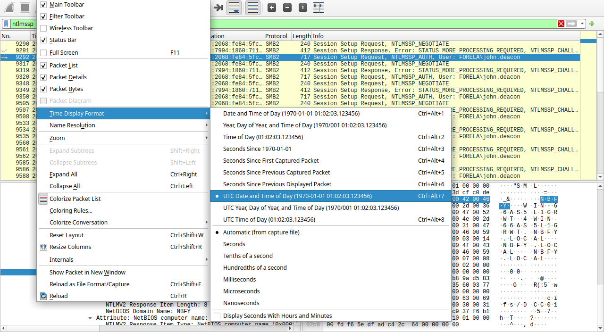

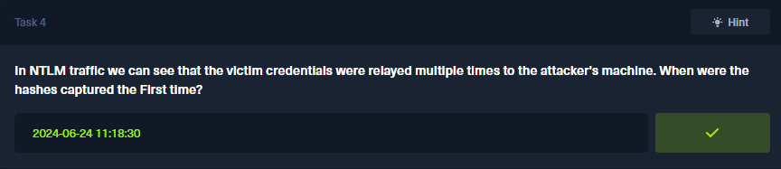

#### Task #5

> What was the typo made by the victim when navigating to the file share that caused his credentials to be leaked?

La víctima intentó acceder a un recurso de red utilizando el nombre de dominio correcto "DC01", que corresponde a un **Domain Controller** legítimo. Sin embargo, cometió un error tipográfico y escribió "DCC01", lo que provocó que la consulta DNS fallara, ya que el nombre "DCC01" no estaba registrado en el servidor DNS.

Debido a la imposibilidad de resolver el nombre a través de DNS, la máquina de la víctima recurrió a un protocolo de respaldo llamado **LLMNR** (Link-Local Multicast Name Resolution), que se utiliza en redes locales para resolver nombres de host cuando DNS no está disponible.

En este momento, el **atacante** entra en escena. Su máquina maliciosa está configurada para **responder a consultas LLMNR**. Al detectar que la víctima intentaba resolver "DCC01", el atacante respondió a la consulta, **suplantando al controlador de dominio legítimo (DC01)** y engañando a la víctima.

Al filtrar los paquetes LLMNR en Wireshark mediante `ip.addr 172.17.79.135 && llmnr`, se puede observar que el atacante respondió a la consulta de la víctima, proporcionando una respuesta falsa. Se observa "DCC01" en lugar de "DC01". Esto confirma que la víctima intentó acceder a un nombre incorrecto debido al error tipográfico en su solicitud.

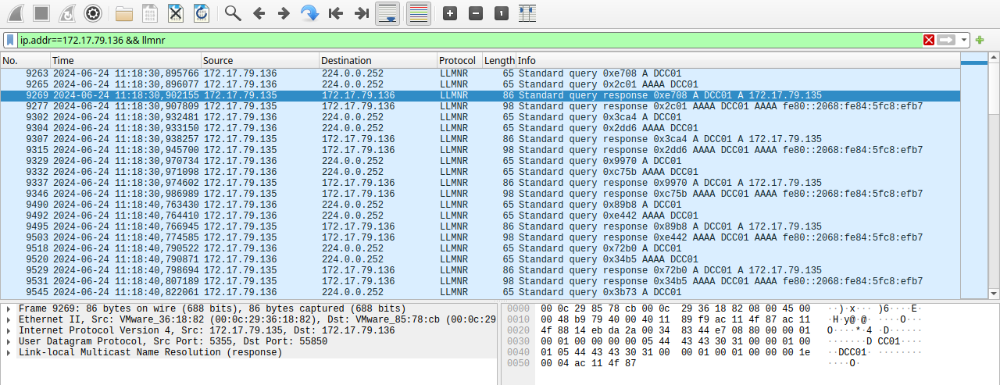

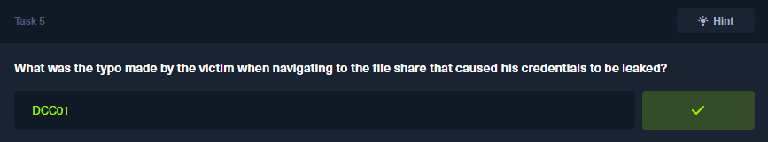

#### Task #6

> To get the actual credentials of the victim user we need to stitch together multiple values from the ntlm negotiation packets. What is the NTLM server challenge value?

En el protocolo NTLM, durante el proceso de autenticación, se intercambian varios mensajes, y uno de estos mensajes es el **challenge message** (mensaje de desafío). Este mensaje contiene un valor crucial, conocido como el **NTLM server challenge value**, que es un número aleatorio generado por el servidor durante el proceso de autenticación. Este valor es parte del desafío que el servidor envía al cliente (la víctima) como parte de la verificación de la autenticidad de las credenciales enviadas. Este valor de desafío es importante para los ataques de **pass-the-hash** o **cracking de hashes**, ya que forma parte de la fórmula que se utiliza para generar el hash de la contraseña de la víctima.

Para encontrar el **NTLM Server Challenge** en Wireshark, se utiliza el filtro `ntlmssp` con el objetivo de localizar un paquete tipo **Session Setup Response** que contenga el **NTLM_CHALLENGE**. Una vez identificado este paquete, se navega a través de la siguiente ruta en el análisis de Wireshark:

**Session Setup Response → Security Blob → GSS-API Generic → SimpleProtected Negotiation → negTokenTarg → NTLM Secure Service Provider → NTLM Server Challenge.**

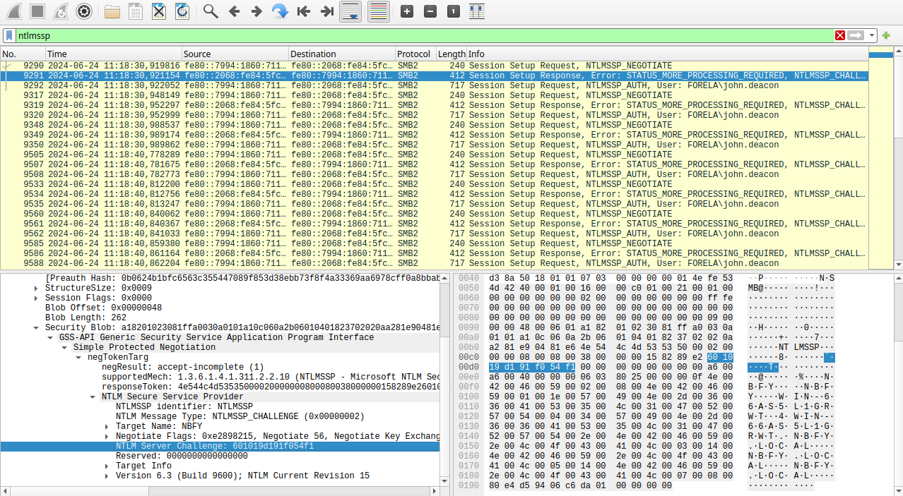

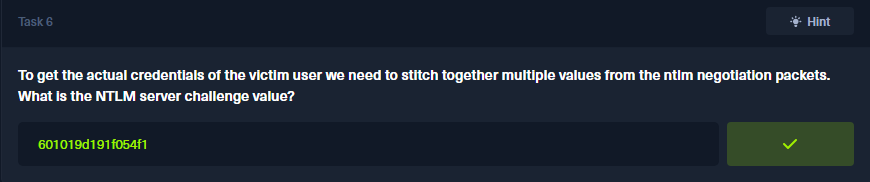

#### Task #7

> Now doing something similar find the NTProofStr value.

El **NTProofstr** (NT Proof String) es un valor utilizado en el proceso de autenticación NTLM (NT LAN Manager) para confirmar que un cliente ha recibido correctamente el **Challenge** del servidor, en el marco de la fase de autenticación. 

En el proceso de autenticación NTLM, después de que el servidor envía el **NTLM Server Challenge** al cliente, este utiliza un **hash de la contraseña del usuario** para generar una respuesta al **Challenge**. La respuesta se calcula utilizando el **NTLM hash** de la contraseña del usuario y el **Challenge** enviado por el servidor. Esta respuesta se incluye en el paquete **NTLM Authentication Response** como parte del proceso de verificación.

El **NTProofstr** es parte de este cálculo y contiene la cadena de prueba que el cliente usa para demostrar que posee la contraseña correcta sin enviar la contraseña en texto claro. Este valor se encuentra en los paquete `ntlmssp` de tipo **Session Setup Request**: 

**Session Setup Request** -> **Security Blob** -> **GSS-API Generic** -> **Simple Protected Negotiation** -> **negTokenTarg** -> **NTLM Secure Service Provider** -> **NTLM Response** -> **NTLMv2 Response** -> **NTProofStr**

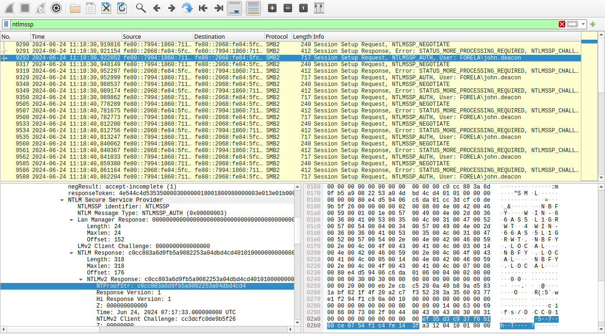

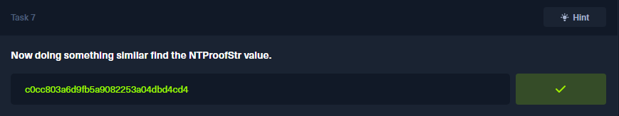

#### Task #8

> To test the password complexity, try recovering the password from the information found from packet capture. This is a crucial step as this way we can find whether the attacker was able to crack this and how quickly.

La información necesaria para recuperar la contraseña incluye:

~~~
Usuario::Dominio:ServerChallenge:NTProofStr:NTLMv2Response(sin los primeros 16 bytes).

El valor de NTMLv2Response se encuentra en la misma ubicación que el valor de NTProofStr encontrado anteriormente.
~~~

Primero, se crea un archivo llamado `hash.txt` que contenga los valores extraídos de la captura de paquetes. Se utilizaron los siguientes valores para el archivo:

~~~
john.deacon::FORELA:601019d191f054f1:c0cc803a6d9fb5a9082253a04dbd4cd4:010100000000000080e4d59406c6da01cc3dcfc0de9b5f2600000000020008004e0042004600590001001e00570049004e002d00360036004100530035004c003100470052005700540004003400570049004e002d00360036004100530035004c00310047005200570054002e004e004200460059002e004c004f00430041004c00030014004e004200460059002e004c004f00430041004c00050014004e004200460059002e004c004f00430041004c000700080080e4d59406c6da0106000400020000000800300030000000000000000000000000200000eb2ecbc5200a40b89ad5831abf821f4f20a2c7f352283a35600377e1f294f1c90a001000000000000000000000000000000000000900140063006900660073002f00440043004300300031000000000000000000
~~~

Una vez creado este archivo con la información correcta, se utiliza la herramienta **Hashcat** para intentar el crackeo de la contraseña: `hashcat -a0 -m5600 hash.txt /usr/share/wordlists/rockyou.txt` 

Este comando realiza un ataque de diccionario sobre el hash con el archivo de contraseñas `rockyou.txt`, que contiene una lista común de contraseñas, para intentar encontrar la contraseña de la víctima. Este proceso ayuda a evaluar la complejidad de la contraseña y determinar si el atacante pudo descifrarla y, en caso afirmativo, cuánto tiempo le habría llevado hacerlo.

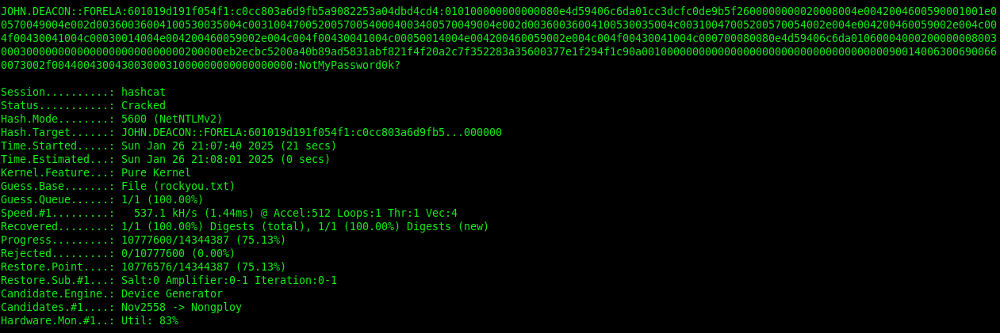

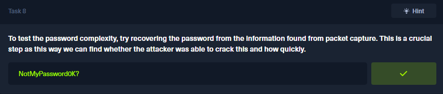

#### Task #11

> Just to get more context surrounding the incident, what is the actual file share that the victim was trying to navigate to?

Al aplicar un filtro en **Wireshark** para capturar paquetes `smb2`, es posible observar que el atacante realizó solicitudes de conexión y accedió correctamente a dos recursos compartidos específicos: `\\DC01\IPC$` y `\\DC01\DC Confidential`. Esto se puede confirmar al analizar los paquetes `Tree Connect Request` y `Tree Connect Response`, que contienen la información sobre las solicitudes y respuestas de conexión a estos recursos. A partir de la información obtenida, podemos inferir que el recurso compartido que el atacante tenía como objetivo principal era `\\DC01\DC Confidential`.

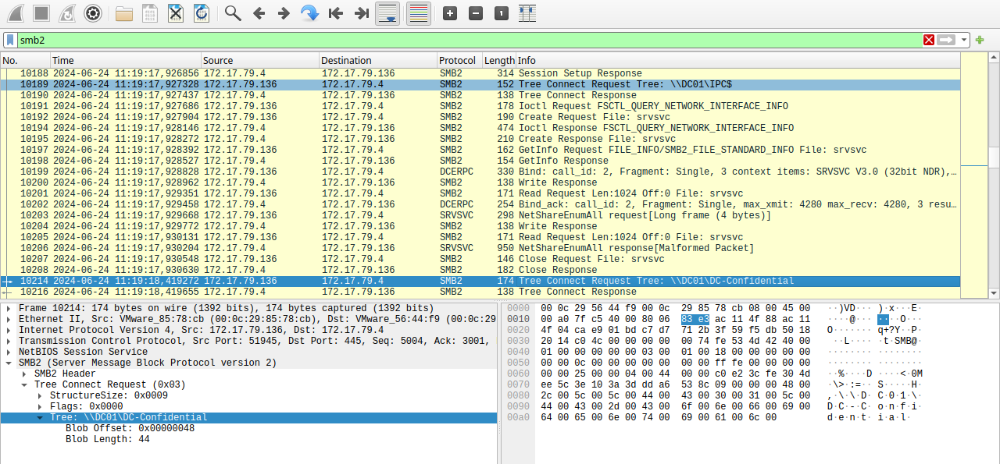

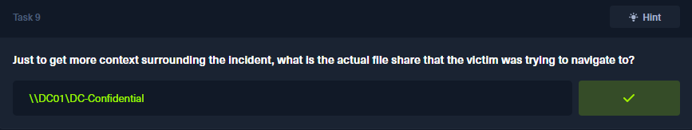

[Verify Achievment](https://labs.hackthebox.com/achievement/sherlock/2035837/747)

