## Introduction

En este Write-Up, realizo la máquina **Oopsie** de **[HackTheBox](https://app.hackthebox.com/)**. Comenzando con los puertos **22 (SSH)** y **80 (HTTP)** abiertos, en el código fuente del sitio descubrí la ruta hacia un panel de autenticación accesible como **guest**. Mediante manipulación de cookies, accedí a la sección de **uploads**, donde subí una **reverse shell** que me permitió obtener acceso al sistema. Posteriormente, encontré credenciales en texto claro en una base de datos, lo que me permitió ingresar a **SSH**. Finalmente, exploté una vulnerabilidad en el binario **bugtracker** a través de **path hijacking** para escalar privilegios a root.

~~~
Platform: HackTheBox
Level: VeryEasy
OS: Linux
~~~

## Reconnaissance

~~~
Target IP: 10.129.58.5
~~~

Comenzamos con el comando **ping**, que utiliza el **ICMP (Protocolo de Control de Mensajes de Internet)**. Este comando envía un mensaje de “echo request” a una dirección IP y espera recibir un mensaje de “echo response”. Este proceso permite verificar si una máquina en la red es accesible y medir la latencia. Además, se puede inferir que es una máquina **Linux** debido al **TTL = 63**

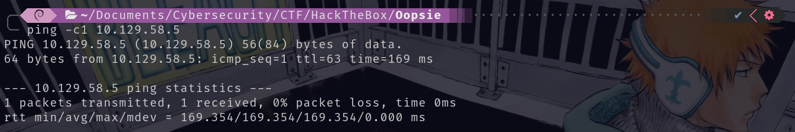

## Scanning

El paquete fue recibido correctamente por la máquina objetivo. Verificada la conexión, realizamos un escaneo de múltiples etapas con la herramienta **Nmap**. Primero, identificamos los puertos abiertos:

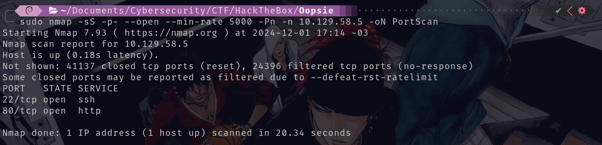

Se encontraron los puertos abiertos **22/tcp** y **80/tcp**. A continuación, realizamos un escaneo más detallado utilizando la la flag `-sCV` para obtener más información de los puertos:

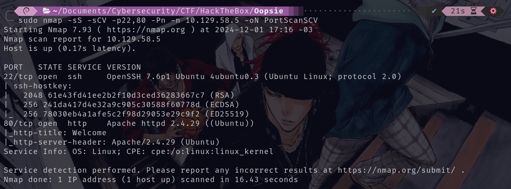

## Enumeration

### 22/tcp SSH

El puerto **22/tcp** ejecuta el servicio `OpenSSH 7.6p1` Se podría utilizar la vulnerabilidad **CVE-2018-15473**, que permite a un atacante obtener información sobre los nombres de usuario válidos en el sistema. Lo que puede facilitar a ataques de fuerza bruta.

### 80/tcp HTTP

El puerto **80/tcp** aloja un servidor web `http Apache/2.4.29`  

Utilizo la herramienta **WhatWeb**, aunque no obtenemos mucha información adicional. Sin embargo, identificamos un correo electrónico: `admin@megacorp.com`, del cual podemos deducir lo siguiente:

- Posible nombre de usuario: `admin`
- Posible dominio: `megacorp.com`

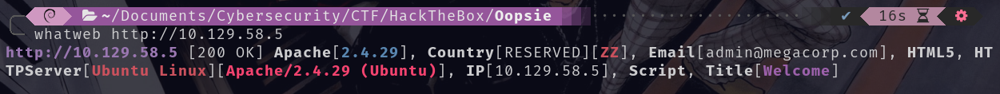

Al ingresar al sitio web, observamos que la funcionalidad es limitada:

Observamos nuevamente el correo `admin@megacorp.com` y además encontramos el mensaje "please login to get access to the service", lo que nos sugiere la existencia de un panel de autenticación.

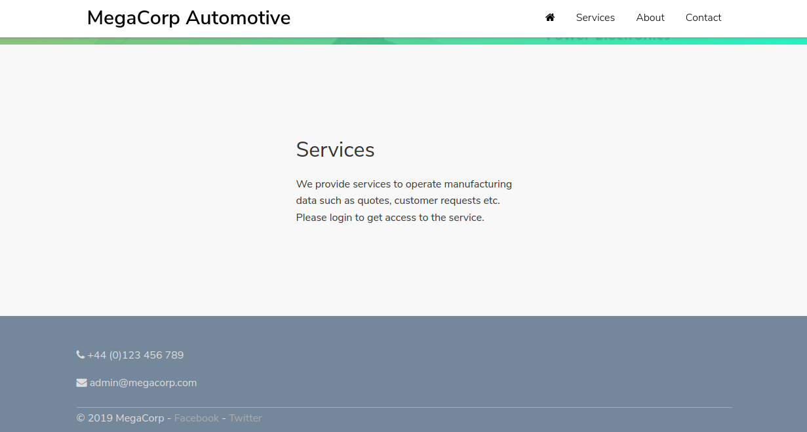

Procedo a realizar un escaneo con **Gobuster** en busca de directorios ocultos. Luego de realizar el escaneo notamos interesante el directorio `/uploads` podemos inferir que es la ubicación donde almacenan archivos subidos al servidor, por lo que es posible que ademas exista una funcionalidad que nos permita subir archivos: 

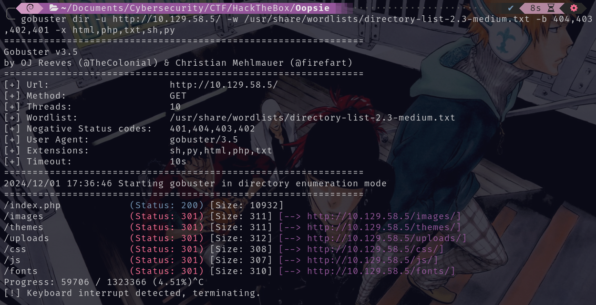

Al no encontrar el panel de autenticación me dirigo al sitio y con `CTRL + U` veo el código fuente de la página, al final de la misma es posible encontrar la URL del panel de autenticación: `/cdn-cgi/login/`

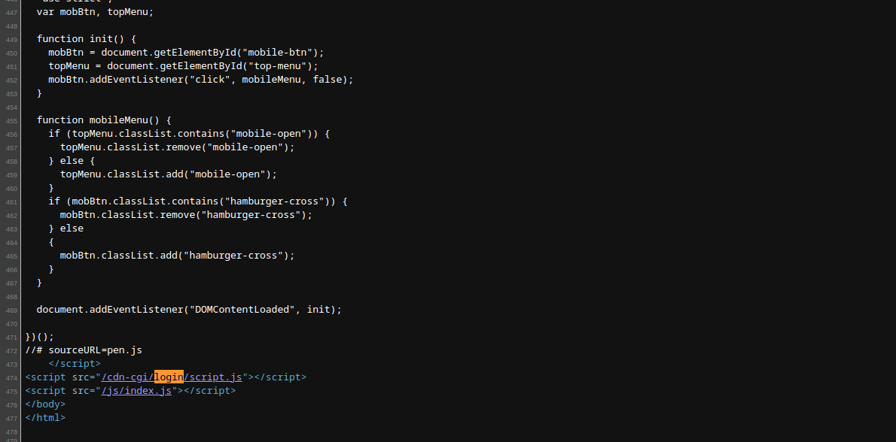

Al dirigirme al panel de autenticación `http://10.129.58.5/cdn-cgi/login/` notamos que es posible ingresar como invitado `"Login as Guest"`

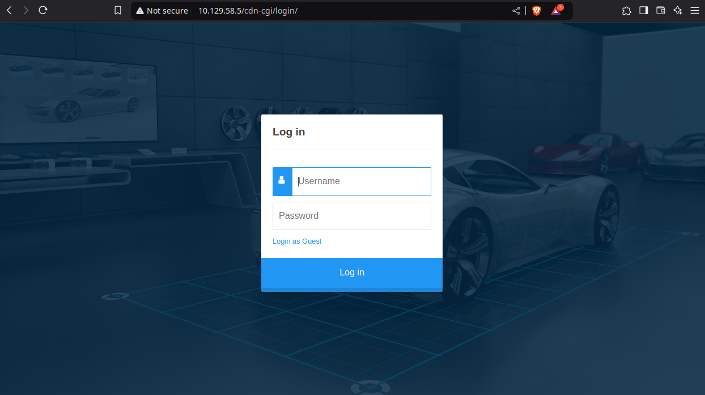

Ingresamos a lo que parece ser un panel de control con las siguientes secciones: `Account`, `Branding`, `Clients` y `Uploads`

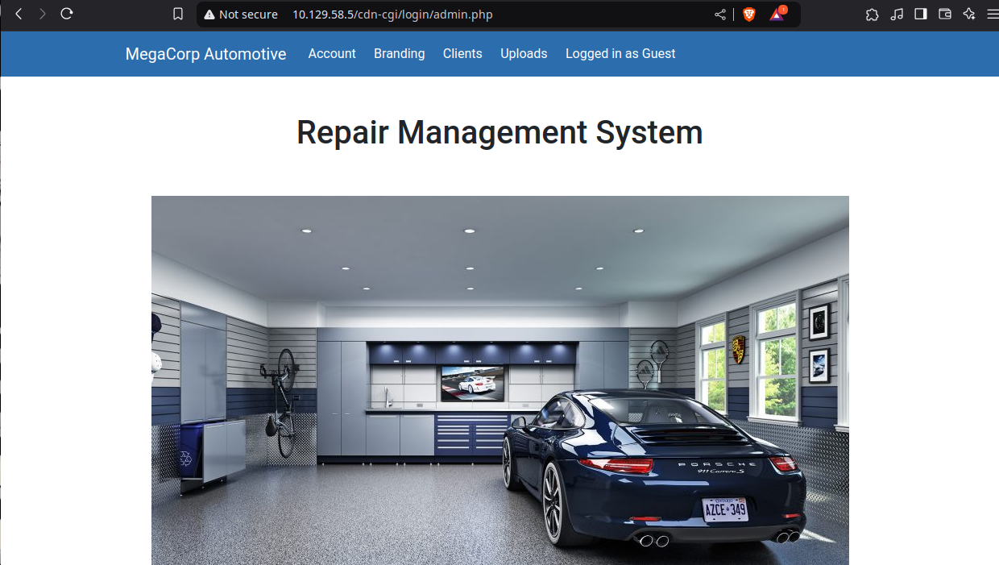

### IDOR Vulnerability

En la sección `Account` notamos que en la URL hay una **query string (cadena de consulta)**. las URLs con parámetros como `id=2` pueden ser vulnerables a **IDOR (Insecure Direct Object Reference)** una de las categorías de **[Broken Access Control](https://yw4rf.vercel.app/posts/ethical-hacking/bac/)**. 

> **IDOR** ocurre cuando un sistema permite que un usuario acceda directamente a un recurso identificándolo mediante un parámetro (como `id`) sin validar si ese usuario tiene permiso para acceder al recurso.

Notamos que tenemos la información: 

- Access ID: `2233`
- Name:  `guest`
- Email: `guest@megacorp.com`

Recordemos que exista un correo `admin@megacorp.com` por lo que es probable que existe el user `admin`

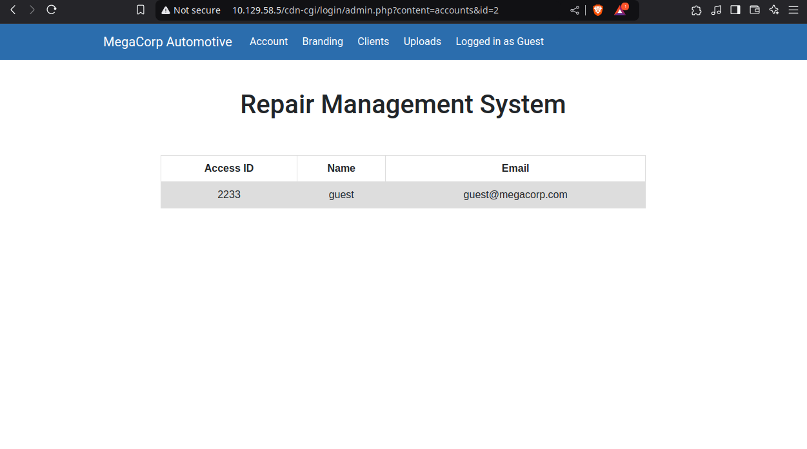

En la sección `Uploads` notamos que se requieren permisos de administrador para acceder: 

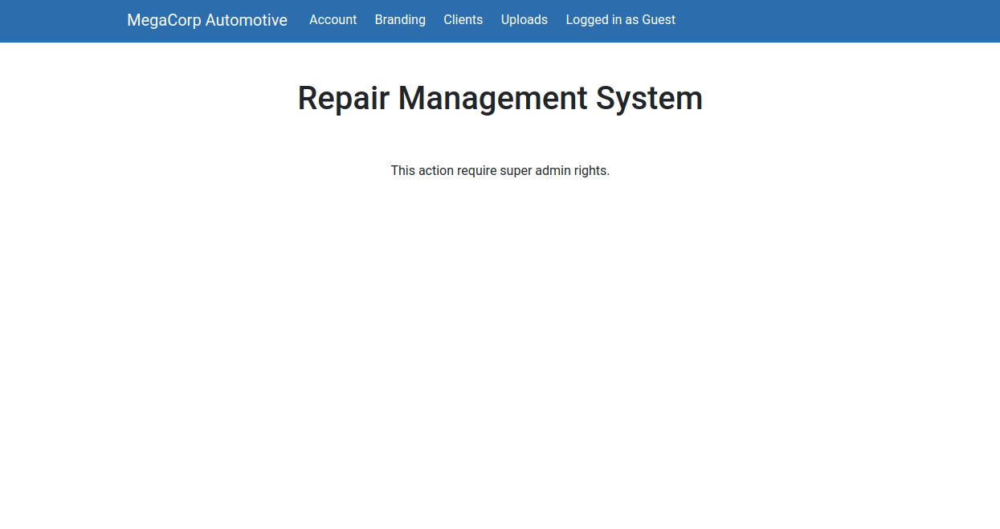

## Exploitation

Al cambiar el parametro `id=2` a `id=1` notamos que ahora tenemos la información: 

- Access ID: `34322`
- Name:  `admin`
- Email: `admin@megacorp.com` 

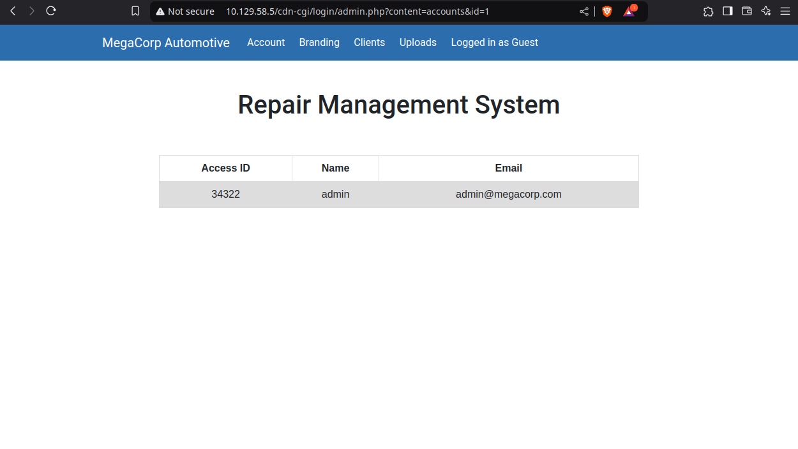

### Cookie Manipulation

Procedo a modificar el valor de las cookies siendo el `role:admin` y el `user:34322` 

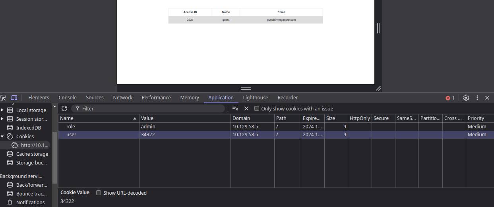

Luego de ello, notamos que podemos acceder a `Uploads` y subir archivos de manera arbitraria:

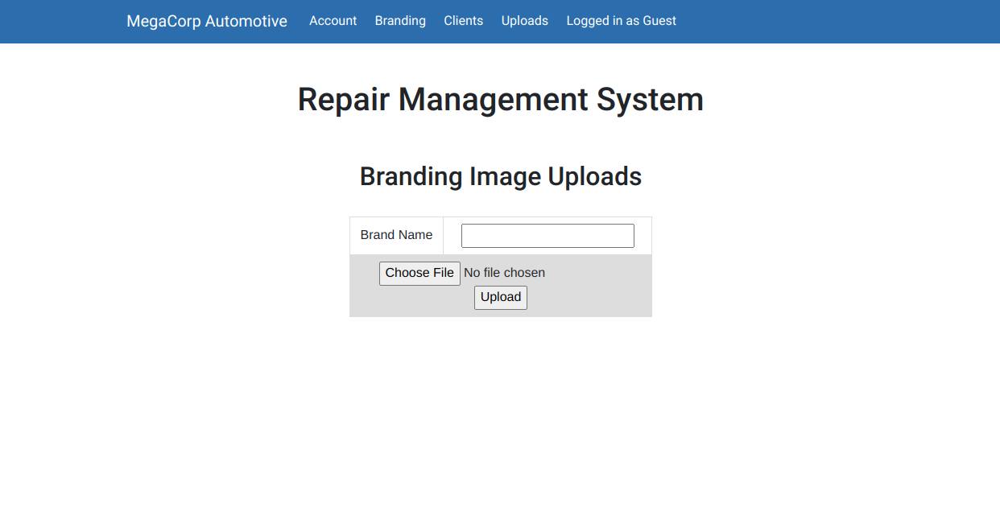

### Reverse Shell 

Al poder subir cualquier tipo de archivo procedo a crear un archivo llamado `rshell.php` y en el contenido añado la **[Reverse Shell de Pentest Monkey](https://github.com/pentestmonkey/php-reverse-shell/blob/master/php-reverse-shell.php)** y cambio las lineas `$ip` y `$port`

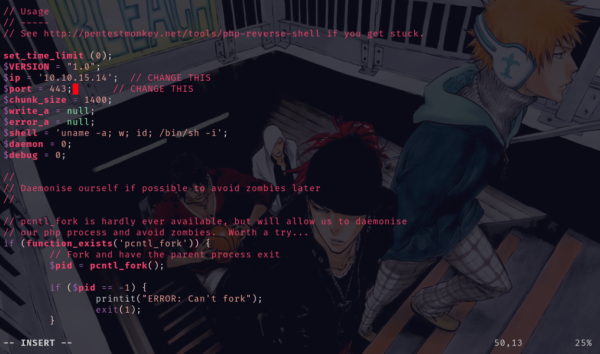

**Ponemos Netcat en escucha** en el puerto 443, que utilizaremos para recibir la conexión de la reverse shell: 

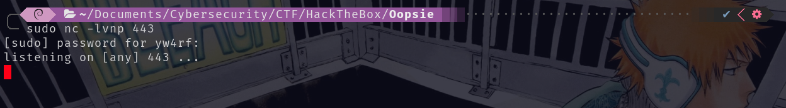

Subimos el archivo:

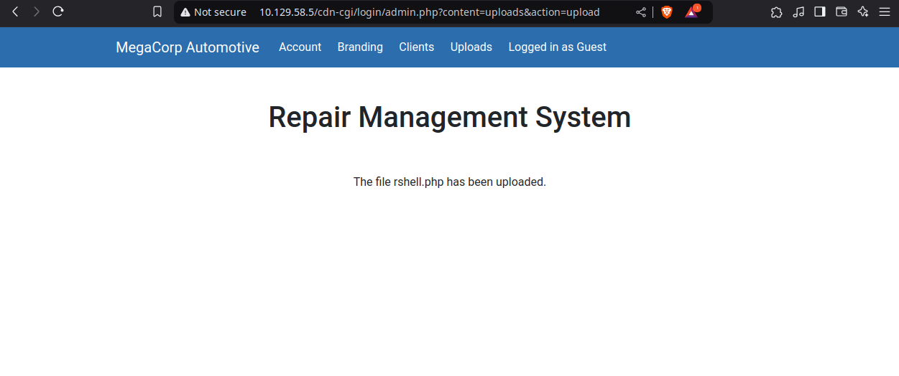

Una vez subido el archivo procedemos a realizar una petición al mismo con `curl http://10.129.58.5/uploads/rshell.php`

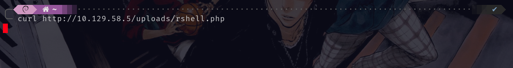

Al revisar la consola de Netcat en nuestra máquina, notamos que hemos recibido la conexión. De momento somos el usuario `www-data`

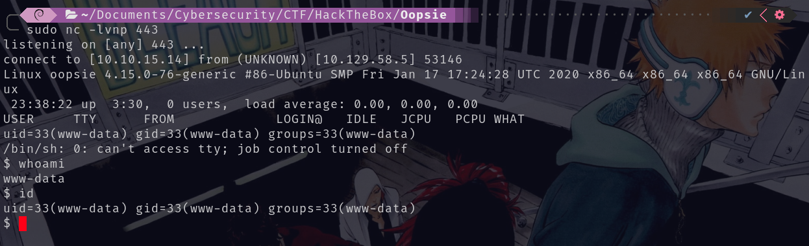

Antes que nada, realizo tratamiento de la tty para evitar cualquier inconveniente innecesario a la hora de manipular el sistema:

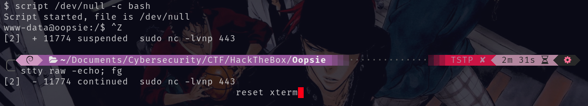
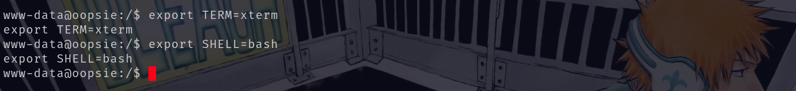

## Privilege Escalation

En primer lugar hago uso del comando `find / -type f -name *.php 2>/dev/null`. El propósito principal de este comando es buscar **archivos con extension PHP** en todo el sistema sin mostrar errores relacionados con permisos restringidos:

- **`find /`**:
    - El comando `find` se usa para buscar archivos y directorios en un sistema de archivos.
    - El `/` indica el directorio raíz (es decir, busca en todo el sistema). Puedes cambiar `/` por otro directorio si deseas limitar la búsqueda.
- **`-type f`**:
    - Filtra la búsqueda para incluir solo **archivos** (no directorios).
    - `f` significa "file" (archivo).
- **`-name *.php`**:
    - Busca archivos cuyo **nombre coincida con el patrón `*.php`**, es decir, todos los archivos que terminan con la extensión `.php`.

Después de ejecutar el comando, identificamos la ruta `/var/www/html/cdn-cgi/login/db.php`, que llamó nuestra atención, ya que `db` probablemente hace referencia a "database". Decidimos inspeccionar el archivo accediendo a su ubicación y utilizamos el comando `cat` para abrirlo. Al hacerlo, descubrimos las siguientes credenciales:

- Username: `robert`
- Password: `M3g4C0rpUs3r!`

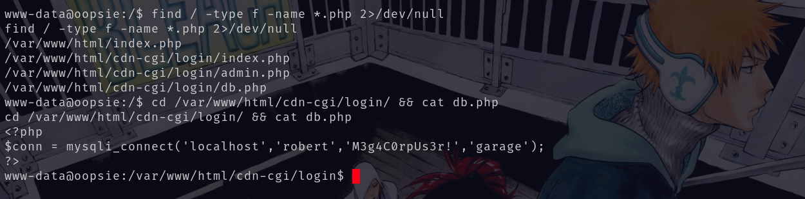

Recordamos que el puerto **22/tcp (SSH)** estaba abierto, por lo que decidimos probar las mismas credenciales en el servicio SSH. Las credenciales fueron correctas, ingresamos al **SSH** por lo que ahora mismo somos el usuario `robert`

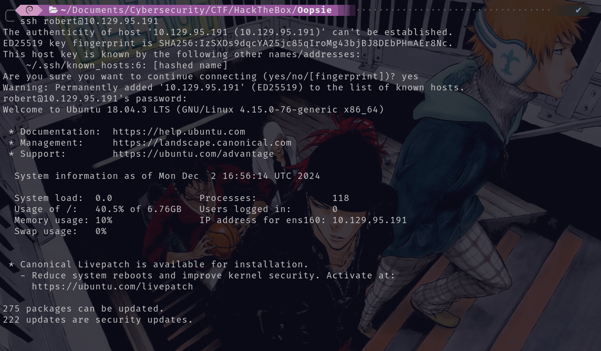

Al ejecutar el comando `id`, observamos que el usuario **robert** pertenece al grupo `bugtracker`. El grupo **`bugtracker`** probablemente está relacionado con una aplicación o servicio específico instalado en el sistema. Este nombre sugiere que podría estar vinculado a un sistema de gestión de errores

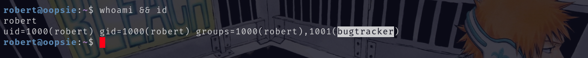

Con el comando `find / -group bugtracker 2>/dev/null` busco archivos o carpetas cuyo propietario o permisos esten asignados al grupo **`bugtracker`** lo que devuelve la ruta `/usr/bin/bugtracker`, lo cual sugiere que hay un archivo o ejecutable llamado **`bugtracker`** en ese directorio.

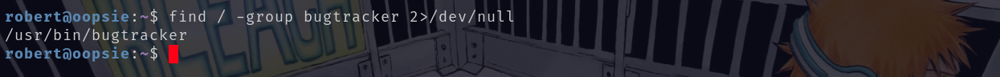

Con el comando `ls -l` reviso los permisos del archivo para entender qué usuarios o grupos pueden ejecutarlo o modificarlo y con `file` verifico más detalles del archivo. 

El archivo **`/usr/bin/bugtracker`** tiene permisos **`rwsr-xr--`** 
- `rws` (para el propietario, **root**) indica que el archivo tiene el **bit SetUID (Set User Id)** activado. Esto significa que cuando un usuario ejecuta este archivo, obtiene los **privilegios del propietario del archivo** (en este caso, **root**).
- `r-x` (para el grupo `bugtracker`) indica que los miembros del grupo pueden leer y ejecutar el archivo, pero no modificarlo.
- `r--` (para otros usuarios) indica que cualquier usuario puede leer el archivo, pero no ejecutarlo.

El archivo **`/usr/bin/bugtracker`** es un **binario ELF** de 64 bits para **GNU/Linux**, específicamente para arquitectura x86-64. Está **dinámicamente vinculado**, lo que significa que depende de bibliotecas externas. Nuevamente, la salida menciona que el archivo está diseñado para ser ejecutado por el sistema **Linux**, y tiene el **bit SetUID** activado, lo que le da privilegios de root al ejecutarlo:

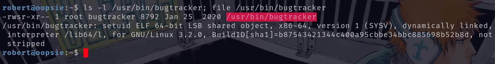

Ejecuté **`bugtracker`**, y me solicitó ingresar un "Bug ID". Al ingresar el número **1**, la respuesta fue: `Binary package hint: ev-engine-lib Version: 3.3.3-1`.

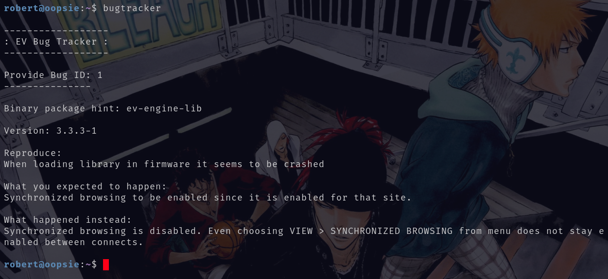

Al ejecutarlo nuevamente e introducir un "Bug ID" más alto, como en este caso **100000**, la salida fue: `cat: /root/reports/100000: No such file or directory`. 

Esto sugiere que **`bugtracker`** utiliza el comando **`cat`** para acceder a archivos del sistema con **privilegios de root**

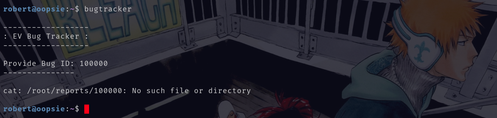

### Path Hijacking

Si en lugar de ingresar un **Bug ID** específico, introducimos una ruta, como por ejemplo, aprovechando que nos encontramos en el directorio **`/root/reports/`**, al escribir en el campo de entrada **`../root.txt`**, podríamos estar realizando un **path hijacking**. Este ataque aprovecha la manipulación de las rutas para acceder a archivos fuera de los directorios permitidos, como el archivo **`/root/root.txt`**, lo que nos permitiría leer la **flag de root**:

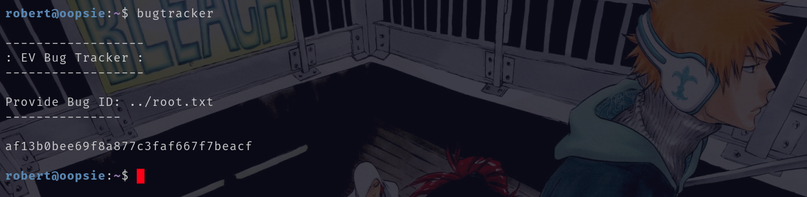

> **Path Hijacking** generalmente se refiere a la explotación de una vulnerabilidad donde un atacante manipula el **PATH** del sistema para que se ejecute un archivo malicioso en lugar de un archivo legítimo, normalmente sin la intención de ejecutar el comando con privilegios elevados. Esto se hace aprovechando que un archivo con el mismo nombre que un comando legítimo se encuentra en una carpeta en el **PATH** del sistema, que el sistema ejecuta primero.

Aprovechando la vulnerabilidad se puede realizar un ataque de **Path Hijacking** para obtener privilegios de root. 

1. Cambio de directorio a `/tmp/`: `cd /tmp/`	

2. Creación de un archivo llamado `cat` en `/tmp/` que ejecutará `/bin/bash`: `echo '/bin/bash' > cat`

3. Cambio de permisos para hacer el archivo ejecutable: `chmod +x cat`

4. Modificación del PATH para que `/tmp/` tenga prioridad, de modo que el sistema ejecute el archivo `cat` de `/tmp/` en lugar del binario legítimo del sistema: `export PATH=/tmp:$PATH`

5. Verificación del nuevo PATH: `echo $PATH /tmp:/usr/local/sbin:/usr/local/bin:/usr/sbin:/usr/bin:/sbin:/bin:/usr/games:/usr/local/games:/snap/bin`

	El directorio `/tmp/` ahora tiene prioridad en el **PATH**, lo que significa que cualquier comando ejecutado por el sistema primero buscará en `/tmp/` antes de buscar en las ubicaciones predeterminadas, como `/bin/`.

7.  Ejecución del comando `bugtracker`: Al ejecutar `bugtracker`, el sistema invoca el archivo `cat` desde `/tmp/`, que en realidad es un script que ejecuta `/bin/bash` con privilegios de root debido al SetUID de `bugtracker`.

8. Obtención de privilegios de root: Cuando el comando `bugtracker` se ejecuta, se ejecuta el archivo `cat` en `/tmp/` con privilegios de root, y el usuario es capaz de ejecutar comandos como root: `whoami && id root uid=0(root) gid=1000(robert) groups = 1000 (robert), 1001 (bugtracker)`

Una vez obtenido root en el sistema hemos finalizado la máquina y por ende terminamos la máquina:

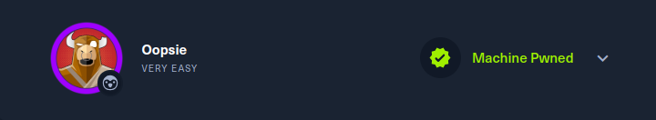