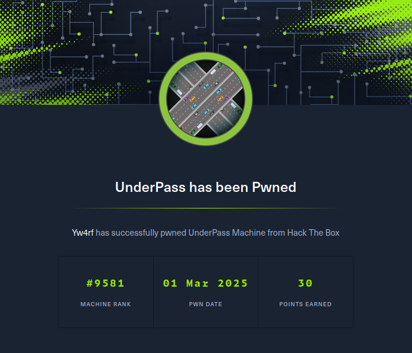

## Introduction

La máquina **UnderPass** se encuentra actualmente activa en la plataforma de HackTheBox. De acuerdo con las **[políticas de HackTheBox](https://help.hackthebox.com/en/articles/5188925-streaming-writeups-walkthrough-guidelines)**, no puedo compartir el contenido en este momento, ya que podría afectar la experiencia de quienes intentan resolver una máquina activa. Por lo tanto, el contenido permanecerá oculto hasta que la máquina esté retirada.

**[Verify Achievement](https://www.hackthebox.com/achievement/machine/2035837/641)**

