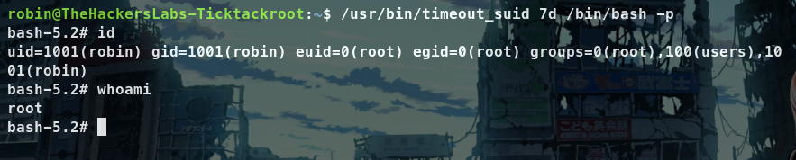

## Introducción

Esta vez, abordaremos la máquina TickTackRoot de la plataforma **[TheHackersLabs](https://thehackerslabs.com)**, una plataforma gratuita diseñada para la práctica de hacking ético. Nos encontraremos con tres puertos abiertos, 21/FTP**, 22/SSH y 80/HTTP. Explotaremos la vulnerabilidad FTP Anonymous login y realizaremos fuerza bruta con Hydra al servicio SSH, por último, escalaremos privilegios aprovechando el binario timeout_suid.

~~~
Platform: TheHackersLabs
Level: Principiante
~~~

## Desplegando la máquina

Primero descargamos la máquina de la plataforma de **[TheHackersLabs](https://thehackerslabs.com/ticktackroot/)**. Se descargará un **.rar** el cual tendremos que descomprimir, en mi caso usare la herramienta **unrar**. Una vez descomprimida la carpeta tendremos un archivo **.ova** el cual tendremos que importar en **Virtual Box** o **VMware**.  Sin olvidar de configurar la red en **Bridge** o **NAT** para poder realizar el CTF correctamente. Una vez hecho eso, podremos ejecutar la máquina correctamente y deberiamos ver esto:

## Scanning (Escaneo)

~~~
Target IP: 192.168.0.6
~~~

Inicialmente, usamos el comando **Ping**. Este utiliza el **ICMP (Protocolo de Control de Mensajes de Internet)**. Específicamente, **Ping** envía un mensaje de “echo request” a una **dirección IP** y espera recibir un mensaje de “echo response” en respuesta. Este proceso nos permite verificar si una máquina en la red es accesible y medir el tiempo que tarda en recibir una respuesta (conocido como latencia). Ademas, podemos inferir que es una máquina **Linux** debido al **Time To Leave** (**ttl**) que en este caso es **64**, si fuese en su lugar **128** o un número cercano a este, sería una máquina **Windows**.

Luego de verificar la conexión procedemos a realizar un escaneo de puertos y servicios con **Nmap**

- `sudo`: Ejecuta el comando con privilegios de superusuario.
- `nmap`: Herramienta de escaneo de redes.
- `-sS`: Escaneo TCP SYN, conocido como escaneo “sigiloso” porque no completa el handshake.
- `-p-`: Escanea todos los puertos (del 1 al 65535).
- `--open`: Muestra solo los puertos que están abiertos.
- `-Pn`: Omite la detección de host (asume que el host está activo).
- `-n`: No resuelve nombres de host (no intenta convertir IP a nombres).
- `--min-rate 5000`: Establece una tasa mínima de paquetes por segundo (aumenta la velocidad del escaneo).
- `-vvv`: Modo muy detallado (muestra más información durante el escaneo).
- `192.168.0.6`: Dirección IP del objetivo.
- `-oG PortsScan`: Guarda los resultados en formato “grepable” en el archivo `PortsScan`.

Vemos que tenemos abiertos los puertos **22/tcp (SSH)**, **80/tcp (HTTP)** y **21/tcp (FTP)**. El puerto **22 SSH (Secure Shell)** es un protocolo de red que permite la conexión segura a sistemas remotos. El puerto 80 **HTTP (Hypertext Transfer Protocol)** se utiliza para cargar páginas web y recursos en navegadores. El puerto **21 FTP (File Transfer Protocol)** es un protocolo estándar para la transferencia de archivos entre un cliente y un servidor, permitiendo a los usuarios subir y descargar archivos de manera eficiente y gestionar la estructura de directorios en el servidor. Aunque **FTP** no cifra los datos por defecto, se pueden utilizar variantes más seguras como **FTPS** o **SFTP**. Estos puertos permiten la comunicación entre un cliente y un servidor.

Haremos un escaneo más detallado utilizando scripts predeterminados de **Nmap** con la flag `-sC` lo que nos ayudará a la detección de vulnerabilidades e información adicional sobre los servicios. Además, con la flag `-sV` haremos uso de la detección de versiones de los servicios que corren los puertos indicados.

El escaneo revela información detallada y muy importante acerca del sistema objetivo.

## Enumeration (Enumeración)

### 21/FTP
El servidor FTP tiene la versión **vsftpd 2.0.8** y vemos que dice **Anonymous FTP login allowed**, lo que significa que cualquier usuario puede iniciar sesión sin necesidad de credenciales. Además, ncontró dos archivos: `index.html` y un directorio `login`. El archivo `index.html` es accesible y tiene permisos de lectura para todos (`-rw-r--r--`)

### 22/SSH
El servidor SSH tiene la versión **OpenSSH 9.6p1** y está en funcionamiento. De momento, no se observa ninguna vulnerabilidad para este servicio. 

### 80/HTTP
El servidor web tiene la versión **Apache 2.4.58**, está activo y muestra la página de inicio predeterminada de Ubuntu. Esto indica que el servidor web está en funcionamiento. Además, podemos inferir que la página predeterminada del servidor es un indicativo de falta de mantenimiento.

Accedemos a la página web `http://192.168.0.6/` para ver si encontramos algo de información valiosa:

Con la **hotkey** `CTRL + U` revisamos el codigo fuente de la página pero no encontramos nada interesante.

De momento no encontramos nada interesante, solo la página default de apache. Haremos un escaneo de archivos y directorios con **Gobuster** a la web:

No encontramos mucho más de lo que ya sabiamos. Recordemos que el **puerto 21/FTP** está abierto y tiene el **Anonymous login** permitido por lo que podriamos acceder fácilmente sin la necesidad de contraseña.

Vemos al iniciar sesión correctamente que nos recibe con un mensaje de bienvenida al nombre de **Robin**, podemos inferir que es un posible usuario. Encontramos con `ls` el archivo **index.html** y un directorio **login** que contiene un archivo llamado **login.txt**. Los descargo con `get` en mi entorno local y verificamos su contenido.

El archivo **index.html** es la página defaut de Apache. El archivo **login.txt** en cambio, tiene dos nombres, **Rafael** y **Monica**. Los cuales podemos inferir son posibles usuarios.

Hasta el momento, contamos con 3 posibles nombres de usuarios: **Robin**, **Rafael** y **Monica**.  Recordemos que teníamos el puerto **22/SSH** abierto. Podriamos intentar un ataque de **Fuerza Bruta** para obtener contraseñas con estos posibles nombres de usuarios. 

## Exploitation (Explotación)

Usaré la herramienta **Hydra**, en mi caso, usaré el diccionario [**rockyou.txt**](https://github.com/brannondorsey/naive-hashcat/releases/download/data/rockyou.txt). Primero intentaremos con el nombre de usuario **Robin**.

- `hydra`: Herramienta para ejecutar ataques de fuerza bruta.
- `-l`: Le indica que sabemos el usuario, en este caso **robin**.
- `-P`: Le indica que queremos saber la **password**; para ello, le indicamos la ruta local del diccionario.
- `ssh://192.168.0.6`: Le indicamos que el ataque se realice en el servicio **ssh** de la IP objetivo.

Encontró la **password** la cual es: **babyblue**

Accedemos al servicio SSH indicando el usuario **robin** y la IP objetivo posteriormente la contraseña, `ssh robin@192.168.0.6` 

Nos conectamos exitosamente al servicio **SSH** con el usuario **Robin**.

## Privilege Escalation (Escalada de Privilegios)

Una vez hemos obtenido acceso vemos que necesitamos **escalar privilegios**

Ejecutamos el comando `sudo -l` para listar los permisos **sudo** del usuario actual y como vemos nos indica que el usuario **robin** puede ejecutar `/usr/bin/timeout_suid` sin contraseña. 

Podemos aprovechar ese binario **SUID** para escalar privilegios. Más información en **[GTFObins](https://gtfobins.github.io)**

Ejecutamos el binario **SUID** y como vemos, somos **root**

- `/usr/bin/timeout_suid`: Este es un programa que permite ejecutar otro comando con un límite de tiempo.
- `7d`: Este especifica el tiempo límite, en este caso, 7 días.
- `/bin/bash`: Esto indica que se va a iniciar una instancia del shell de Bash.
- `-p`: Esta opción hace que Bash se ejecute con privilegios elevados, es decir, con los permisos del propietario del archivo.

Una vez hemos escalado privilegios tenemos control total del sistema y por lo tanto hemos finalizado la máquina. Restaria encontrar las flags.

## Conclusion

Se inicia el análisis utilizando el comando **Ping** para verificar la accesibilidad de la máquina, lo que indica que es un sistema **Linux** por el **TTL** de 64. Luego, se realiza un escaneo de puertos con **Nmap**, donde se identifican los puertos abiertos: **22 (SSH)**, **80 (HTTP)** y **21 (FTP)**. El servidor FTP permite el acceso anónimo, revelando archivos y posibles nombres de usuario: **Robin**, **Rafael** y **Monica**. Se intenta un ataque de **fuerza bruta** con **Hydra** para obtener la contraseña de **Robin**, encontrando que la contraseña es **babyblue**. Después de acceder por **SSH**, se verifica que el usuario puede ejecutar un binario **SUID** sin contraseña, lo que permite escalar privilegios a **root**. Finalmente, se obtiene control total del sistema, completando la explotación de la máquina.

 