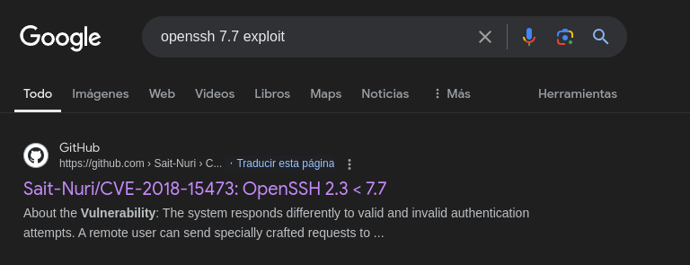

## Introducción

DockerLabs es una plataforma gratuita diseñada para la práctica de hacking ético. En esta ocasión, abordaremos la máquina BreakMySSH la cual como su nombre indica deberemos acceder al servicio SSH que se encuentra en el puerto 22. Haremos uso de la vulnerabilidad de OpenSSH 7.7 username enumeration CVE 2018-15473 para hacer uso de credenciales debiles y luego realizar un ataque de fuerza bruta.

~~~
Platform: DockerLabs
Level: Very Easy
~~~

## Desplegando la máquina

Primero descargamos la máquina de la plataforma de [**DockerLabs**](https://dockerlabs.es/)

Se descargara una carpeta comprimida. Utilizaremos una herramienta de descompresión, en mi caso utilizare **Unzip**. Una vez descomprimida la carpeta ejecutamos el comando `sudo bash auto_deploy.sh breakmyssh.tar` lo cual ejecutara la máquina.

## Scanning (Escaneo)

~~~
Target IP: 172.17.0.2
~~~

Usaremos el comando `pinc -c1 172.17.0.2` para verificar la conectividad con la máquina. Vemos que el paquete fue recibido y que el **ttl=64** por lo que estamos ante una máquina linux.

Una vez verificada la conexión procedemos a hacer un escaneo de puertos y servicios con la herramienta **Nmap**

Vemos que tenemos abierto el puerto **22/tcp ssh**.  El puerto 22 SSH (Secure Shell) un protocolo de red que permite la conexión segura a sistemas remotos.

Haremos un escaneo mas profundo indicandole a **Nmap** especifícando el puerto 22 y que nos indique las versiones y más informacíon acerca de este puerto usando la flag `-sCV`

## Enumeration (Enumeración)

La versión de **OpenSSH es 7.7**, y se está utilizando el protocolo 2.0. También se muestran las claves públicas **RSA**, **ECDSA** y **ED25519** utilizadas por el servidor SSH. 

A partir de aquí podriamos intentar explotar alguna vulnerabilidad conocida en **OpenSSH 7.7** o intentar realizar un ataque de **fuerza bruta** para obtener acceso a la máquina.

**[ExploitDB](https://www.exploit-db.com/)** permite buscar exploits y vulnerabilidades en su base de datos desde la **línea de comandos**. Esto lo haremos mediante la herramienta **searchsploit**

Como vemos, hay tres exploits que es posible usar, vemos que los tres llevan en su nombre "username" o "user" por lo que es posible inferir que el exploit trata de la enumeración de nombres de usuarios en OpenSSH. Con una rapida busqueda en Google podemos ver de que tratan. 

**CVE-2018-15473**: Esta vulnerabilidad permite a un atacante obtener información sobre los nombres de usuario válidos en el sistema. Un atacante puede enviar múltiples intentos de autenticación y, al observar la respuesta del servidor, puede deducir si el nombre de usuario existe o no, lo que puede facilitar ataques posteriores como ataques de fuerza bruta.

Haré un `git clone https://github.com/Sait-Nuri/CVE-2018-15473` al exploit modificadó por **[Sait-Nuri](https://github.com/Sait-Nuri)** para ejecutarlo

Primero en lugar de hacer uso de un diccionario intentaré con credenciales debiles:

Nos indica que **root** es un usuario valido, ahora con el nombre de usuario podriamos intentar un **ataque de fuerza bruta** para averiguar la contraseña. 

## Exploitation (Explotación)

Usaré la herramienta **Hydra**, con el comando `hydra -l root -P /usr/share/wordlists/rockyou.txt ssh://172.17.0.2` En mi caso, usaré el diccionario [**rockyou.txt**](https://github.com/brannondorsey/naive-hashcat/releases/download/data/rockyou.txt).

- `hydra`: Herramienta para ejecutar ataques de fuerza bruta.
- `-l`: Le indica que sabemos el usuario **mario**.
- `-P`: Le indica que queremos saber la **password**; para ello, le indicamos la ruta local del diccionario.
- `ssh://{Target IP}`: Le indicamos que el ataque se realice en el servicio **ssh** de la IP objetivo.

Como vemos, encontró la password: **estrella**

Ahora podemos ingresar al servicio **SSH** del objetivo mediante el comando `ssh root@172.17.0.2` e ingresando la password `estrella`

Hemos ingresado correctamente y como vemos somos **root** y tenemos permisos de super usuario por lo tanto hemos finalizado la máquina

## Resumen

Comencé realizando un escaneo de puertos con Nmap, lo que reveló que solo el puerto 22 (SSH) estaba abierto. Posteriormente, analicé el servicio, identificando que usaba OpenSSH 7.7, investigué en profundidad si presentaba alguna vulnerabilidad y efectivamente la tenía. A continuación, intenté probar credenciales debiles lo que resultó en el usuario "root", lo que me llevó a considerar luego un ataque de fuerza bruta para encontrar la contraseña. Utilicé Hydra para ejecutar este ataque y, tras varios intentos, encontré una contraseña válida, lo que me permitió acceder exitosamente al servidor como "root". 

 

