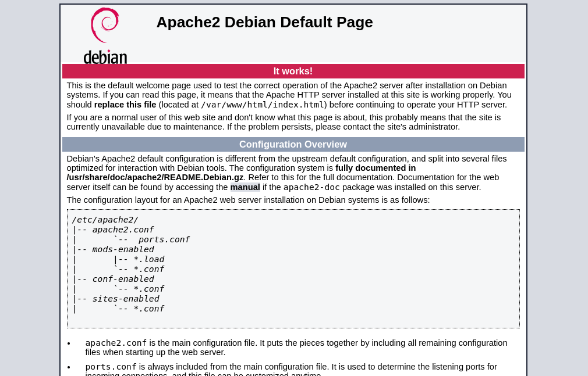
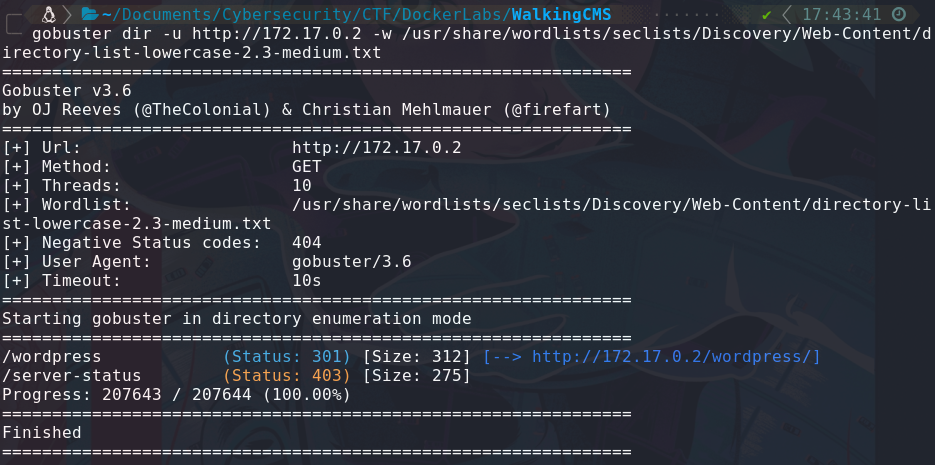
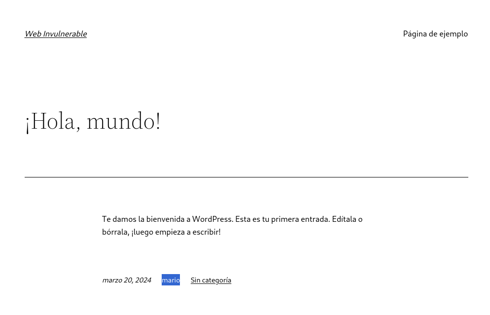
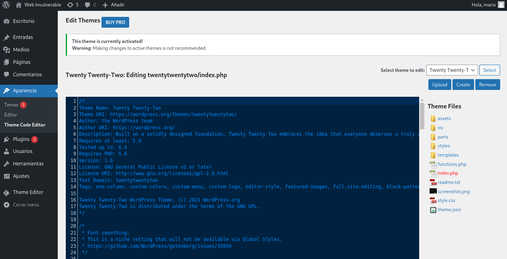

## Introducción

DockerLabs es una plataforma gratuita diseñada para la práctica de hacking ético. En esta ocasión, abordaremos la máquina WalkingCMS. Realizaremos escaneo de puertos, comprometeremos el una página Wordpress, haremos uso de Hydra para ataque de fuerza bruta, usaremos una Reverse Shell y escalaremos privilegios.

~~~
Platform: DockerLabs
Level: Easy
~~~

## Desplegando la máquina 

Primero descargamos la máquina de la plataforma de [**DockerLabs**](https://dockerlabs.es/). Una vez descomprimida la carpeta ejecutamos el comando `sudo bash auto_deploy.sh injection.tar` lo cual ejecutara la máquina.

## Enumeración

~~~
Target IP: 172.17.0.2
~~~

Usaremos el comando `pinc -c 1 172.17.0.2` para verificar la conectividad con la máquina. Este utiliza el **ICMP (Protocolo de Control de Mensajes de Internet)**. `Ping` envía un mensaje de “echo request” a una `dirección IP` y espera recibir un mensaje de “echo response” en respuesta. Este proceso nos permite verificar si una máquina en la red es accesible y medir el tiempo que tarda en recibir una respuesta (conocido como latencia). El `ttl=64` por lo que deducimos es una máquina Linux.

Una vez verificada la conexión procedemos a hacer un escaneo de puertos y servicios con la herramienta **Nmap**

Vemos que unicamente el **puerto 80/tcp http** está abierto. El puerto 80 HTTP (Hypertext Transfer Protocol) Se utiliza para cargar páginas web y recursos en navegadores.

Haremos un escaneo mas profundo indicandole a **Nmap** que nos indique las versiones y más informacíon acerca de estos puertos en específico. Usando la flag `-sCV`

Como vemos, nos indica que la **página predeterminada de Apache** está activa y funcionando. La página por defecto puede ser un indicativo de que el servidor no está configurado adecuadamente.

Haremos un escaneo de **directorios y archivos web** mediante la herramienta **Gobuster**. Es un escáner que usa fuerza bruta para descubrir rutas ocultas en un servidor web.

- **`Gobuster`**: Herramienta de escaneo de directorios y archivos web
- **`dir`**: Modo de enumeración de directorios/archivos
- **`-u`**: Se usa para indicar la URL del objetivo a escanear.
- **`-w`**: Indica la ubicación donde se encuentra la lista de palabras a utilizar durante el escaneo.

Como vemos, encontró `/wordpress` intentaremos acceder a la URL `http://172.17.0.2/wordpress` y nos dirige a la página default de un sitio Wordpress

Accedemos al post  en cuestion `¡Hola, mundo!` e investigamos para encontrar algo de información

Vemos que hay un posible usuario llamado `mario`. Wordpress tiene un panel de autenticación, generalmente se encuentra en la URL de inicio de sesión, que generalmente es `/wp-admin`. Accedemos a la URL `http://172.17.0.2/wordpress/wp-admin` 

Como vemos, nos pide usuario y contraseña. Tenemos un posible usuario el cual es `mario` pero aún necesitamos encontrar la contraseña. 

Usaremos la herramienta **WPScan** es una herramienta de seguridad diseñada específicamente para anlizar sitios web de WordPress en busca de vulnerabilidades. En este caso lo usaremos para realizar un ataque de **Fuerza Bruta**

- **`wpscan`**: Herramienta para analizar sitios Wordpress
- **`--url`**: Indicamos la URL del sitio Wordpress a escanear
- **`-U`**: Indica el usuario
- **`-P`**: Indica la contraseña, en este caso la ruta local del diccionario el cual contiene una lista de contraseñas 

Como vemos, el ataque de Fuerza Bruta fue exitoso y encontró que la contraseña del usuario `mario` es `love`

## Explotación

Iremos al panel de autenticación el cual se encuentra en la URL `http://172.17.0.2/wordpress/wp-admin` 

Logramos acceder exitosamente al panel de administración del sitio Wordpress. 

Desde alli podemos realizar varias acciones y como vemos tenemos varias secciones. Nos centraremos en la seccion `Apariencia > Theme Code Editor` Nos encontramos con varios archivos del tema, iremos al `index.php` y vemos que podemos editar el codigo. 

## Reverse Shell

Una **reverse shell** es un tipo de conexión de red. En lugar de que un atacante se conecte directamente a un sistema comprometido, el sistema afectado se conecta de vuelta al atacante.

- **Infección**: Un atacante puede ejecutar un código malicioso en una máquina víctima, lo que le permite abrir una shell (línea de comandos) en esa máquina.
- **Conexión**: La máquina víctima inicia una conexión a una dirección IP del atacante y un puerto específico.
- **Control**: Una vez establecida la conexión, el atacante puede enviar comandos a la shell de la máquina víctima y recibir la salida de esos comandos.

Lo que haremos es ingresar una **Reverse Shell**, yo en este caso usare la reverse shell de [PentestMonkey](https://github.com/pentestmonkey/php-reverse-shell/blob/master/php-reverse-shell.php) 

- **Subida del Script**: El atacante debe subir el script PHP al servidor web, normalmente en un directorio accesible.
- **Escucha en el Atacante**: El atacante configura su máquina para escuchar en un puerto específico (usualmente usando `netcat` o similar).
- **Acceso a través del Navegador**: Al acceder al script desde un navegador, se inicia la conexión inversa, permitiendo al atacante controlar el servidor.

Como vemos, necesitamos cambiar `$ip = {Nuestra dirección IP}` y `$port = {cualquier puerto}`

Podemos ver la ruta a la cual debemos conectarnos para que el reverse shell funcione al seleccionar **remove**, como vemos debemos acceder a `https://172.17.0.2/wordpress/wp-content/themes/twentytwentytwo/index.php`

Nos ponemos en escucha en el puerto 443 mediante el comando `nc -lvnp 443`

- **`nc`**: Es el comando para invocar Netcat, una herramienta versátil de red que puede leer y escribir datos a través de conexiones de red utilizando los protocolos TCP o UDP.
- **`-l`**: Indica que `nc` debe escuchar en lugar de iniciar una conexión. Es decir, actúa como un servidor.
- **`-v`**: Habilita el modo "verbose", lo que significa que Netcat proporcionará información adicional sobre lo que está haciendo, como conexiones entrantes.
- **`-n`**: Indica que no se debe realizar la búsqueda de nombres de dominio (resolución DNS). Esto puede hacer que la conexión sea más rápida, ya que evita la búsqueda de direcciones IP.
- **`-p 443`**: Especifica el puerto en el que `nc` escuchará. El puerto 443 es típicamente utilizado para HTTPS, lo que puede hacer que este puerto sea más difícil de detectar por algunas defensas de seguridad.

Luego de ponernos en escucha debemos acceder a la URL en la cual se ubica el reverse shell.

Al estar en escucha nos abre una Shell interactiva, lo que nos permite controlar el servidor

Como vemos somos el usuario `www-data`. Para tener una shell de bash interactiva podemos ejecutar el script `script /dev/null -c bash` 

Ejecutamos el comando `sudo -l` para listar los permisos **sudo** del usuario actual y como vemos no los tenemos por lo que debemos escalar privilegios.

El comando `find / -perm -4000 2>/dev/null` realiza una búsqueda en el sistema de archivos que tengan el bit **SUID (Set User ID)** activado

- **`find /`**: Inicia la búsqueda desde el directorio raíz (`/`), lo que significa que revisa todo el sistema de archivos.
- **`-perm -4000`**: Busca archivos que tengan el bit de SUID activado. Este bit permite que un archivo se ejecute con los permisos del propietario del archivo en lugar de los permisos del usuario que lo ejecuta. El `4000` representa este bit específico.
- **`2>/dev/null`**: Redirige la salida de error (cualquier mensaje de error) a `/dev/null`, lo que significa que se descartarán esos mensajes. Esto se utiliza para evitar que aparezcan errores en la pantalla, como los que pueden surgir al intentar acceder a directorios sin permisos.

Como vemos, tenemos el `usr/bin/env` por lo que podemos utilizar el binario `env`, que se utiliza para ejecutar un comando en un entorno modificado. Lo que nos permite escalar privilegios, ejecutando `usr/bin/env /bin/bash -p`

- **`usr/bin/env`**: Este es el comando que se utiliza para ejecutar un programa en un entorno modificado. Normalmente se utiliza para localizar y ejecutar el binario especificado en el `PATH` del sistema.
- **`/bin/bash`**: Este es el comando que se ejecutará, en este caso, una nueva instancia de Bash.
- **`-p`**: Esta opción se utiliza para iniciar Bash sin desactivar los privilegios efectivos del usuario, lo que significa que se conservarán los privilegios de usuario elevando el acceso a la shell.

Con `whoami` o `id` verificamos que somos `root` por lo que hemos finalizado la máquina.

## Resumen

La máquina nos presenta un puerto abierto, el puerto **80/HTTP**, realizamos un escaneo de directorios y archivos con la herramienta **Gobuster** y encontramos "**/wordpress**" a lo que deducimos es una página wordpress, la cual es posible ingresar, accedemos a la página y encontramos un post de un autor llamado "**mario**" con un posible usuario encontrado usamos la herramienta **wpscan** para realizar un ataque de **fuerza bruta** al panel de autenticación de wordpress que se encuentra en "**/wp-admin**" una vez accedemos ingresamos a la administración del sitio wordpress y hacemos uso de un **reverse shell** en el **index.php**. Al nosotros ingresar a la ruta donde pusimos la **reverse shell** luego de ponernos en escucha del puerto seleccionado en la reverse shell nos da una **shell interactiva** lo que nos permite controlar el servidor y escalar privilegios

 